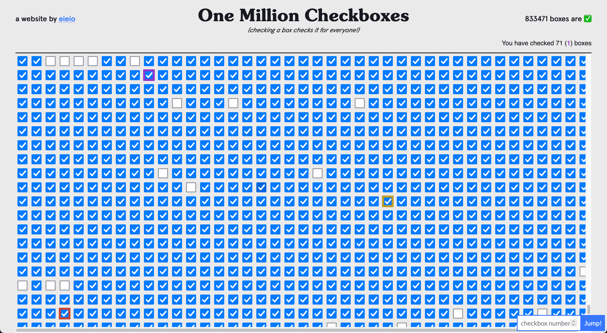

I reproduced [Josh's claude-3.5-sonnet mirror test](https://twitter.com/joshwhiton/status/1806000237728931910).
I hadn't realized [gpt-4 and claude-3-opus](https://twitter.com/joshwhiton/status/1770870738863415500) had also been "passing" this test since back in March.
More interesting still, Sonnet actually seems to resist speaking in the first person about itself.
Fascinating research and evolution of the models' behaviors.
After reading a bit more, apparently this type of model behavior has been around at least since [Bing/Sydney (paywall, sorry)](https://www.nytimes.com/2023/02/16/technology/bing-chatbot-microsoft-chatgpt.html).

---

https://onemillioncheckboxes.com is an amusing, massively-parallel art project(?)

