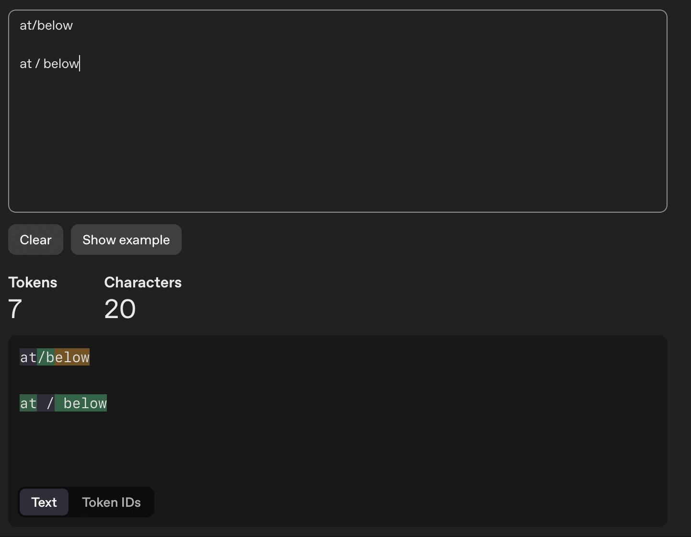

I commonly use an `and/or` approach when writing, both for people and language models.
At some point (I can't remember exactly when), I switched to doing the following, for language models only:

> and / or

The reasoning in my head was this would tokenize more clearly to the model.
Today, I checked the [OpenAI tokenizer](https://platform.openai.com/tokenizer) and kind of think I confirmed this thought process.
I'm still not quite sure though, since very few people would actually write this way in the source texts on which models have been trained.

That said, I have seen tokenization tricks work for helping models to solve certain problems, like a Wordle puzzle or [counting the letters in a word](/til/dspy/intro).

If you know anything about how this works, let me know!

---

A fun think about this post - I had Claude Code find the post I wrote about counting letters in a word with LLMs and link it above with this prompt.
I'm going to be using this trick more often.

> '/Users/danielcorin/dev/lab/thought-eddies/src/content/logs/2025/12/17/index.mdx'
> "counting the letters in a word" find if I wrote about this and link to it
