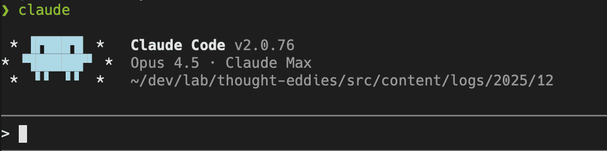

Notes on way too many hours spent agent coding over the holidays.

- Claude Opus 4.5 running in Claude Code is a workhorse. It hardly ever got stuck in the stacks I was working in (SwiftUI with HTML/CSS/JS in a WebView and a TypeScript 2D Canvas game).
- My ideas will move faster than the agent can. I found myself starting additional `claude` instances to work on smaller fixes and features I intuited wouldn't overlap with the work the "main" agent was doing. This allowed me to get more things done even while I was poking around with the agent working on more complicated features and refining rough edges.
- If the agent is struggling, `ultrathink` can help in a pinch. It's also as good or better to plan a feature up front with `ultrathink`. Hard to compare the two but it's a nice thing to have in your bag.
- Claude Code has gotten excellent at structuring and/or searching projects so it can find existing implementations rather than creating duplicate implementations. This was a problem several months back which created a "point of no return" for fully agent coded projects, where the agents couldn't search or understand a project well enough to code its way out of problems. I'm sure there is a max codebase size where these agents can be effective, but I've had great success on projects of 10k and 100k lines. It's worth noting the speed of the agent per prompt decreases as lines of code increases. The agent spends more time searching existing files in larger codebases. This seems to be what allows it to continue to implement successfully, and seems to be an unavoidable part of the physics of growing codebases (and was before coding agents were a thing too).
- I ran into one weird set of Swift warnings where Claude Code kept undoing and redoing two approaches, neither of which eliminated all warnings. GPT-5.2 in Cursor managed to resolve this one.
- My intuition is still necessary. When working on a feature that required a text editor in a Swift app, Claude tried several open source editors and none quite fit the way I wanted them to. I explicitly told Claude to use the [Monaco](https://microsoft.github.io/monaco-editor/) text editor (the core of VS Code) because I have an affinity for it.
- Sometimes the agent knows better than me. The agent is great at following directions and sometimes that means it will try to do things it shouldn't. This has improved since past model iterations but if an approach isn't working and I give the agent leeway to try a different approach, often I am pleasantly surprised by the idea and adopt something like it.
- Vision is indispensable. Software is an incredibly flexible canvas and the agent will give you a decent implementation of whatever you ask for, but if you don't ask for something or have a rough idea you're trying to implement, you will get lost in the slop.
- For fun, personal projects, I start by doing a voice-to-text brain dump of the idea in a `dump.md` file. Then I prompt the agent to make a `spec.md` from these raw thoughts. I read and refine that, then have it start implementing. I use fresh context windows for each of these tasks.
- By the end of the holiday, I was working on two or sometimes three projects in parallel. I don't think this is a particularly desirable thing to do, but otherwise I found I was waiting for the agent to finish and had the thought to do something else.
- Agent coding is entrancing and addicting for me, far more than writing software by hand ever was. The feedback loop for writing a prompt and getting what you asked for is tight and the agents are really good at following instructions.
- Polish is always needed. I'm continually reminded of an interview [Ryo Lu gave](/logs/2025/12/21) where he said "You always start with slop, with AI". I agree. When I am prompting, it's quite rare the first draft with AI is exactly what I want; it's the first draft. From the starting point, I play with the implementation and buff away the rough edges and tweak and tease out the experience or implementation I had in mind. Because of this, metaphors like "sculpting", "raising", "chiseling", and "molding" software resonate for me. The process is completely different than typing out all the characters. You throw a hunk of clay on the table and then start removing, shaping, and adding new things. It's as much exploration as execution or implementation and the journey and the wrong turns are instructive for how you find the path you prefer.
