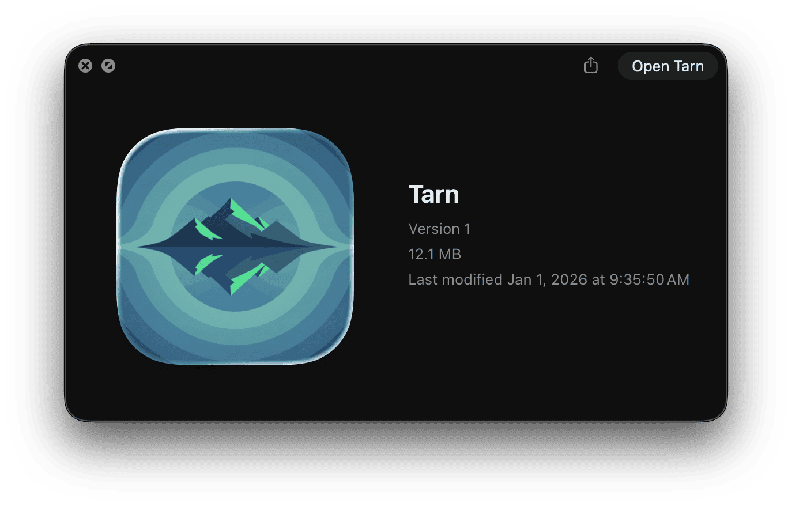

Agents are increasingly being trusted to do quantities of work that cannot be verified at code-level detail.
Finding verification criteria for the products of work done like this will be critical for having any amount of trust in it. 

---

I still run Tarn out of Xcode because its codebase is very much in flux.
Today, I finally patched an issue where unsaved file contents got cleared between app restarts.
I lost the first draft of this log to that issue.
Slowly but surely, this app is feeling like the best place for me to write stuff.

A few days ago, I used Nano Banana Pro and Apple's [Icon Composer](https://developer.apple.com/icon-composer/) to create an app icon for it.
The aim is to be at a point where I have more of a stable release in my app folder soon.

