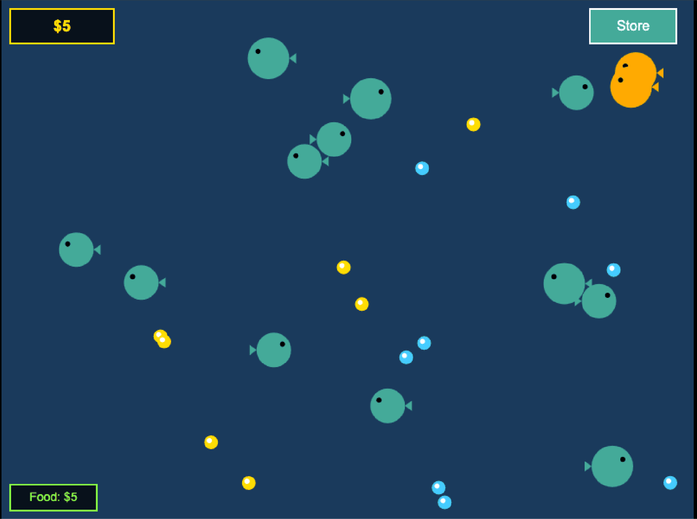

I just incinerated $10 running GLM 4.7 on Cerebras to try and Ralph a clone of this game I used to play.
Took about 15 minutes for the balance to go to $0.
Result, not awesome. Maybe okay.



I Claude Coded the game into a playable state with a few more prompts (it was still broken once my balance reached zero).

Cerebras was fast but costly given the token throughput.

## Takeaways

This approach "works" in that it builds in the direction of the spec for extended periods of time.
A browser game might not have been GLM's strength -- the model measures well on coding benchmarks, so some kind of backend task might have been more reasonable to try.
It did write a lot of compiling TypeScript though and I didn't give it much to work with in terms of design or aesthetics, so I'll take the blame there as well.

It seems like building an intuition for managing long running loops and getting good results requires building and experimenting with a lot of long running loops.
No big surprise there.
And it's not a cheap thing to learn.

## Code

```sh
#!/bin/bash

# Simple Ralph Loop
# Continuously passes plan.md to opencode with the prompt to work the plan
# Stops when the agent returns <complete/>

PLAN_FILE="${1:-plan.md}"
ITERATION=0

if [ ! -f "$PLAN_FILE" ]; then
    echo "Error: $PLAN_FILE not found"
    exit 1
fi

echo "Starting Ralph loop..."
echo "Will continue until agent returns <complete/>"
echo "---"

while true; do
    ITERATION=$((ITERATION + 1))
    echo ""
    echo "=== ITERATION $ITERATION ==="
    echo ""

    # Build the prompt: reference the plan file by name
    PROMPT="Work the plan in $PLAN_FILE and test until complete. Perform one task at a time. Update the plan file with the completed tasks as you work. When _all_ tasks in $PLAN_FILE are done and tests pass, output <complete/> to signal completion."

    # Run opencode with the prompt and capture output
    OUTPUT=$(echo "$PROMPT" | opencode run --model cerebras/zai-glm-4.7)

    echo "$OUTPUT"

    # Check if output contains <complete/>
    if echo "$OUTPUT" | grep -q "<complete/>"; then
        echo ""
        echo "=== RALPH COMPLETE ==="
        echo "Finished after $ITERATION iteration(s)"
        exit 0
    fi

    echo ""
    echo "--- Iteration $ITERATION complete, starting fresh context ---"
done
```
