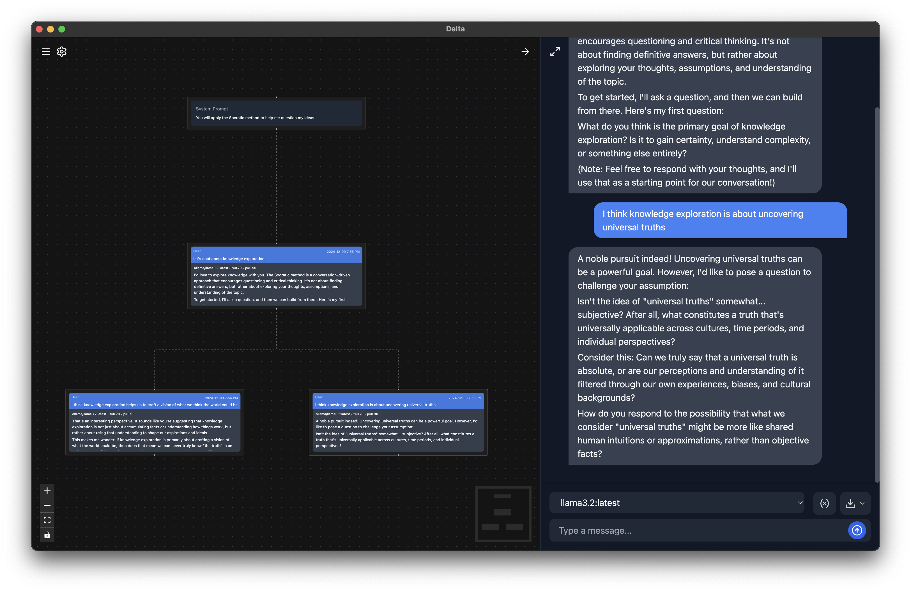

I've been building an Electron app called "[Delta](/projects/delta).
Delta is a tool for knowledge exploration and ideation through the branching of conversations with language models.
I have lots of ideas for how I want to make this idea useful and valuable, but today it looks like this.

This article is about my struggles building Delta using Electron and how I eventually found workable, though likely suboptimal, solutions to these challenges.



## Origins

The app started out as a [Next.js](https://nextjs.org/) app using Vercel's [`ai`](https://sdk.vercel.ai/docs/introduction) SDK for interacting with and streaming responses from language models.
I had a version of this working pretty well, but as I began thinking about wanting to share the app with friends, I realized I needed to make it a local-first app.
I don't want to store others' conversations or media on servers I manage.
I also wanted to support local models through tools like [`ollama`](https://ollama.com/), to allow for a fully offline experience for those who want that.

With these requirements, I looked to [Electron](https://www.electronjs.org/).
Having already built the app in React, my hope was it would be straightforward to construct a similar app using Electron, reusing much of the same React code, so that I could distribute it as a Desktop application.

This understanding was not entirely wrong, but it has been far from easy.

I decided to build my project with [`vite`](https://vite.dev/) and [`electron-forge`](https://www.electronforge.io/).

```sh
npm init electron-app@latest delta -- --template=vite-typescript
```

There have been challenges but it's not clear if I would have run into fewer challenges with different tools.

## Challenges

### HTTP to IPC

The first major difference I encountered between Next.js and Electron was the "backend".
Next uses HTTP/REST-style routes and a separate client server architecture.
Electron uses a similar client-server structure, but communicates over [IPC](https://www.electronjs.org/docs/latest/tutorial/ipc) rather than HTTP.
Translating HTTP to IPC wasn't too complicated but it took me longer than expected to understand how to test my changes.
One particularly annoying part was that on each code change, the server appeared to reload.
However, it turned out this code hot reloading only was pulling in client side changes.
When I made changes to the backend, I needed to re-run `npm start` (`electron-forge start`).

### The database

I was using `sqlite3` for the database with my Next app.
I didn't intend to go to production with this approach but when I pivoted to building a local app, it seemed like a reasonable decision to stick with.
I was interacting with the database using the [`better-sqlite3`](https://github.com/WiseLibs/better-sqlite3) library.
This library was nice and easy to build with in Next, but I started running into very weird problems when I tried to package the Electron app (`npm run package`).

I would frequently get the following error when opening the app after packaging:

```
A JavaScript error occurred in the main process

Uncaught Exception:
Error: Cannot find module 'better-sqlite3'
Require stack:
- /Users/danielcorin/dev/delta/out/Delta-darwin-arm64/Delta.app/Contents/Resources/app.asar/.vite/build/main.js
-
at Module._resolveFilename (node:internal/modules/cjs/loader:1232:15)
at s._resolveFilename (node:electron/js2c/browser_init:2:123517)
at Module._load (node:internal/modules/cjs/loader:1058:27)
at c._load (node:electron/js2c/node_init:2:16955)
at Module.require (node:internal/modules/cjs/loader:1318:19)
at require (node:internal/modules/helpers:179:18)
at Ul (/Users/danielcorin/dev/delta/out/Delta-darwin-arm64/Delta.app/Contents/Resources/app.asar/.vite/build/main.js:27:10501)
at Object.<anonymous> (/Users/danielcorin/dev/delta/out/Delta-darwin-arm64/Delta.app/Contents/Resources/app.asar/.vite/build/main.js:27:10856)
at Module._compile (node:internal/modules/cjs/loader:1484:14)
at Module._extensions..js (node:internal/modules/cjs/loader:1564:10)
```

A combination of adding an `electron-forge` hook for `packageAfterCopy` and the following `forge.config.ts` seemed to resolve most of the issues

```ts
const config: ForgeConfig = {
  packagerConfig: {
    asar: {
      unpack: '*.{node,dylib}',
      unpackDir: '{better-sqlite3}',
    },
  },
  rebuildConfig: {
    onlyModules: ['better-sqlite3'],
    force: true,
  },
};
```

### Using sqlite extensions

I decided to use the [`sqlite-vec`](https://github.com/asg017/sqlite-vec) extension to store and query embeddings generated by embedding models to do search by semantic similarity across the things in my database.
After adding and wiring up this library, I started seeing errors like this

```
Uncaught Exception:
SqliteError: dlopen(/Users/danielcorin/dev/delta/out/Delta-darwin-arm64/Delta.app/Contents/Resources/app.asar/node_modules/sqlite-vec-darwin-arm64/vec0.dylib.dylib, 0x000A): tried: '/Users/danielcorin/dev/delta/out/Delta-darwin-arm64/Delta.app/Contents/Resources/app.asar/node_modules/sqlite-vec-darwin-arm64/vec0.dylib.dylib' (errno=20), '/System/Volumes/Preboot/Cryptexes/OS/Users/danielcorin/dev/delta/out/Delta-darwin-arm64/Delta.app/Contents/R
at Database.loadExtension (/Users/danielcorin/dev/delta/out/Delta-darwin-arm64/Delta.app/Contents/Resources/app.asar/node_modules/better-sqlite3/lib/methods/wrappers.js:19:14)
at Module.load (/Users/danielcorin/dev/delta/out/Delta-darwin-arm64/Delta.app/Contents/Resources/app.asar/node_modules/sqlite-vec/index.cjs:55:6)
at Object.<anonymous> (/Users/danielcorin/dev/delta/out/Delta-darwin-arm64/Delta.app/Contents/Resources/app.asar/.vite/build/main.js:24:10581)
at Module._compile (node:internal/modules/cjs/loader:1484:14)
at Module._extensions..js (node:internal/modules/cjs/loader:1564:10)
at Module.load (node:internal/modules/cjs/loader:1295:32)
at Module._load (node:internal/modules/cjs/loader:1111:12)
at c._load (node:electron/js2c/node_init:2:16955)
at node:electron/js2c/browser_init:2:129164
at node:electron/js2c/browser_init:2:129373
```

The solution combines the previous `forge.config.ts` with a `packageAfterCopy` hook that copies required native packages and migrations to the build directory.

```ts
const config: ForgeConfig = {
  packagerConfig: {
    asar: {
      unpack: '*.{node,dylib}',
      unpackDir: '{better-sqlite3,sqlite-vec*,sqlite-vec-darwin-arm64}',
    },
  },
  rebuildConfig: {
    onlyModules: ['better-sqlite3', 'sqlite-vec', 'sqlite-vec-darwin-arm64'],
    force: true,
  },

  // ...

  hooks: {
    async packageAfterCopy(_forgeConfig, buildPath) {
      const requiredNativePackages = [
        'better-sqlite3',
        'bindings',
        'file-uri-to-path',

        'sqlite-vec',
        'sqlite-vec-darwin-arm64',
      ];

      const sourceNodeModulesPath = path.resolve(__dirname, 'node_modules');
      const destNodeModulesPath = path.resolve(buildPath, 'node_modules');

      await Promise.all(
        requiredNativePackages.map(async (packageName) => {
          const sourcePath = path.join(sourceNodeModulesPath, packageName);
          const destPath = path.join(destNodeModulesPath, packageName);

          await mkdir(path.dirname(destPath), { recursive: true });
          await cp(sourcePath, destPath, {
            recursive: true,
            preserveTimestamps: true,
          });
        })
      );
    },
  },
};
```

This solution didn't feel great but resolved the issue for the time being, copying over the needed files.

### Closing thoughts on Electron

Moving to Electron from Next.js was harder than expected because of the SQLite runtime issues documented above.
Further complicating things was needing to debug the minified JavaScript rather than the original TypeScript source.
I'll need to see if there is a source map configuration option to help with debugging in the future.
I did my best to collocate the errors I ran into and the solution that worked for me in case you happen to run into any of the same problems.
Be forewarned, I'm relatively new to Electron so even if the solutions work they may not be what you want for your app in production.

I'm undecided if I would use Electron again if I built another desktop app.
I do prefer to build with web technology and cross platform but the SQLite dependency package issues were painful and time consuming.
I'm not sure if I would have similar trouble with a different approach or framework.
I do know solutions to these problems for the next time around but I found debugging painful and wonder if some of the newer cross-platform frameworks might offer a better developer experience.
