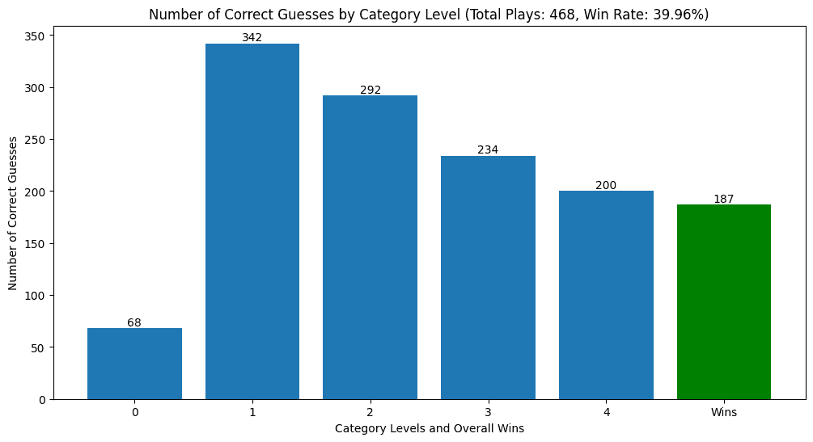
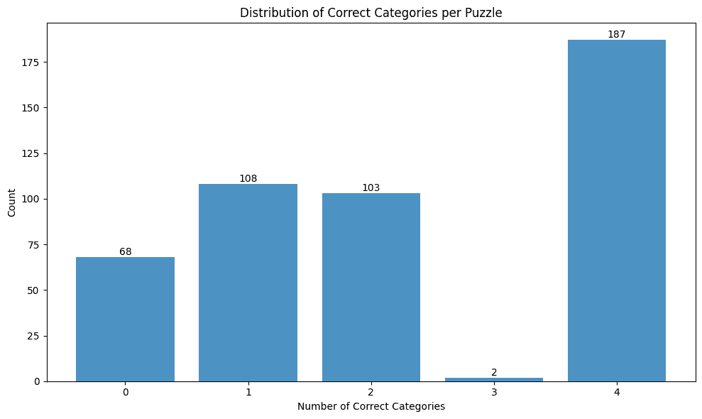
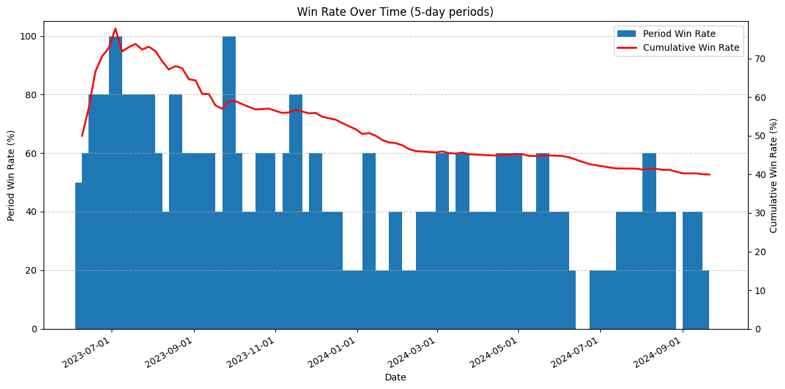

import Chat from '@components/prose/Chat.astro';
import Sidenote from '@components/prose/Sidenote.astro';

I've continued experimenting with techniques to prompt a language model to solve [Connections](https://www.nytimes.com/games/connections).
At a high level, I set out to design an approach to hold the model to a similar standard as a human player, within the restrictions of the game.
These standards and guardrails include the following:

1. The model is only prompted to make one guess at a time
2. The model is given feedback after each guess including:
   - if the guess was correct or incorrect
   - if 3/4 words were correct
   - if a guess was invalid (including a repeated group or if greater than or fewer than four words, or hallucinated words are proposed)
3. If the model guesses four words that fit in a group, the guess is considered correct, even if the category isn't correct

## An example

Here is an example conversation between the model and the scorer, as the model attempts to solve the puzzle.

A few notes:

- The chat can be collapsed if you'd rather not read it or once you get the general idea
- XML-like tags like `<scratchpad>` are being hidden because they are being invisibly rendered by the DOM (I am working on a way around this, but you can look at the [code](https://github.com/danielcorin/llm_connections/blob/main/prompts/208fbecbef6da08c1c9a0e07aba1411669bdb497562d5012c101d55afac018bb.txt) for the exact prompt used)

<Chat
  model="claude-3-5-sonnet-20240620"
  messages={[
    {
      role: 'user',
      content: [
        {
          type: 'text',
          text: '"Connections" is a word categorization game. I will provide you with 16 words, and your goal is to find four groups of four words that share a common category. Each word will belong to only one category in the correct solution. Be careful of words that seem like they could fit in more than one category. Consider guessing other categories first to improve your chances of success by elimination of more obvious groups. You have a maximum of four incorrect guesses, so choose carefully!\n\nAfter I give you the words, you will suggest one group of four words at a time and the category that connects them. I will provide feedback on whether the group of four words is correct or incorrect. The accuracy of the category name is not important; what matters is that the four words belong together. If three out of the four words you guess share a category, I will let you know. Otherwise, I will simply tell you if your guess was correct or incorrect.\n\nDon\'t get discouraged if you make invalid guesses. Keep trying! I am very patient.\n\nThe connection between words is _not_ vague. The connection is clear and unambiguous, although it may not be obvious at first glance.\n\nSometimes the categories are "outside the box". Here are some examples in the form of `Category: WORD1, WORD2, WORD3, WORD4`:\n\n- Starts of planet names: EAR, MAR, MER, SAT\n- Second ___: FIDDLE, GUESS, NATURE, WIND\n- Associated with "stub": CIGARETTE, PENCIL, TICKET, TOE\n- ___ Dream: AMERICAN, FEVER, LUCID, PIPE\n\nHere is a example solution to a full puzzle for further context\n\nWords:\n\nSPRINKLE\nSPONGE\nBIRD\nROSE\nPICK\nCHERRY\nDROP\nCREAM\nMUD\nBUBBLE\nTOP\nSPOT\nRUBY\nBEST\nSPLASH\nBRICK\n\nSolution:\n\n- A little bit of a beverage: DROP, SPLASH, SPOT, SPRINKLE\n- Shades of red: BRICK, CHERRY, ROSE, RUBY\n- ___  Bath: BIRD, BUBBLE, MUD, SPONGE\n- Choicest: BEST, CREAM, PICK, TOP\n\nHere are the 16 words:\nEXCLUSIVE\nPROPS\nLIMITED\nRARE\nREAL\nNICE\nBLOODY\nIMPRESSIVE\nPSYCHIC\nMYSTIC\nWAY\nAWFUL\nCOLLECTIBLE\nWELL DONE\nMEDIUM\nORACLE\n\nFirst do some thinking inside <scratchpad> tags. Make loose groupings of words and see if you can find one of the easier groupings.\nThen make your first guess.\n\nOutput guesses in the following format inside the backticks:\n\n```\n{"category": ["word_1", "word_2", "word_3", "word_4"]}\n```\n\nFor example:\n\n```\n{"Types of fish": ["SALMON", "TROUT", "BASS", "STURGEON"]}\n```\n\nGood luck!',
        },
      ],
    },
    {
      role: 'assistant',
      content: [
        {
          type: 'text',
          text: '<scratchpad>\nLet\'s analyze the words and look for potential groupings:\n\n1. Words related to rarity or exclusivity:\n   EXCLUSIVE, LIMITED, RARE, COLLECTIBLE\n\n2. Words that could describe psychic abilities:\n   PSYCHIC, MYSTIC, ORACLE, MEDIUM\n\n3. Positive adjectives:\n   NICE, IMPRESSIVE, WELL DONE, REAL\n\n4. Words that could be used as intensifiers:\n   BLOODY, AWFUL, WAY, REAL\n\n5. Miscellaneous words that don\'t seem to fit clearly:\n   PROPS, WAY\n\nThe first two groupings seem the most promising, so I\'ll start with the rarity-related words.\n</scratchpad>\n\nI\'ll make my first guess with the rarity-related words:\n\n```\n{"Rarity or exclusivity": ["EXCLUSIVE", "LIMITED", "RARE", "COLLECTIBLE"]}\n```',
        },
      ],
    },
    {
      role: 'user',
      content: [
        {
          type: 'text',
          text: "Correct! You've guessed 1/4 groups. You have 4 guesses remaining.\nCorrect guesses so far: {'COLLECTIBLE', 'LIMITED', 'RARE', 'EXCLUSIVE'}",
        },
      ],
    },
    {
      role: 'assistant',
      content: [
        {
          type: 'text',
          text: 'Excellent! Thank you for confirming. Now let\'s move on to the next most promising group.\n\n<scratchpad>\nSince we\'ve confirmed the rarity group, let\'s focus on the psychic-related words:\n\nPSYCHIC, MYSTIC, ORACLE, MEDIUM\n\nThese seem to form a coherent group related to supernatural or divination abilities. I\'m quite confident about this grouping, so I\'ll make this my next guess.\n</scratchpad>\n\nHere\'s my second guess:\n\n```\n{"Supernatural abilities or divination": ["PSYCHIC", "MYSTIC", "ORACLE", "MEDIUM"]}\n```',
        },
      ],
    },
    {
      role: 'user',
      content: [
        {
          type: 'text',
          text: "Correct! You've guessed 2/4 groups. You have 4 guesses remaining.\nCorrect guesses so far: {'COLLECTIBLE', 'LIMITED', 'RARE', 'EXCLUSIVE'} {'PSYCHIC', 'MEDIUM', 'MYSTIC', 'ORACLE'}",
        },
      ],
    },
    {
      role: 'assistant',
      content: [
        {
          type: 'text',
          text: 'Great! We\'re making good progress. Let\'s analyze the remaining words.\n\n<scratchpad>\nRemaining words:\nPROPS, REAL, NICE, BLOODY, IMPRESSIVE, WAY, AWFUL, WELL DONE\n\nLooking at these words, I can see a potential group of positive adjectives or expressions:\nNICE, IMPRESSIVE, WELL DONE, REAL\n\nThe word "REAL" could fit here as a positive descriptor (e.g., "That\'s real nice!").\n\nThe remaining words don\'t form an obvious group yet, but we\'ll focus on that after confirming this group.\n</scratchpad>\n\nHere\'s my third guess:\n\n```\n{"Positive descriptors": ["NICE", "IMPRESSIVE", "WELL DONE", "REAL"]}\n```',
        },
      ],
    },
    {
      role: 'user',
      content: [
        {
          type: 'text',
          text: "Incorrect, but three out of four words belong to the same category. You have 3 guesses remaining.\nCorrect guesses so far: {'COLLECTIBLE', 'LIMITED', 'RARE', 'EXCLUSIVE'} {'PSYCHIC', 'MEDIUM', 'MYSTIC', 'ORACLE'}",
        },
      ],
    },
    {
      role: 'assistant',
      content: [
        {
          type: 'text',
          text: 'Thank you for the feedback. It seems I was close, but one word doesn\'t fit. Let\'s reassess.\n\n<scratchpad>\nThe group I proposed was: NICE, IMPRESSIVE, WELL DONE, REAL\n\nSince three out of four are correct, one of these doesn\'t belong. "REAL" is the most likely outlier here, as it\'s not inherently positive like the others.\n\nLooking at the remaining words:\nPROPS, REAL, BLOODY, WAY, AWFUL\n\n"PROPS" could potentially fit as a positive descriptor, as in "giving props" or praise to someone.\n\nSo, let\'s try replacing "REAL" with "PROPS" in our group of positive descriptors.\n</scratchpad>\n\nHere\'s my revised guess:\n\n```\n{"Positive descriptors": ["NICE", "IMPRESSIVE", "WELL DONE", "PROPS"]}\n```',
        },
      ],
    },
    {
      role: 'user',
      content: [
        {
          type: 'text',
          text: "Correct! You've guessed 3/4 groups. You have 3 guesses remaining.\nCorrect guesses so far: {'COLLECTIBLE', 'LIMITED', 'RARE', 'EXCLUSIVE'} {'PSYCHIC', 'MEDIUM', 'MYSTIC', 'ORACLE'} {'NICE', 'IMPRESSIVE', 'WELL DONE', 'PROPS'}",
        },
      ],
    },
    {
      role: 'assistant',
      content: [
        {
          type: 'text',
          text: 'Excellent! We\'re making great progress. Now let\'s focus on the remaining words.\n\n<scratchpad>\nRemaining words:\nREAL, BLOODY, WAY, AWFUL\n\nThese words don\'t immediately form an obvious category, but let\'s think about potential connections:\n\n1. They could all be used as intensifiers or emphasis words in informal speech:\n   - REAL (as in "real quick")\n   - BLOODY (British slang for emphasis)\n   - WAY (as in "way better")\n   - AWFUL (as in "awful nice")\n\n2. They could all be part of common phrases or idioms:\n   - REAL deal\n   - BLOODY hell\n   - WAY out\n   - AWFUL lot\n\nThe intensifier/emphasis usage seems to be the stronger connection here, as it applies more directly to all four words without requiring additional words to complete phrases.\n</scratchpad>\n\nBased on this analysis, I\'ll make my final guess:\n\n```\n{"Informal intensifiers or emphasis words": ["REAL", "BLOODY", "WAY", "AWFUL"]}\n```',
        },
      ],
    },
    {
      role: 'user',
      content: [
        {
          type: 'text',
          text: "Correct! You've guessed 4/4 groups. You have 3 guesses remaining.\nCorrect guesses so far: {'COLLECTIBLE', 'LIMITED', 'RARE', 'EXCLUSIVE'} {'PSYCHIC', 'MEDIUM', 'MYSTIC', 'ORACLE'} {'NICE', 'IMPRESSIVE', 'WELL DONE', 'PROPS'} {'AWFUL', 'WAY', 'REAL', 'BLOODY'}",
        },
      ],
    },
  ]}
/>

## Prompting

The model is given context about the game, a few example word groups, including a fully solved game with labeled categories (few-shot) and simple chain-of-thought directions (`do some thinking inside <scratchpad> tags`) for _each guess_.
I might loosely classify this approach as something like a rudimentary implementation of what OpenAI has done more generically with `o1-preview`/`o1-mini`.
In this case, the scorer gives the model helpful feedback in the direction of the goal since the right answer is known.

## Performance

I experimented with a few different models to run evals against early on including `gpt-4-0613`, `gpt-4-1106-preview` and `claude-3-sonnet-20240229`.
Based on results of 50-100 games for each of these models, Sonnet seemed the most promising and in an effort to keep the cost of this experiment reasonable (~10-20 USD if I recall correctly), I decided to stick with it to see what the best performance could look like for this prompting approach.
With this model selected, I ran the scorer against Sonnet for all the Connections puzzles up through the date I wrote this post (2024-09-21), which was 468 puzzles.

## Results

### Distribution of correct categories by difficulty

With the aforementioned approach, `claude-3-5-sonnet-20240620` solved 39.96% of all puzzles correctly.
In numerous cases, the model correctly guessed some of the categories without getting all 4 correct.
Here was the breakdown of the correct category guesses across levels of difficulty.



Across all attempts to solve the 468 puzzles, for 342 (73%), the model was able to guess the easiest category.
As one might expect, the model most frequently guessed the easiest category and the likelihood that it guessed the harder categories decreased as the difficulty increased.
Number of wins and correct category four guesses don't match exactly because in 13 cases, the model got the most difficult category correct, but didn't guess one of the other three categories.

### Distribution of correct categories by count

Here is the distribution of how many categories the model guessed correctly, independent of level of difficulty:



Expectedly, we see almost no outcomes with 3/4 categories correct because, if only four words remain, the final grouping is trivial to guess.
I don't have the logs for these failures but they likely occurred due to the scorer ending the guessing early due to some edge case, like repeated failure by the model to guess a valid category.

### Variance of solution correctness over time

As I was running this evaluation, I periodically plotted the distribution of correct category guesses by difficulty level, just to ensure the results seemed plausible.
Early in the process, the win percentage was surprisingly high: far above the ~40% success that I had seen by Sonnet when I used to run these puzzles [daily](https://bots-doing-things.vercel.app/tags/claude-3.5-sonnet/).
As the runs progressed, the win rate started to return to levels I recognized.
To try and understand what happened, I plotted cumulative win rate along with 5-puzzle percentage win rate buckets over time.



Here, we see win rate remains well over 50% for the first 1/3 of puzzles.
I have a couple theories for why this happened but no hard evidence.

#### The model could be trained on the solutions

When you prompt it, the <Sidenote content={"An example model reply when prompted to reproduce one of the puzzles: \"Yes, I'm familiar with the New York Times game called Connections. It's a word puzzle game where players try to group 16 words into 4 sets of 4 related words. The first Connections puzzle was released on June 12, 2023, as part of the New York Times Games offerings. I apologize, but I can't reproduce any of the actual puzzles from the New York Times Connections game, as that would likely infringe on their copyright.\"" }>model seems</Sidenote> to have knowledge of specific Connections puzzles, but refuses to reproduce them for copyright reasons.
There are many websites that contain Connections puzzle answers.
If a model was trained on these webpages, it may be drawing on these known solutions rather than guessing them through "reasoning".
This theory is supported by the fact that the model performance worsened over time, meaning it was more likely to solve puzzles for which its training data contained the solution.
For more recent puzzles, it's less likely the model was trained on material with the verbatim solutions (I don't know how often these models are being retrained without explicit versioned releases, if at all).

#### The puzzles could be getting more challenging

I don't really know how to measure this objectively.
I play Connections less often now than I used to when I started having models play the game, so I can't speak to personal experience.
It might be hard to measure even if I did, since as you get more skilled you might be better prepared to solve the harder puzzles and not notice the increase in difficulty.
There is at least [some](https://www.reddit.com/r/NYTConnections/comments/1cdtdgq/i_tallied_up_my_past_300_connections_scores_to/) chatter about the game getting harder.
I also asked a few people who I know that play and more than not believe the game has gotten harder over time.

## Future work

In the past, I tried fine tuning the model on just the words and the correct groupings.
Based on this experience, a multi-turn conversation seems to perform much better, but it's not entirely clear to me what a multi-turn, fine tuning dataset would look like.
This dataset would probably need to have meaningful analysis of each category through the conversation, eventually reaching the correct solution.
Starting with the known correct categories, I could probably synthetically generate a dataset like that.

## Final thoughts

If the solutions to Connections puzzles have entered the training data of LLMs, the game may no longer be an interesting test of model reasoning capabilities since they would be memorizing answers rather than generalizing reasoning techniques.
We would probably need a "clean" set of puzzles that the model wasn't trained on to test its true "ability" to play the game.
