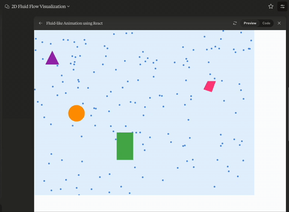

import Sidenote from '@components/prose/Sidenote.astro';

I spent some time working with Claude [Artifacts](https://support.anthropic.com/en/articles/9487310-what-are-artifacts-and-how-do-i-use-them) for the first time.
I started with this prompt

> I want to see what you can do. Can you please create a 2d rendering of fluid moving around obstacles of different shapes?

<Sidenote content="I need to figure out a better way to share conversations from all the different models I interact with, including multi-modal models. Ideally, I could export these in a consistent JSON structure to make rendering them in a standard conversation format easier. Static media (images, video, etc.) would be straightforward but things like Artifacts, which are rendered by the Claude UI fit this structure less cohesively.">In effort to not spend this whole post quoting prompts</Sidenote>
, I've [exported the whole conversation](/files/claude-artifacts.json) returned
from the Anthropic API, using the response from the following
<Sidenote content="This API may change in the future. It isn't an externally-documented API.">endpoint</Sidenote>
.

```text
https://claude.ai/api/organizations/<org_id>/chat_conversations/<conversation_id>?tree=True&rendering_mode=raw
```

## Initial Prompt and Response

Claude outputted a static SVG as its first attempt at solving this problem.
I followed up that I wanted to animate it.
First it tried to do that with a library called [Matter.js](https://brm.io/matter-js/), but it seemed Artifacts didn't have access to that.
I told Claude and it created a different version with its own simple physics.

This result was a nice, working example.
It wasn't exactly what I had in mind, which was something like this [WebGL Fluid Simulation](https://paveldogreat.github.io/WebGL-Fluid-Simulation/), but I'll concede that that isn't exactly what I asked for.
I didn't know the right <Sidenote content="I tried starting a new conversation, prompting Claude to 'Create a fluid simulation with WebGL' but got 'Output blocked by content filtering policy' which was disappointing.">terminology</Sidenote> when I started.

## Iterating on the Artifact

I prompted several more times to have Claude improve collision detection, add more shapes and add interactions between the particles.
I also tried to make it so I could click and drag around the shapes with my mouse.
I (Claude) never fully got any of these working.
Some generations were incrementally closer, but didn't quite accomplish was I was aiming for.



When I prompted Claude to make an improvement or fix a mistake, it occasionally simplified the problem to try and get a working version of the isolated feature I was asking for, like when I prompted to add the ability to move the shapes around with the mouse.
This helped it get back on track, but wasn't really what I wanted, which was to have the feature added to the working version of the code we were iterating on.

## Limitations of Artifacts for Software Development

This experience brings me to my main complaint about Artifacts from the perspective of a software engineer.
I want to collaborate with the model and specifically target areas where it makes changes and improvements in certain cases.
I also do not want to regenerate the entire artifact after every prompt.
I want to build incrementally on top of what is working.
Waiting for a full regeneration is more time consuming and the model sometimes changes parts of the code that I would have preferred to keep the same.
I could see myself using Artifacts as a starting point or for ideation, but Sonnet 3.5 + Cursor has been a much nicer experience as an engineer hoping to iterate, make more targeted changes and make my own edits to the code.
Also, I mostly prefer the development environment in Cursor to the Claude UI.

## Context Window Challenges

After many iterations in the Claude UI, I got this error message

> Your message will exceed the length limit for this chat. Try shortening your message or starting a new conversation. Or consider upgrading to Claude Pro.

I'm happy to upgrade to a paid product (I mostly pay for model APIs these days), but this raises another issue with this approach for iterating on software -- the context window.
Even with a larger context window that would have let me send many more messages, I've experienced a few problems with an append-only conversation history.

- We don't want or need many of the failed attempts in the context and retaining them sometimes seems to continue to steer the model in the wrong direction, even for subsequent generations
- The inference is slower and more expensive with more tokens
- The quality of the inference seems to degrade with larger context -- this is a vibes-based take, I don't have hard data to back it up and it seems to be improving

Claude 3.5 Sonnet is my favorite model right now.
I'd would say I prefer `claude-3.5-sonnet` over `gpt-4o` more than I preferred `claude-3-opus` over `gpt-4-turbo`.
I enjoyed seeing Anthropic dive into the model+tool arena and I'm looking forward to seeing how they continue to iterate from here.
