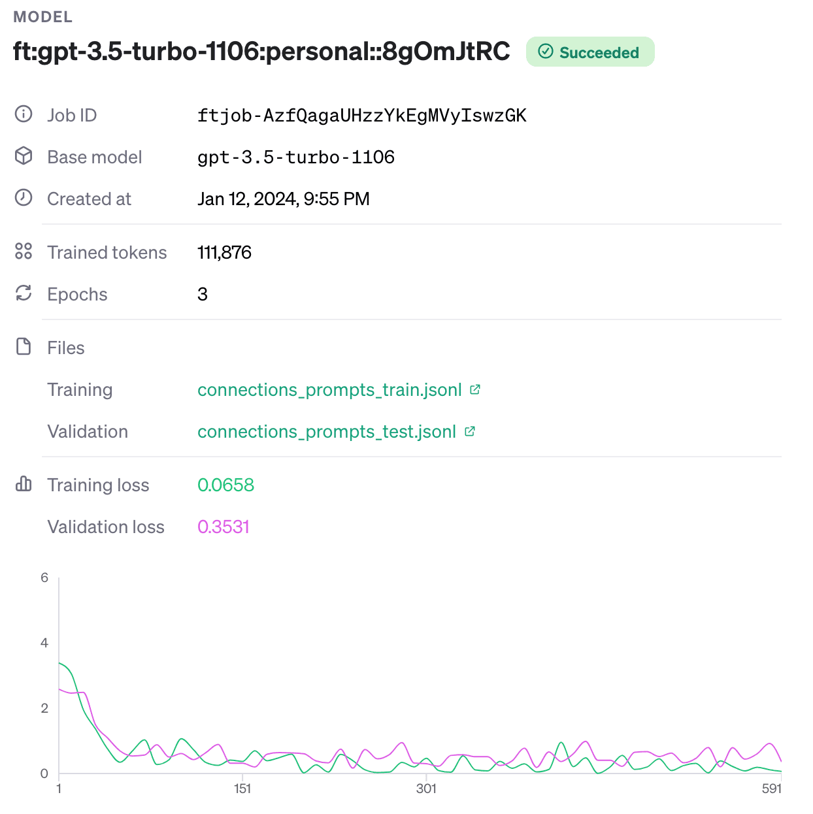
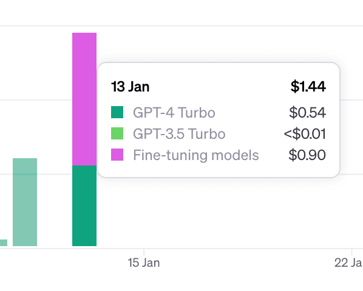
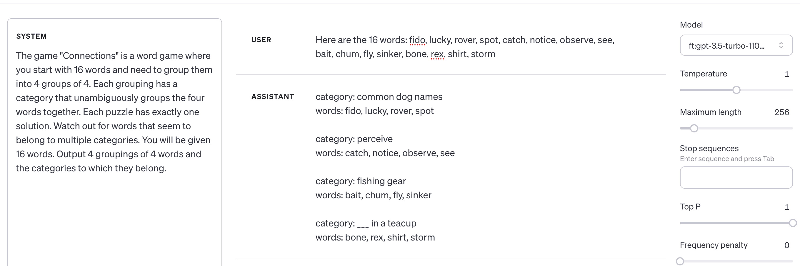

I started playing the NYTimes word game "[Connections](https://www.nytimes.com/games/connections)" recently, by the recommendation of a few friends.
It has the type of freshness that [Wordle](https://www.nytimes.com/games/wordle/index.html) lost for me a long time ago.
After playing Connections for a few days, I wondered if an OpenAI language model could solve the game (the objective is to group the 16 words into 4 categories of 4 words).
I tried with `gpt-4-32k` and `gpt-4-1106-preview`, tweaking prompts for a few hours and wasn't able to make much progress.
It's certainly possible prompt engineering alone could solve this problem, but it wasn't easy for me for find a path forward.
I imagine it will involve a bit of creativity.
I decided this was as good a time as any to try and fine tune a model to do a thing I couldn't easily get it to do with prompts.

## Getting the dataset

I remembered seeing at some point that Wordle had an API to return the day's word and it does at `https://www.nytimes.com/svc/wordle/v2/yyyy-mm-dd.json`.
I figured Connections might have a similar JSON API and it does.
I wrote a script to get all the solutions to past game and put the in the `connections_data` folder with the naming convention `yyyy-mm-dd.json`.

```python
import json
import httpx
from datetime import timedelta, datetime


url = "https://www.nytimes.com/svc/connections/v1/{date}.json"
start_date = datetime.strptime("2023-06-12", "%Y-%m-%d")

def main():
    end_date = datetime.now()
    dates_generated = [
        start_date + timedelta(days=x)
        for x in range((end_date - start_date).days + 1)
    ]
    for date in dates_generated:
        formatted_date = date.strftime("%Y-%m-%d")
        response = httpx.get(url.format(date=formatted_date))
        response_object = response.json()
        with open(f"connections_data/{formatted_date}.json" , "w") as f:
            f.write(json.dumps(response_object, indent=2))


if __name__ == "__main__":
    main()
```

It turns out the first game was published on 2023-06-12.
Next, I wrote some not pretty code to create a jsonl file to upload to OpenAI.
They describe the structure of the file to fine-tune the `gpt-3.5-turbo` model [here](https://platform.openai.com/docs/guides/fine-tuning/example-format).

```python
import os
import json

SYSTEM_PROMPT = """The game "Connections" is a word game where you start with 16 words and need to group them into 4 groups of 4. Each grouping has a category that unambiguously groups the four words together. Each puzzle has exactly one solution. Watch out for words that seem to belong to multiple categories. You will be given 16 words. Output 4 groupings of 4 words and the categories to which they belong."""

OUT_FILE = "connections_prompts.jsonl"

def main():
    with open(OUT_FILE, "w") as writef:
        for file in os.listdir("connections_data"):
            if file.endswith(".json"):
                print(file)
                with open(f"connections_data/{file}", "r") as f:
                    data = json.load(f)
                categories = [c for c in data["groups"].keys()]
                categories_and_members = {c: data["groups"][c] for c in categories}
                assistant_str = ""
                for c, words in categories_and_members.items():
                    assistant_str += f"category: {c.lower()}\nwords: {' '.join(words)}\n\n"
                all_words = [word.lower() for group in categories_and_members.values() for word in group["members"]]
                all_words_str =  ', '.join(all_words)
                out_obj = {
                    "messages": [
                        {
                            "role": "system",
                            "content": SYSTEM_PROMPT,
                        },
                        {
                            "role": "user",
                            "content": f"Here are the 16 words: {all_words_str}",
                        },
                        {
                            "role": "assistant",
                            "content": assistant_str.strip(),
                        },
                    ]
                }
                writef.write(f"{json.dumps(out_obj)}\n")


if __name__ == "__main__":
    main()
```

## Estimating Price

I estimated the price of the job by counting the number of tokens in my fine-tune file.
The [OpenAI pricing page](https://openai.com/pricing) lists the price of the fine-tune at $0.0080 / 1K tokens.
Additionally, the [fine-tuning guide](https://platform.openai.com/docs/guides/fine-tuning/estimate-costs) notes

> To estimate the costs for a specific fine-tuning job, use the following formula:
>
> ```
> base cost per 1k tokens * number of tokens in the input file * number of epochs trained
> ```
>
> For a training file with 100,000 tokens trained over 3 epochs, the expected cost would be ~$2.40 USD.

Using `tiktoken` to count tokens

```python
import tiktoken

# gpt-3.5-turbo	$0.0080 / 1K tokens

with open("connections_prompts.jsonl", "r") as file:
    data = file.read()

encoding = tiktoken.encoding_for_model("gpt-3.5-turbo")
tokens = len(encoding.encode(data))
price = (tokens / 1000) * 0.0080
print(f"Number of tokens: {tokens}.\nPrice: {price:.2f}")
```

which output

```text
Number of tokens: 46814.
Price: 0.37
```

## Running the fine-tune job

I took 15 of the rows (number chosen pretty randomly) from the result and separated them out into a training file, so that OpenAI can used it to calculate loss for the fine-tuning (I think).
I called these files `connections_prompts_train.jsonl` and `connections_prompts_test.jsonl`.
I went to [OpenAI](https://platform.openai.com/finetune) and created a new fine-tuning job.
I selected the `gpt-3.5-turbo-1106` model then uploaded my training and test data, and clicked "create" and off it went.
As the job ran, I could see this dashboard.
Here's what it looked like when it finished.



And it cost \\$0.90.
According to the fine-tune metrics, 3 epochs (given my estimated cost of \\$0.37) as mentioned [fine-tune training guide](https://platform.openai.com/docs/guides/fine-tuning/estimate-costs) though I don't recall setting that or seeing it anywhere else.



## Testing the fine-tune

With the fine-tuning done, I went to the [playground](https://platform.openai.com/playground?mode=chat&model=ft%253Agpt-3.5-turbo-1106) to try it out.
I fetched the words for the next day's puzzle, which was mercifully already available.
I forgot to make a validation set.
Shame on me.
It would have take a bit longer to fine-tune again, and I had a lot of anticipation to see the results, it being my first fine-tune and not really understanding the loss graph or knowing if it worked.

I copied the same system prompt from the training

```text
The game "Connections" is a word game where you start with 16 words and need to group them into 4 groups of 4. Each grouping has a category that unambiguously groups the four words together. Each puzzle has exactly one solution. Watch out for words that seem to belong to multiple categories. You will be given 16 words. Output 4 groupings of 4 words and the categories to which they belong.
```

then added the user message with the words

```text
Here are the 16 words: punt, badge, tackle, run, direct, pass, end, table, ticket, stall, chair, center, lead, safety, invite, hold
```

and clicked submit.
The model outputted

```text
category: american football terms
words: level members

category: football actions
words: level members

category: things that might be numbered
words: level members

category: field positions
words: level members
```

A definite bummer.
I did a quick search in my project directory for "words: level members", and found it _everywhere_.
Oops!
I built the dataset improperly.

## Fixing a dataset bug

After a bit of a reset, I found some issues in the prompt generation python script and fixed them here

```python
import os
import json

SYSTEM_PROMPT = """The game "Connections" is a word game where you start with 16 words and need to group them into 4 groups of 4. Each grouping has a category that unambiguously groups the four words together. Each puzzle has exactly one solution. Watch out for words that seem to belong to multiple categories. You will be given 16 words. Output 4 groupings of 4 words and the categories to which they belong."""

OUT_FILE = "connections_prompts.jsonl"

def main():
    with open(OUT_FILE, "w") as writef:
        for file in os.listdir("connections_data"):
            if file.endswith(".json"):
                print(file)
                with open(f"connections_data/{file}", "r") as f:
                    data = json.load(f)
                categories = [c for c in data["groups"].keys()]
                categories_and_members = {c: data["groups"][c]["members"] for c in categories}
                assistant_str = ""
                for c, words in categories_and_members.items():
                    lower_words = [w.lower() for w in words]
                    assistant_str += f"category: {c.lower()}\nwords: {', '.join(lower_words)}\n\n"
                all_words = [word.lower() for group in categories_and_members.values() for word in group]
                all_words_str =  ', '.join(all_words)
                out_obj = {
                    "messages": [
                        {
                            "role": "system",
                            "content": SYSTEM_PROMPT,
                        },
                        {
                            "role": "user",
                            "content": f"Here are the 16 words: {all_words_str}",
                        },
                        {
                            "role": "assistant",
                            "content": assistant_str.strip(),
                        },
                    ]
                }
                writef.write(f"{json.dumps(out_obj)}\n")


if __name__ == "__main__":
    main()
```

I checked my data and validated the correct words for each category were in the output jsonl file.
This time around, I remembered to create an external validation set so I had a few cases to run once the fine-tune was ready.
I split the data up 60% to train, 20% to validate for the fine-tune and 20% to use myself to validate after the fine-tune.

I put up my feet and waited for the fine-tune to run.

The first run of the fine-tune.



I'm very glad I had more validation data because I couldn't believe it when I saw it work.
I ran several more and each time, it got the word groups correct.
Though occasionally it seemed to struggle to get the category right with `x ___` or `___ x` categories.
But honestly, I was a little stunned.
Before this fine-tuning, the model could not come all that close to solving Connections puzzles and now it could generally get the 4 word groups right every time and the categories right most of the time.
It seemed to good to be true.
It _was_!
Can you spot the problem?
The input words

```
Here are the 16 words: fido, lucky, rover, spot, catch, notice, observe, see, bait, chum, fly, sinker, bone, rex, shirt, storm
```

and the output categories

```
category: common dog names
words: fido, lucky, rover, spot

category: perceive
words: catch, notice, observe, see

category: fishing gear
words: bait, chum, fly, sinker

category: ___ in a teacup
words: bone, rex, shirt, storm
```

are in the same order.

When I change the input order of the words for this fine-tune

```text
Here are the 16 words: lucky, chum, shirt, storm, spot, catch, rex, fly, observe, rover, see, bait, fido, notice, sinker, bone
```

it all falls apart.

```text
category: pal
words: lucky, chum, shirt, storm

category: find
words: spot, catch, rex

category: ways to call
words: fly, observe, rover, see

category: dog, e.g.
words: bait, fido, notice, sinker
```

The categories stop making sense.
The model hallucinates words.
Some categories don't even have 4 words in them.
This fine-tune is toast.

## Fixing another dataset bug

Back to the code.
I modified my data set generation code, then split my data into three sets again.
I used a stable random seed, so that the generation would be the same each time.

```python
import os
import json
import random

random.seed(42)

SYSTEM_PROMPT = """The game "Connections" is a word game where you start with 16 words and need to group them into 4 groups of 4. Each grouping has a category that unambiguously groups the four words together. Each puzzle has exactly one solution. Watch out for words that seem to belong to multiple categories. You will be given 16 words. Output 4 groupings of 4 words and the categories to which they belong."""

OUT_FILE = "connections_prompts.jsonl"

def main():
    with open(OUT_FILE, "w") as writef:
        for file in os.listdir("connections_data"):
            if file.endswith(".json"):
                with open(f"connections_data/{file}", "r") as f:
                    data = json.load(f)
                categories = [c for c in data["groups"].keys()]
                categories_and_members = {c: data["groups"][c]["members"] for c in categories}
                assistant_str = ""
                for c, words in categories_and_members.items():
                    lower_words = [w.lower() for w in words]
                    assistant_str += f"category: {c.lower()}\nwords: {', '.join(lower_words)}\n\n"
                all_words = [word.lower() for group in categories_and_members.values() for word in group]
                random.shuffle(all_words)
                all_words_str =  ', '.join(all_words)
                out_obj = {
                    "messages": [
                        {
                            "role": "system",
                            "content": SYSTEM_PROMPT,
                        },
                        {
                            "role": "user",
                            "content": f"Here are the 16 words: {all_words_str}",
                        },
                        {
                            "role": "assistant",
                            "content": assistant_str.strip(),
                        },
                    ]
                }
                writef.write(f"{json.dumps(out_obj)}\n")


if __name__ == "__main__":
    main()
```

I ran a few tests

```text
Here are the 16 words: adult, height, kiss, top, pair, tease, times, josh, peak, ten, score, gross, kid, dozen, max, rib
```

```text
category: nudge, as for information
words: hint, josh, rib, tease

category: mountain ___
words: adult, gross, height, peak

category: 12
words: dozen, max, score, times

category: ___ number
words: kid, kiss, pair, top
```

and

```text
Here are the 16 words: get, presto, secure, tada, fire, voila, carpenter, adam, win, behold, surprise, anger, land, fear, happiness, red
```

```text
category: eureka!
words: behold, presto, tada, voila

category: “inside out” emotions
words: anger, fear, happiness, sadness

category: ___ and peace
words: land, order, red, secure

category: ___’s rib
words: adam, carpenter, get, surprise
```

The results are _ok_, but not incredible.
It does get some groupings correct.
There are hallucinations, adding words that don't exist.
Also, most categories and grouping are not correct.

## Evaluating the results

To figure out if this fine-tune was worthwhile, I needed benchmark against the performance of `gpt-3.5-turbo-1106`.

I wrote some quick and dirty code to read the `validation.jsonl`, make an OpenAI call, parse the response and compare it to the known, correct answer.
I decided to measure percentage of puzzles correct (all four categories) and percentage of categories correct (4 words correctly grouped).
I also augmented the user prompt a bit to get the un-fine-tuned model to output its response the same way the fine-tuned model would for consistent parsing.

```python
import json
from openai import OpenAI


client = OpenAI()

data = []
puzzles_correct = 0
puzzles_incorrect = 0
with open("validation.jsonl", "r") as file:
    for row in file:
        data.append(json.loads(row))

total_puzzles = len(data)
categories_correct = 0
total_categories = total_puzzles * 4

for da in data:
    system_prompt = da["messages"][0]["content"]
    user_prompt = da["messages"][1]["content"] + """\nOutput your response in exact adherence to the following form

category: <category>
words: <word1>, <word2>, <word3>, <word4>

for example:

category: height
words: height, top, peak, max
"""

    expected_result = da["messages"][2]

    completion = client.chat.completions.create(
        model="gpt-3.5-turbo-1106"
        # for the fine-tune:
        # model="ft:gpt-3.5-turbo-1106:personal::<my_id>",
        messages=[
            {"role": "system", "content": system_prompt},
            {"role": "user", "content": user_prompt},
        ]
    )
    # parse response
    result = completion.choices[0].message.content
    categories_with_words = {}
    for line in result.strip().split("\n\n"):
        category, words_str = line.lower().split("\nwords: ")
        category_name = category.split(": ")[1].strip()
        words = [word.strip() for word in words_str.split(", ")]
        categories_with_words[category_name] = tuple(sorted(words))

    # compare to correct answer
    correct_categories_with_words = {}
    correct_str =  da["messages"][2]["content"]
    for line in correct_str.strip().split("\n\n"):
        category, words_str = line.split("\nwords: ")
        category_name = category.split(": ")[1].strip()
        words = [word.strip() for word in words_str.split(", ")]
        correct_categories_with_words[category_name] = tuple(sorted(words))

    num_correct = 0
    for word_list in categories_with_words.values():
        if (word_list in list(correct_categories_with_words.values())):
            print(word_list)
            num_correct += 1
    categories_correct += num_correct
    if num_correct == 4:
        puzzles_correct += 1
    else:
        puzzles_incorrect += 1

    # Calculate and print the percentages
    percent_correct = (puzzles_correct / total_puzzles) * 100
    percent_incorrect = (puzzles_incorrect / total_puzzles) * 100
    print(f"Correct: {percent_correct:.2f}%")
    print(f"Incorrect: {percent_incorrect:.2f}%")

    percent_categories_correct = (categories_correct / total_categories) * 100
    print(f"Total Categories Correct: {percent_categories_correct:.2f}%")
```

I started by running the code against `gpt-3.5-turbo-1106`.

```text
Correct: 0.00%
Incorrect: 100.00%
Total Categories Correct: 20.24%
```

Next, I ran it against my fine-tuned model.

```text
Correct: 4.76%
Incorrect: 95.24%
Total Categories Correct: 23.81%
```

Not a huge difference.
I did a few more runs and none of the results we're too out of the ordinary.
Other than consistent formatting, it's not clear the model got all that much better at the game after fine-tuning.

## Wrap up

This experience was an interesting introduction to model fine-tuning.
The results weren't that amazing, but I learned a lot about easy pitfalls and mistakes one can make and had some fun.

## Future work

To see if there might be more to explore for this project, I ran the validation set through `gpt-4` with the following results

```text
Correct: 9.52%
Incorrect: 90.48%
Total Categories Correct: 39.29%
```

This improvement is notable over gpt-3.5's ~20-25%.
I requested access to fine-tune `gpt-4`, so we'll see if that comes through and I can try it out.
