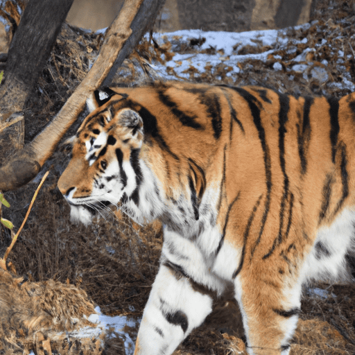
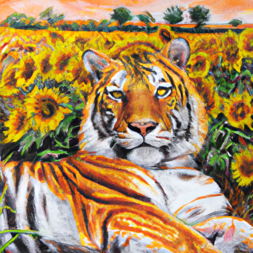

Using models for various different purposes daily has been a satisfying endeavor for me because they can be used as tools to help make your vision for something come to life.
Models are powerful generators that can produce code, writing, images and more based on a user's description of what they want.
But models "fill in the gaps" on behalf of the user to resolve ambiguity in the user's prompt.

Let's take an example of prompting an image model (which I am honestly a bit of a novice at) to generate a picture of a tiger with [DALL·E 2](https://openai.com/index/dall-e-2/).

> An adult tiger

The model has implicitly filled in several gaps in the prompt:

- should the picture be photo realistic, cartoon, watercolor?
- what environment should the tiger be in?
- what should the primary color scheme be?
- should anything else be in the image?

The model outputs what looks like a picture of a tiger, but there are all sorts of aspects of it that aren't true to how you might have envisioned that picture in your head.
If your vision ends at producing an image of _some tiger_, then models might not be very useful, but models really excel at giving you the output you want if you have something more specific in mind.

I use the example of image generation because I personally am not a particularly skilled artist.
However, if I can imagine a scene in my head, I can describe what I want to see in words, and continuously refine that image by tweaking my prompt and running model inference until the image in my head comes to life from my description (or something pretty close to it).
This materialization of one's vision is what I find so powerful about today's models.
Using skills I have (precise language and description), I can provide instructions to models to make something more real from only an idea.
I can do this generating images, writing code or even refining the language I use to describe my own thoughts to others in terms that resonate more clearly with them.

After more than 30 rounds of refinement, I settled on this prompt and image as an example[^1].

[^1]: I didn't use any post-processing techniques like in-painting or editing. This is the raw result from the model. There are subtle changes I might still want to make, like making the right eye look more like the left one, but in general, this image is ~85% true to my vision achieved in ~30 minutes as a relative novice using these tools, but knowing a bit about how prompts work.

> A realistic painting of a majestic adult tiger, center frame, regally sprawled out in the flat, expansive, arid grasslands of Africa, unexpectedly dotted by blooming sunflowers. There is a knowing twinkle in the tiger's eyes, providing recognition of the absurdity of the scene.

With these tools, more than ever before, you can consider what you want to create in the world and get closer to making it real so that others can experience it rather than being limited by the skills you currently possess or the time it used to take to acquire baseline competence at a new skill.
Models are tools you can use to help empower yourself to make your visions reality.

This vision of how models will transform one's abilities is what excites me about the widespread application of this technology.
All of this is something new -- not something that can or should replace art or craft, but rather deepen it and augment our abilities to accomplish more of what we want to see in the world.
There is a lot left to figure out in anticipation of the changes to come, but I'm (maybe naively) optimistic that these changes can be positive.
