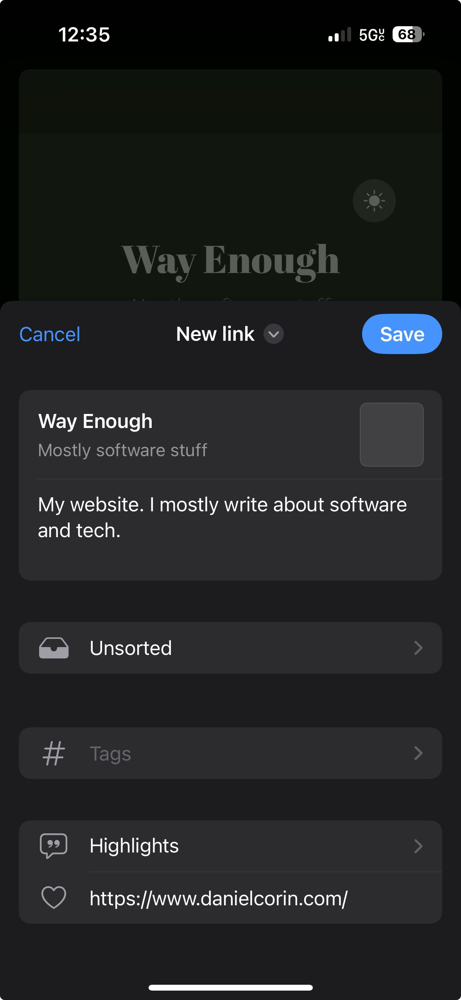

I've been using [Pocket](https://getpocket.com) for a long time to keep track of things on the web that I want to read later.
I save articles on my mobile or from my browser, then revisit them, usually on my desktop.
Some articles I get to quickly.
Others remain in the stack for a long time and can become stale.
Periodically, I scan through everything I've saved and do a bit of house cleaning.

Recently, Pocket stopped supporting their desktop app and now ships the mobile version of the app on the desktop using [Catalyst](https://developer.apple.com/mac-catalyst/) (or something similar).
I'm sad to say it, but I didn't like this change.
This was the first bit of friction.
More recently, I've started to refine my reading and writing workflows.
One specific need I had was to see the date on which I saved an article.
Pocket didn't seem to have an easy solution to this problem.
I started looking for alternatives.

The main options I considered were [Instapaper](https://www.instapaper.com/) and [Raindrop](https://raindrop.io/).
My requirements were:

- Ability to save articles from mobile
- Ability to save articles from a browser
- Ability to see the date I saved an article
- A nice reader mode on desktop

Nice to have:

- An API to view the articles I've saved and any metadata
- Nice reader on mobile

## Why I chose Raindrop

Both Instapaper and Raindrop both met my requirements.
What truly convinced me to choose Raindrop was the capability to add extra metadata such as notes and tags on iOS when I save an article.



I anticipate this will be useful for creating [log](/logs) posts about things I enjoyed reading -- something I do now, but didn't do when I started using Pocket.
In contrast, Instapaper just saves the link immediately (a behavior closer to Pocket's).
I didn't really think about these features as "missing" when I was using Pocket, but now that I have the option, I'm taking it.

## Migrating my data from Pocket

Initially, I was hesitant to try and import my old Pocket saves because there are years of accumulated data.
I decided to go ahead and do it because in the past, whenever I've done a wholesale data purge, I've usually regretted it later.
To complete this process, I [exported](https://getpocket.com/export) my Pocket saves and [imported](https://app.raindrop.io/settings/import) them into Raindrop.
The links are imported into Raindrop in folders called "Unread" and "Read Archive".
I don't have the bandwidth to review or sort these now, but I want them to be available for when I do.
With that, I've fully transitioned from Pocket to Raindrop.

## Pocket had the data I needed

Ironically, the `html` file I exported from Pocket seems to contain the timestamp I was looking for.

```html
<li>
  <a href="https://example.com" time_added="1717501846" tags=""
    >Example bookmark</a
  >
</li>
```

Unfortunately, Pocket doesn't seem to expose this in an easy-to-find way in their UI.

It's the end of an era for me, but I am grateful to the Pocket/Mozilla team who supported the app for as long as I used it, and [Rustem](https://medium.com/@exentrich), who built Raindrop and has made onboarding seamless.
