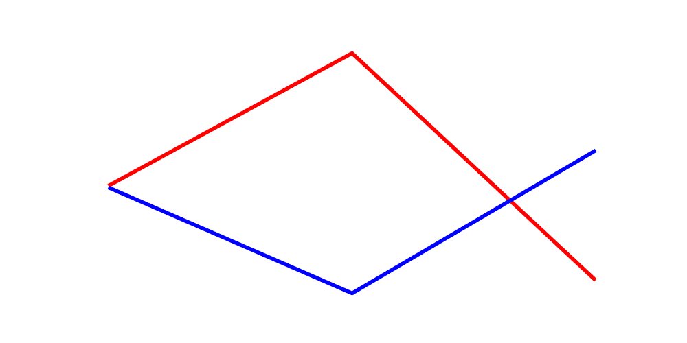

I attempted to reproduce the results for one task from the [VLMs are Blind paper](https://vlmsareblind.github.io/).
Specifically, Task 1: Counting line intersections.
I ran 150 examples of lines generated by the [code from the project](https://github.com/anguyen8/vision-llms-are-blind/blob/9414e9ca6d81b8038d30eef0ac2195bba5c6d55c/src/LineIntersection/GenerateSamples.ipynb) with line thickness 4.

I started with the prompt:

> How many times do the blue and red lines intersect?

using the model `claude-3.5-sonnet` with temperature 0.
The paper reported 73.00% correctness for `claude-3.5-sonnet` with thickness 4.

## Reproducing the experiment

My results were a bit better than those reported in the paper.

```text
Results summary:
Expected count 0: 35/45 correct (Accuracy: 77.78%)
Failed images for count 0:
  - set1/0/image_49_thickness_4.png
  - set1/0/image_95_thickness_4.png
  - set1/0/image_33_thickness_4.png
  - set1/0/image_140_thickness_4.png
  - set1/0/image_26_thickness_4.png
  - set1/0/image_14_thickness_4.png
  - set1/0/image_3_thickness_4.png
  - set1/0/image_21_thickness_4.png
  - set1/0/image_12_thickness_4.png
  - set1/0/image_27_thickness_4.png
Expected count 1: 57/72 correct (Accuracy: 79.17%)
Failed images for count 1:
  - set1/1/image_109_thickness_4.png
  - set1/1/image_22_thickness_4.png
  - set1/1/image_125_thickness_4.png
  - set1/1/image_146_thickness_4.png
  - set1/1/image_100_thickness_4.png
  - set1/1/image_48_thickness_4.png
  - set1/1/image_9_thickness_4.png
  - set1/1/image_107_thickness_4.png
  - set1/1/image_70_thickness_4.png
  - set1/1/image_105_thickness_4.png
  - set1/1/image_38_thickness_4.png
  - set1/1/image_142_thickness_4.png
  - set1/1/image_79_thickness_4.png
  - set1/1/image_28_thickness_4.png
  - set1/1/image_31_thickness_4.png
Expected count 2: 26/33 correct (Accuracy: 78.79%)
Failed images for count 2:
  - set1/2/image_46_thickness_4.png
  - set1/2/image_63_thickness_4.png
  - set1/2/image_16_thickness_4.png
  - set1/2/image_29_thickness_4.png
  - set1/2/image_91_thickness_4.png
  - set1/2/image_87_thickness_4.png
  - set1/2/image_103_thickness_4.png
Overall accuracy: 78.67%
```

## Trying the second prompt from the paper

I ran the original image set with the second prompt to see if that meaningfully changed the success rate.

> How many times do the blue and red line plots cross each other?

This approach had better performance than the first:

```text
Results summary:
Expected count 0: 39/45 correct (Accuracy: 86.67%)
Failed images for count 0:
  - set1/0/image_49_thickness_4.png
  - set1/0/image_95_thickness_4.png
  - set1/0/image_33_thickness_4.png
  - set1/0/image_26_thickness_4.png
  - set1/0/image_14_thickness_4.png
  - set1/0/image_3_thickness_4.png
Expected count 1: 65/72 correct (Accuracy: 90.28%)
Failed images for count 1:
  - set1/1/image_146_thickness_4.png
  - set1/1/image_100_thickness_4.png
  - set1/1/image_11_thickness_4.png
  - set1/1/image_105_thickness_4.png
  - set1/1/image_38_thickness_4.png
  - set1/1/image_142_thickness_4.png
  - set1/1/image_31_thickness_4.png
Expected count 2: 27/33 correct (Accuracy: 81.82%)
Failed images for count 2:
  - set1/2/image_41_thickness_4.png
  - set1/2/image_46_thickness_4.png
  - set1/2/image_63_thickness_4.png
  - set1/2/image_16_thickness_4.png
  - set1/2/image_29_thickness_4.png
  - set1/2/image_52_thickness_4.png
Overall accuracy: 87.33%
```

## Trying a second set of images

To attempt to guard against highly anomalous results, I generated a new set of images and ran both prompts again.


| Intersection Count | Set 1, Prompt 1 | Set 1, Prompt 2 | Set 2, Prompt 1 | Set 2, Prompt 2 |
|--------------------|-----------------|-----------------|-----------------|-----------------|
| 0                  | 77.78%          | 86.67%          | 77.14%          | 85.71%          |
| 1                  | 79.17%          | 90.28%          | 90.91%          | 97.40%          |
| 2                  | 78.79%          | 81.82%          | 84.21%          | 94.74%          |
| Overall            | 78.67%          | 87.33%          | 86.00%          | 94.00%          |


## Conclusions

The prompt that used simpler language appeared to perform better across both sets of images.
I played around with adding additional context (for fun) but all my attempts seemed to make Sonnet perform worse than the prompts enumerated above.
I think it's also worth calling attention to a specific class of model "mistakes".
The following is an example:



In this image, the model "incorrectly" identifies that there are two intersections between the blue and red lines.
The ground truth says there is only one intersection because the lines do not overlap in Cartesian space but the lines in the image actually do overlap due to the thickness of the lines.
If we considered these cases, the reported performance might improve, but I am probably not going to take this investigation much further.
My data indicate the performance of Sonnet is better than what the paper reports, unless my approach has meaningfully diverged from theirs in some way that I'm not understanding.

I embarked on this reproduction because I was surprised to see how poorly models performed at these simple tasks and wanted to validate it for myself.
Early testing with `gpt-4o` yielded results that seemed in alignment with the paper.
I was getting a lot of failures.
However, I think `claude-3.5-sonnet` deserves more credit for its capabilities than was given.

You can find the code and images used for these experiments [here](https://github.com/danielcorin/toys/tree/main/vision-models-arent-blind).
