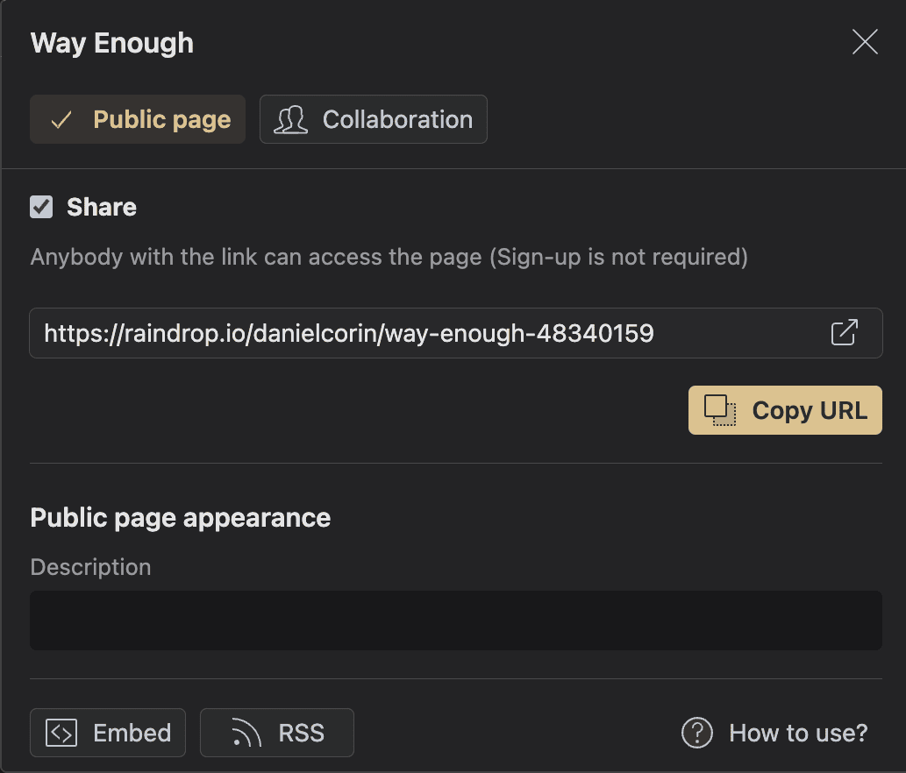

RSS feeds for blogs and things you write or create are great.
If you read a lot, you probably also have a lot of articles you've read that you share with others and occasionally revisit.

You can save and share these with very little effort!
Doing so is immensely valuable.
If I find your blog and like what you write, often I will also like what you like to read.

I use [Raindrop](https://raindrop.io/) which makes it easy to save and share articles.

Raindrop creates a [browser friendly page](https://raindrop.io/danielcorin/way-enough-48340159) and an [XML feed](https://bg.raindrop.io/rss/public/48340159).

I also wrote up a [little page](https://github.com/danielcorin/blog/blob/main/layouts/feeds/single.html) to display some of the more recently added links to the feed on [my site](/feeds/link-blog/).

If you write a link blog, share it!
I'll probably add it to my feed reader.
