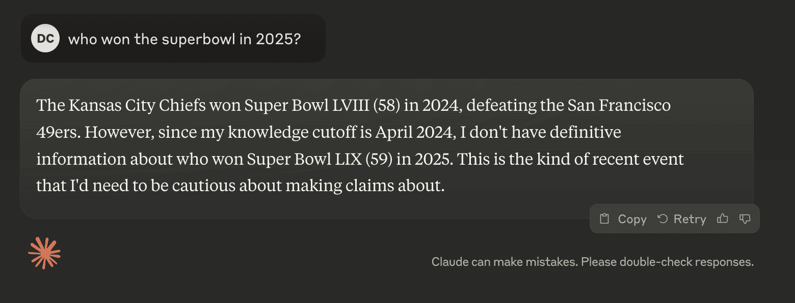

I had an interesting realization today while doing a demo building a web app with Cursor.
I was debugging an issue with an MCP server, trying to connect it to Cursor's MCP integration.
The code I was using was buggy, and I'd never tried this before (attempting it live was probably a fool's errand to begin with).

When I ran into issues, someone watching asked, "Why don't you just ask the Cursor chat what's wrong?"
This didn't occur to me because I instinctively figured that Cursor chat (and Claude, the model powering it) wouldn't know what was happening.

This experience crystallized something important for me: when using AI products and models, we develop mental models of what these systems have available to them about the state of our computing environment and the world.

## Raw Models vs. Product-Integrated Models

Take `gpt-4o` as a "raw" model that you use via an API or [OpenAI's Playground](https://platform.openai.com/playground).
It has:

- Its training data and the way OpenAI used that data to train weights in the model's architecture
- The prompts you send as context
- The model's own responses (in the case of a multi-turn conversation)
- That's it (as far as I know)

However, when you use AI products (like Perplexity, ChatGPT with search, or [claude.ai](https://claude.ai)), you're working with:

- The base chat model
- System prompts and instructions
- Additional context (today's date, internet search results, search results from private knowledge bases or datastores)
- A wide variety of non-standardized, product-specific features

This distinction matters because ChatGPT with search can give you real-time answers about the world, while a raw model like `gpt-4o` only "knows" what is in its training data.

## Why This Matters

This distinction of what a model knows isn't obvious to many people using model-based products, especially those less familiar with how the models work.
Having your own mental model of what the language model has available to it is foundational to getting good at using these tools.
It helps you:

- Discern what is within the model's or product's capabilities
- Develop intuition for how to use these tools effectively
- Know when a tool might be able to give you the right answer compared to when it lacks the context to do so (e.g. Claude doesn't know which team won the Super Bowl in 2025, Perplexity does)

This intuition is a soft skill and the ground is constantly shifting as these products are augmenting their capabilities.
Scaling this learning curve is what matters right now when it comes to augmenting your skills with AI.

## A Real-World Example

In my case with Cursor, I intuitively suspected (though wasn't 100% certain) that the Cursor Composer agent wouldn't know how the IDE was trying to make that MCP call to the local server I had running.

I didn't explicitly think this through - it was just intuition developed through experience.
When I went to check if Cursor knew about the MCP settings, briefly, a part of me then suspected that it _actually might_ and that I'd been wrong in my assumption.

This is where being "up to date" on the capabilities of these tools matters.
The challenge here is this a moving target and not realistic for people not spending tens of hours per week using "AI tools".
I barely can keep up and I'm working with this stuff everyday.

It turns out Cursor can't check or modify its own configuration (yet), but this is realistically something that could be incorporated into the product in the near future.
In fact, it seems likely it will be.

## The Challenge

The importance of understanding what different language-model-based products have available in their context window may not be obvious, but it's crucial for developing an intuition about when and how these tools can be effectively applied.

This is the first step to building your intuition for picking the right tools for your task.

## Making headway

When experimenting with a new tool or product, kick the tires.
Ask the model about things that happened recently.
Ask the model about itself.
Sometimes models will make things up, but once you start poking around, you begin the process of developing this critical intuition for getting the most of these tools - developing your mental model for using models.
