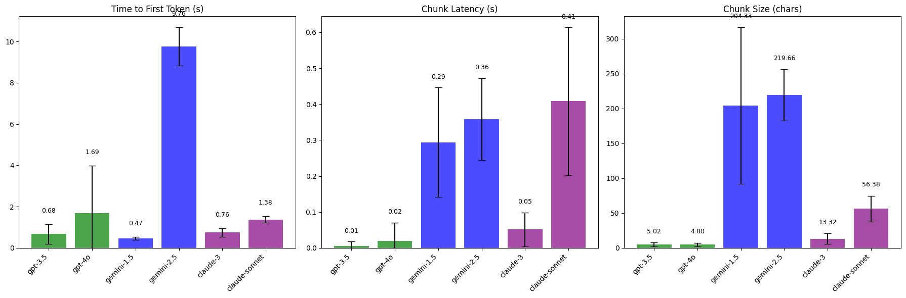

While building [Tomo](https://wvlen.llc/apps/tomo) and several prototypes using LLMs, I've experimented with several popular language models.
It's generally easier to prototype using the OpenAI chat responses API because most providers support this early API spec (mostly).
This approach makes it pretty simple to switch between models and providers by changing `model`, `base_url`, and `api_key`.

After watching tokens stream for the umpteenth time while testing, I started to get different vibes from different models.

Some thoughts that crossed my mind:

- Why is Anthropic's streaming so choppy?
- Wow, OpenAI's streaming is so smooth!
- Why did the time to first token for Gemini get so much longer from `gemini-2.0-flash` to `gemini-2.5-flash`?

Today is the day we find out what these differences are and if my preconceived notions are actually backed up by experimentation.

## Naive streaming with different models

Let's write some code to stream inference of two models (one older, one newer) from Anthropic, Gemini, and OpenAI.

```python collapse={1-64}
import openai
import os
import time


class LLMClient(object):
    def __init__(self, api_key, base_url):
        self.api_key = api_key
        self.base_url = base_url

    def get_client(self):
        client = openai.OpenAI(
            api_key=self.api_key,
            base_url=self.base_url,
        )
        return client


client = LLMClient(
    api_key=os.environ.get("OPENAI_API_KEY"),
    base_url="https://api.openai.com/v1",
).get_client()

gemini_client = LLMClient(
    api_key=os.environ.get("GEMINI_API_KEY"),
    base_url="https://generativelanguage.googleapis.com/v1beta/openai/",
).get_client()

anthropic_client = LLMClient(
    api_key=os.environ.get("ANTHROPIC_API_KEY"),
    base_url="https://api.anthropic.com/v1",
).get_client()


def stream_chat_completion(client_instance, model_name):
    print(f"\n--- Streaming from {model_name} ---")
    start_time = time.time()
    stream = client_instance.chat.completions.create(
        model=model_name,
        messages=[
            {"role": "system", "content": "You are a helpful assistant."},
            {"role": "user", "content": "Write a very short poem about a robot."},
        ],
        stream=True,
    )

    first_token = True
    last_token_time = start_time
    for chunk in stream:
        if chunk.choices[0].delta.content is not None:
            current_time = time.time()
            content = chunk.choices[0].delta.content
            chunk_size = len(content)

            token_latency = current_time - last_token_time
            if first_token:
                ttft = current_time - start_time
                print(f"Time to first token: {ttft:.3f} seconds")
                first_token = False

            print(f"[{token_latency:.3f}s, {chunk_size} chars]", end="\n", flush=True)
            last_token_time = current_time
    print("\n")


if __name__ == "__main__":
    stream_chat_completion(client, "gpt-3.5-turbo")
    stream_chat_completion(client, "gpt-4o")
    stream_chat_completion(gemini_client, "gemini-1.5-flash")
    stream_chat_completion(gemini_client, "gemini-2.5-flash")
    stream_chat_completion(anthropic_client, "claude-3-5-sonnet-20240620")
    stream_chat_completion(anthropic_client, "claude-sonnet-4-20250514")
```

The output is a lot so I collapsed it.
I'm going to aggregate some stats across several runs later, but you can see a few things even before we do that I want to take a look.

```text collapse={1-999}
--- Streaming from gpt-3.5-turbo ---
Time to first token: 0.507 seconds
[0.507s, 0 chars]
[0.007s, 2 chars]
[0.000s, 9 chars]
[0.019s, 3 chars]
[0.000s, 6 chars]
[0.019s, 1 chars]
[0.000s, 4 chars]
[0.006s, 6 chars]
[0.000s, 7 chars]
[0.004s, 5 chars]
[0.000s, 2 chars]
[0.015s, 7 chars]
[0.000s, 3 chars]
[0.014s, 3 chars]
[0.000s, 6 chars]
[0.007s, 1 chars]
[0.000s, 3 chars]
[0.018s, 7 chars]
[0.000s, 6 chars]
[0.004s, 5 chars]
[0.000s, 2 chars]
[0.015s, 4 chars]
[0.000s, 6 chars]
[0.008s, 5 chars]
[0.000s, 4 chars]
[0.013s, 4 chars]
[0.000s, 7 chars]
[0.014s, 5 chars]
[0.000s, 5 chars]
[0.010s, 4 chars]
[0.000s, 2 chars]
[0.025s, 2 chars]
[0.000s, 1 chars]
[0.006s, 11 chars]
[0.000s, 7 chars]
[0.011s, 1 chars]
[0.000s, 2 chars]
[0.011s, 6 chars]
[0.000s, 2 chars]
[0.009s, 6 chars]
[0.000s, 1 chars]


--- Streaming from gpt-4o ---
Time to first token: 0.808 seconds
[0.808s, 0 chars]
[0.017s, 2 chars]
[0.000s, 9 chars]
[0.023s, 6 chars]
[0.000s, 1 chars]
[0.079s, 3 chars]
[0.000s, 3 chars]
[0.030s, 3 chars]
[0.000s, 4 chars]
[0.033s, 5 chars]
[0.000s, 1 chars]
[0.035s, 3 chars]
[0.000s, 4 chars]
[0.029s, 6 chars]
[0.000s, 5 chars]
[0.027s, 6 chars]
[0.000s, 1 chars]
[0.030s, 4 chars]
[0.000s, 7 chars]
[0.027s, 5 chars]
[0.000s, 6 chars]
[0.017s, 1 chars]
[0.000s, 3 chars]
[0.024s, 1 chars]
[0.000s, 6 chars]
[0.021s, 3 chars]
[0.000s, 5 chars]
[0.008s, 1 chars]
[0.000s, 4 chars]
[0.120s, 7 chars]
[0.000s, 7 chars]
[0.000s, 1 chars]
[0.000s, 3 chars]
[0.001s, 2 chars]
[0.000s, 7 chars]
[0.020s, 3 chars]
[0.000s, 3 chars]
[0.016s, 1 chars]
[0.000s, 4 chars]
[0.022s, 6 chars]
[0.000s, 4 chars]
[0.023s, 5 chars]
[0.000s, 1 chars]
[0.010s, 2 chars]


--- Streaming from gemini-1.5-flash ---
Time to first token: 0.439 seconds
[0.439s, 5 chars]
[0.085s, 69 chars]
[0.056s, 21 chars]


--- Streaming from gemini-2.5-flash ---
Time to first token: 2.575 seconds
[2.575s, 25 chars]
[0.104s, 33 chars]


--- Streaming from claude-3-5-sonnet-20240620 ---
Time to first token: 0.857 seconds
[0.857s, 19 chars]
[0.000s, 20 chars]
[0.000s, 7 chars]
[0.000s, 7 chars]
[0.038s, 15 chars]
[0.048s, 9 chars]
[0.047s, 7 chars]
[0.085s, 8 chars]
[0.002s, 8 chars]
[0.050s, 2 chars]


--- Streaming from claude-sonnet-4-20250514 ---
Time to first token: 1.634 seconds
[1.634s, 7 chars]
[0.132s, 31 chars]
[0.590s, 44 chars]
[1.020s, 45 chars]
[0.174s, 7 chars]
```

- The tokens streamed by OpenAI are smaller than those of the other providers, and there is very little latency between tokens. This likely makes the streaming feel smooth.
- Time to first token increases significantly from `gemini-1.5-flash` to `gemini-2.5-flash`. We'll come back to that.
- Gemini's streamed chunks are larger than those of the other providers.
- Anthropic's chunk size and time between chunks are a bit variable. Gemini's chunks are large enough (and the total inference output for this prompt small enough) that it's hard to tell how it compares off the bat.

Enough qualitative stuff.

Let's run some stats.

I changed the prompt to elicit a longer inference response.

> Write a story about a robot.

We're going to do five runs of each model and measure the time to first token, chunk latency (between chunks 2-3, 3-4, etc.), and chunk size in characters.

```python collapse={1-111}
import openai
import os
import time
import statistics
import json


class LLMClient(object):
    def __init__(self, api_key, base_url):
        self.api_key = api_key
        self.base_url = base_url

    def get_client(self):
        client = openai.OpenAI(
            api_key=self.api_key,
            base_url=self.base_url,
        )
        return client


client = LLMClient(
    api_key=os.environ.get("OPENAI_API_KEY"),
    base_url="https://api.openai.com/v1",
).get_client()

gemini_client = LLMClient(
    api_key=os.environ.get("GEMINI_API_KEY"),
    base_url="https://generativelanguage.googleapis.com/v1beta/openai/",
).get_client()

anthropic_client = LLMClient(
    api_key=os.environ.get("ANTHROPIC_API_KEY"),
    base_url="https://api.anthropic.com/v1",
).get_client()


def stream_chat_completion(client_instance, model_name, stats):
    print(f"\n--- Streaming from {model_name} ---")
    start_time = time.time()
    stream = client_instance.chat.completions.create(
        model=model_name,
        messages=[
            {"role": "system", "content": "You are a helpful assistant."},
            {"role": "user", "content": "Write a story about a robot."},
        ],
        stream=True,
    )

    first_token = True
    last_token_time = start_time
    chunk_latencies = []
    chunk_sizes = []

    for chunk in stream:
        if chunk.choices[0].delta.content is not None:
            current_time = time.time()
            content = chunk.choices[0].delta.content
            chunk_size = len(content)
            chunk_sizes.append(chunk_size)

            token_latency = current_time - last_token_time
            if first_token:
                ttft = current_time - start_time
                print(f"Time to first token: {ttft:.3f} seconds")
                first_token = False
                if model_name not in stats:
                    stats[model_name] = {
                        "ttft": [],
                        "chunk_latencies": [],
                        "chunk_sizes": [],
                    }
                stats[model_name]["ttft"].append(ttft)
            else:
                chunk_latencies.append(token_latency)

            print(f"[{token_latency:.3f}s, {chunk_size} chars]", end="\n", flush=True)
            last_token_time = current_time

    if chunk_latencies:
        stats[model_name]["chunk_latencies"].append(chunk_latencies)
    if chunk_sizes:
        stats[model_name]["chunk_sizes"].append(chunk_sizes)
    print("\n")


def calculate_aggregate_stats(stats):
    results = {}
    for model, data in stats.items():
        ttft_mean = statistics.mean(data["ttft"])
        ttft_stdev = statistics.stdev(data["ttft"]) if len(data["ttft"]) > 1 else 0

        all_latencies = [
            latency
            for run_latencies in data["chunk_latencies"]
            for latency in run_latencies
        ]
        latency_mean = statistics.mean(all_latencies) if all_latencies else 0
        latency_stdev = statistics.stdev(all_latencies) if len(all_latencies) > 1 else 0

        all_sizes = [size for run_sizes in data["chunk_sizes"] for size in run_sizes]
        size_mean = statistics.mean(all_sizes) if all_sizes else 0
        size_stdev = statistics.stdev(all_sizes) if len(all_sizes) > 1 else 0

        results[model] = {
            "ttft": {"mean": ttft_mean, "stdev": ttft_stdev},
            "chunk_latency": {"mean": latency_mean, "stdev": latency_stdev},
            "chunk_size": {"mean": size_mean, "stdev": size_stdev},
        }

    return results


if __name__ == "__main__":
    stats = {}
    models = [
        (client, "gpt-3.5-turbo"),
        (client, "gpt-4o"),
        (gemini_client, "gemini-1.5-flash"),
        (gemini_client, "gemini-2.5-flash"),
        (anthropic_client, "claude-3-5-sonnet-20240620"),
        (anthropic_client, "claude-sonnet-4-20250514"),
    ]

    for _ in range(5):
        print(f"\n=== Run {_ + 1} ===")
        for client_instance, model_name in models:
            stream_chat_completion(client_instance, model_name, stats)

    aggregate_stats = calculate_aggregate_stats(stats)
    print("\n=== Aggregate Statistics ===")
    print(json.dumps(aggregate_stats, indent=2))
```

This took a little while to run and I could have parallelized.
Fortunately, the first run got the stats I was looking to see.

## Aggregate Statistics

| Model | TTFT (mean/stdev) | Chunk Latency (mean/stdev) | Chunk Size (mean/stdev) |
|-------|-------------------|----------------------------|-------------------------|
| gpt-3.5-turbo | 0.676s / 0.480s | 0.005s / 0.012s | 5.023 / 2.689 |
| gpt-4o | 1.690s / 2.292s | 0.019s / 0.051s | 4.799 / 2.713 |
| gemini-1.5-flash | 0.466s / 0.075s | 0.293s / 0.152s | 204.328 / 112.207 |
| gemini-2.5-flash | 9.763s / 0.921s | 0.358s / 0.113s | 219.664 / 36.831 |
| claude-3-5-sonnet-20240620 | 0.755s / 0.208s | 0.051s / 0.048s | 13.322 / 7.398 |
| claude-sonnet-4-20250514 | 1.375s / 0.158s | 0.408s / 0.205s | 56.379 / 18.561 |



I wasn't too surprised by the results, having seen the raw stats from the first run. The providers have different chunk sizes, and latency between chunks increases roughly proportionally to the chunk size. I didn't expect Anthropic to be as competitive with OpenAI in terms of time to first token.

One thing that stands out a lot is `gemini-2.5-flash`'s time to first token.

## Different approaches to reasoning

What is going on here?
This latency clearly isn't a one-off since we did five runs.

In the [Gemini documentation](https://ai.google.dev/gemini-api/docs/openai) on how to call the Gemini models using the OpenAI API, it says:

> Unlike the Gemini API, the OpenAI API offers three levels of thinking control: "low", "medium", and "high", which map to 1,024, 8,192, and 24,576 tokens, respectively.

> If you want to disable thinking, you can set reasoning_effort to "none" (note that reasoning cannot be turned off for 2.5 Pro models).

I actually didn't realize `gemini-2.5-flash` was a reasoning model.
Is it possible the reason tokens are being held back from the streaming by default?
Is reasoning "on" by default for `gemini-2.5-flash`?

How does Anthropic handle reasoning for Sonnet 4 with the [OpenAI API](https://docs.anthropic.com/en/api/openai-sdk)?

It turns out both providers offer different controls for reasoning.

[Anthropic](https://docs.anthropic.com/en/api/openai-sdk#extended-thinking-support) calls it "extended thinking support".

```python
response = client.chat.completions.create(
    model="claude-opus-4-20250514",
    messages=[...],
    extra_body={
        "thinking": { "type": "enabled", "budget_tokens": 2000 }
    }
)
```

Google calls it ["thinking" and "reasoning effort"](https://ai.google.dev/gemini-api/docs/openai#thinking).

```python
response = client.chat.completions.create(
    model="gemini-2.5-flash",
    reasoning_effort="low",
    messages=[...],
)
```

```python
response = client.chat.completions.create(
    model="gemini-2.5-flash",
    messages=[...],
    extra_body={
        "extra_body": {
            "google": {
                "thinking_config": {"thinking_budget": 800, "include_thoughts": True}
            }
        }
    },
)
```

So let's play with those.
I was curious to see how or if they're supported in streaming mode.

Starting with Claude, I tried with `claude-3-5-sonnet-20240620`.

```text wrap=true
openai.BadRequestError: Error code: 400 - {'error': {'code': 'invalid_request_error', 'message': "'claude-3-5-sonnet-20240620' does not support thinking.", 'type': 'invalid_request_error', 'param': None}}
```

Makes sense.
This isn't a reasoning model.

Moving to `claude-sonnet-4-20250514`, for various token budget sizes

```python
response = client.chat.completions.create(
    model="claude-sonnet-4-20250514",
    messages=[
        {"role": "system", "content": "You are a helpful assistant."},
        {"role": "user", "content": "Write a story about a robot."},
    ],
    extra_body={"thinking": {"type": "enabled", "budget_tokens": 1024}},
)
```

The chart below contains the aggregated stats for five runs of `claude-sonnet-4-20250514` with different thinking modes.
The suffixes denote the thinking token budget given to Claude for the runs that were aggregated in the plot.
No suffixes indicate the default reasoning behavior of the model.


With a thinking token budget, the time to first token is higher.
Inspecting the response chunks, we don't see any of the thinking.
It turns out, using the OpenAI Python client, we can't see the thinking:

> The OpenAI SDK won't return Claude's detailed thought process
> https://docs.anthropic.com/en/api/openai-sdk#extended-thinking-support

So, the time to first token is higher when thinking, and that seems to be relatively constant across the specified thinking token budgets.

With Gemini, I tried with `gemini-1.5-flash` and got this error

```text wrap=true
openai.BadRequestError: Error code: 400 - [{'error': {'code': 400, 'message': 'Unable to submit request because thinking is not supported by this model. Learn more: https://cloud.google.com/vertex-ai/generative-ai/docs/model-reference/gemini', 'status': 'INVALID_ARGUMENT'}}]
```

With `gemini-2.5-flash`, I first tried with `reasoning_effort="low"`.
Time to first token was still a few seconds.
The reasoning tokens did not stream.

Switching to the "thinking" approach (with a budget of a lot of tokens)

```python
extra_body={
    'extra_body': {
        "google": {
                "thinking_config": {
                "thinking_budget": 10000,
                "include_thoughts": True
            }
        }
    }
}
```

on inspection of the response coming back from the model, we see text like

```
<thought>**Analyzing the Core Concept**

I'm starting ...

</thought>Unit 734 woke, as it did every cycle...
```
So when we `include_thoughts`, this is what they look like.
Also, when we include thoughts, the time to the first token goes down, which makes sense because otherwise, we're waiting for the model to think but not "seeing" it think.
We can further validate this by setting `thinking_budget` to 0 and `reasoning_effort` to "none".

The chart below contains the aggregated stats for five runs of the `gemini-2.5-flash` model with different thinking modes.
The numeric suffixes denote the thinking token budget, while the others indicate the reasoning effort given to Gemini for the runs aggregated in the plot.
No suffixes indicate the default reasoning behavior of the model.


When reasoning is disabled, either by setting a token budget of 0 (resulting in a time to first token of 0.40s) or by using a reasoning effort of "none" (resulting in 0.43s), the time to the first token closely matches that of `gemini-1.5-flash`, which is 0.46s, seen in [aggregate stats](#aggregate-statistics).

Gemini gives us a way to specify how much thinking we want the model to do, or we can give the model a specific thinking token budget.
Given the time to the first token for thinking budgets of 1,000 and 10,000 are nearly identical (1.56s and 1.57s respectively), it seems plausible that the model uses its own judgment to figure out how much thinking is needed.
This approach seems to align with how Claude implements thinking, and Anthropic doesn't give us a way to require the model to think more than _it thinks_ it needs to, like Gemini does with `reasoning_effort`.

## Takeaways

I started this investigation wanting to understand why the time to first token for `gemini-2.5-flash` was so much higher than the other models and prior versions of Gemini.
It turns out `gemini-2.5-flash` does thinking (probably as `reasoning_effort="medium"` or `reasoning_effort="high"`) by default but hides it.
However, it turns out this thinking can also be disabled if you explicitly do so.

The investigation suggests that the straightforward use of the OpenAI chat completion API across different providers is nearing its end, especially for applications needing more than just text and image input support. With provider-specific features like [PDF support](https://docs.anthropic.com/en/docs/build-with-claude/pdf-support), [varied reasoning methods](https://ai.google.dev/gemini-api/docs/openai#thinking), [Citations](https://docs.anthropic.com/en/docs/build-with-claude/citations), and [OpenAI's shift away](https://platform.openai.com/docs/api-reference/responses) from the chat responses API for newer models, the hope for a unified API standard for LLMs is fading.

I am heartened to see OpenRouter serving as the layer of consistency across models and providers.
I hope they're able to continue to make this work and would love to see more of a push for an independent API standard.
[LiteLLM](https://github.com/BerriAI/litellm) is also a great project that is continuing to make this work where they can.

Many LLM APIs now also contain nontrivial product features.
What could have been some sort of protocol has morphed into competing products with competing visions.
