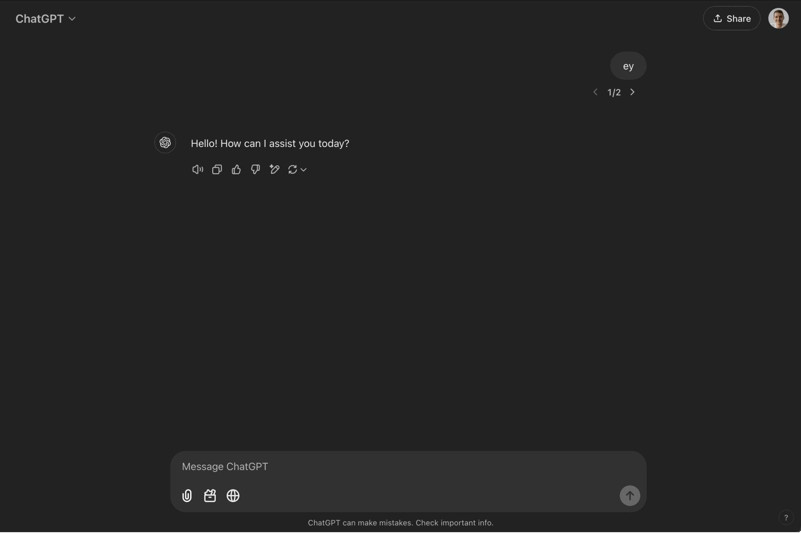

export const messages = [
  {
    id: '1',
    prompt: 'What is machine learning?',
    response:
      'Machine learning is a branch of AI that enables systems to learn from data',
    summary: 'Basic definition and core concept of machine learning',
  },
  {
    id: '2',
    parent_id: '1',
    prompt: 'Can you explain neural networks?',
    response:
      'Neural networks are computing systems inspired by biological brains',
    summary:
      'Introduction to neural networks as brain-inspired computing systems',
  },
  {
    id: '3',
    parent_id: '1',
    prompt: 'What about reinforcement learning?',
    response:
      'Reinforcement learning is learning through interaction with an environment',
    summary: 'Overview of reinforcement learning as environment-based learning',
  },
  {
    id: '4',
    parent_id: '2',
    prompt: 'What are some applications?',
    response:
      'Common applications include image recognition and natural language processing',
    summary:
      'Real-world applications of neural networks in computer vision and NLP',
  },
  {
    id: '5',
    parent_id: '3',
    prompt: 'What are some examples?',
    response:
      'Examples include game playing AIs like AlphaGo and robotics control',
    summary:
      'Concrete examples of reinforcement learning in games and robotics',
  },
];

export const moreMessages = [
  {
    id: '1',
    prompt: 'What is machine learning?',
    response:
      'Machine learning is a branch of AI that enables systems to learn from data',
    summary: 'Basic definition and core concept of machine learning',
    embedding_2d: [-0.8704802293794979, 1.6597547868477167],
  },
  {
    id: '2',
    parent_id: '1',
    prompt: 'What are the ethical concerns?',
    response:
      'Key ethical concerns include bias in training data, privacy issues, and potential job displacement',
    summary: 'Overview of ML ethics and societal impact',
    embedding_2d: [-2.357171023654697, -3.6926941840950964],
  },
  {
    id: '3',
    parent_id: '1',
    prompt: 'How is it used in healthcare?',
    response:
      'ML is used for disease diagnosis, drug discovery, and personalized treatment plans',
    summary: 'Applications of ML in medical field',
    embedding_2d: [-6.512378918799455, -3.4844864717193667],
  },
  {
    id: '4',
    parent_id: '1',
    prompt: 'What programming languages are used?',
    response:
      'Popular languages include Python, R, and Julia with frameworks like TensorFlow and PyTorch',
    summary: 'Programming tools for ML development',
    embedding_2d: [-2.979766807873413, 6.468533476095193],
  },
  {
    id: '5',
    parent_id: '2',
    prompt: 'How can we address algorithmic bias?',
    response:
      'Through diverse training data, regular audits, and transparent model development processes',
    summary: 'Solutions for addressing ML bias',
    embedding_2d: [-4.210181372227558, 4.8947246978693535],
  },
  {
    id: '6',
    parent_id: '3',
    prompt: 'Tell me about radiology applications',
    response:
      'ML assists in analyzing medical images to detect tumors, fractures, and other abnormalities',
    summary: 'ML in medical imaging',
    embedding_2d: [-6.745846105849347, -5.684692915936991],
  },
  {
    id: '7',
    parent_id: '4',
    prompt: 'What is PyTorch?',
    response:
      'PyTorch is a deep learning framework developed by Facebook, known for its dynamic computational graphs',
    summary: 'Overview of PyTorch framework',
    embedding_2d: [15.01975299992652, -2.9826768789456524],
  },
  {
    id: '8',
    parent_id: '4',
    prompt: 'How does Julia compare to Python?',
    response:
      'Julia offers better performance and mathematical syntax, but has a smaller ecosystem than Python',
    summary: 'Julia vs Python for ML',
    embedding_2d: [0.31194656885226835, 10.155799442766826],
  },
  {
    id: '9',
    parent_id: '6',
    prompt: 'What about FDA approval?',
    response:
      'ML medical tools require rigorous validation and regulatory approval processes',
    summary: 'Regulatory aspects of ML in healthcare',
    embedding_2d: [-6.16826307182544, -5.785657819336929],
  },
  {
    id: '10',
    parent_id: '7',
    prompt: 'Compare PyTorch and TensorFlow',
    response:
      'PyTorch is more pythonic and flexible, while TensorFlow has better production tools',
    summary: 'PyTorch vs TensorFlow comparison',
    embedding_2d: [14.512387960830605, -1.5486041335450467],
  },
];

import Aside from '@components/prose/Aside.astro';

<Aside type="tip" mobileOnly>
  The interactive visuals in the post don't play so nice on small devices. You
  can still enjoy on your phone but be sure to check them out later on a bigger
  screen.
</Aside>

I wrote about [Conversation Branching](https://www.danielcorin.com/posts/2024/conversation-branching/) on my main blog and I've been prototyping an LLM chat app called [Delta](https://www.danielcorin.com/projects/delta/) that has first-class conversation branching.
LLM conversations typically follow a linear path, making it unintuitive to explore alternative directions or recover from miscommunications.
This post is an interactive introduction to conversation branching but also an exploration into additional UX patterns that using a canvas can enable.

Here are the basic primitives of conversation branching.
Click any node on the left.
The conversation on the right updates to show the prompts and responses (since we're modeling an LLM conversation).

import ChatAndTree from './components/ChatAndTree';

<ChatAndTree messages={messages} client:load />

The motivation behind conversation branching is multifold

## Keep the context clean

Language models can be sensitive to typos or ambiguous phrases that send the conversation in the wrong direction.
Often, if you notice the model is misunderstanding you, it's more effective to delete the previous conversation turn or update your message.
ChatGPT actually provides subtle support for branching with the message "edit" feature.

## Explore parallel threads, maintaining conversation history

While editing message and implicit branching helps keep the context clean, making branches visible and navigable adds additional depth.
We now can explore multiple lines of thinking from a shared starting premise, while maintaining the integrity of the context, keeping the LLM focused on the thing you care about, in each of the branches.

import ZoomableTree from './components/ZoomableTree';

<ZoomableTree messages={moreMessages} client:load />

We're now exploring multiple lines of thought branching off of the original question "What is machine learning?".
As above, we could navigate any of these branches individually and linearly by clicking on a node, and branch off any node with a new message.
However, the canvas has a ton of content, making it difficult to navigate or get an at-a-glance sense of what each node contains.

LLMs can help us here.
We can summarize each node based on the prompt and response, then show summaries when zoomed out to make the content more digestible at a high level.

<ZoomableTree messages={moreMessages} summaryZoomLevel={0.9} client:load />

Try zooming in and out on either of the last two visualizations to see how the content adapts based on zoom level.

## Semantic clustering and exploration

With concise summaries, we can now add a new perspective to these conversations.
If we generate embeddings of the summaries, which gives us a list of floats for each summary, we can then apply [Principal Component Analysis](https://en.wikipedia.org/wiki/Principal_component_analysis) to reduce the many dimensions down to just two.
Finally, we use those two floats as coordinates to position each of the conversation nodes, clustering them by their semantic similarity.

Here are the results:

import ClusteredTree from './components/ClusteredTree';

<ClusteredTree messages={moreMessages} client:load />

By my assessment, there are three main categories

- ML and programming languages/development (bottom left)
- ML and medicine/society (top left)
- PyTorch (top right)

Equidistant from the three clusters is the more generic, start message.

I always find it interesting to explore latent space like this.
Doing so with a conversation is a bit like blazing a trail and identifying new terrain, seeing where similar pieces fit together and finding unexplored areas in the negative spaces.
