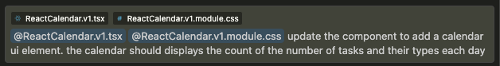

import Aside from '@components/prose/Aside.astro';
import Chat from '@components/prose/Chat.astro';
import CodeBlock from '@components/prose/CodeBlock.astro';
import { Image } from 'astro:assets';

If you've experimented with [Claude Artifacts](https://support.anthropic.com/en/articles/9487310-what-are-artifacts-and-how-do-i-use-them) or [v0.dev](https://v0.dev/), maybe you've been delighted (as I have) that the language model can conjure a UI for an idea you describe.
Most of my experience building software, especially professionally, comes from working on the "backend".
Building frontend (read: user interfaces in a browser) is harder for me (or doesn't come as easily), because while I have experience writing software, I don't have as much experience writing _this type_ of software.

## The "Magic" Stack

When generating UI, one specific stack has proven to be both popular and effective relative to the technologies I have tried.
That stack is React and Tailwind.

Both Claude Artifacts and v0 use these technologies by default and there is a reason why.
For the language model, co-locating the component styling with the structural markup is highly effective and steerable by prompting.

## Comparing Different Approaches

Given the following prompt, here's what `claude-3-5-sonnet-20241022` generates in Cursor (the components below are real, working React code - try them out!).

<Aside type="note" mobileOnly>
  I made a few minor adjustments post-generation to the components to ensure
  they render nicely on small screens
</Aside>

<Aside type="note" darkModeOnly>
  I made minor adjustments to the color schemes of the components after
  generation to play nice with dark mode of this site. The changes I made keep
  the color scheme true to what the model output rather than match the site
  style.
</Aside>

<Chat
  model="claude-3-5-sonnet-20241022"
  messages={[
    {
      role: 'user',
      content:
        'use react, tailwind and lucide-react to create an interface for a bullet-journal inspired calendar',
    },
  ]}
/>

import { default as TailwindCalendarV1 } from './components/TailwindCalendarv1';
import TailwindCalendarV1Source from './components/TailwindCalendarv1?raw';

<TailwindCalendarV1 client:load />

<CodeBlock
  code={TailwindCalendarV1Source}
  lang="tsx"
  title="TailwindCalendar.v1.tsx"
/>

<Chat
  model="claude-3-5-sonnet-20241022"
  messages={[
    {
      role: 'user',
      content:
        'use react and lucide-react to create an interface for a bullet-journal inspired calendar. output the react component with styles and a corresponding css module',
    },
  ]}
/>

import { default as ReactCalendarV1 } from './components/ReactCalendar.v1';
import ReactCalendarV1Source from './components/ReactCalendar.v1?raw';

<ReactCalendarV1 client:load />

<CodeBlock
  code={ReactCalendarV1Source}
  lang="tsx"
  title="ReactCalendar.v1.tsx"
/>

Not much difference between these two from the user's perspective.
Pretty straightforward LLM UI output with lots of opportunities for improvement.

The former component exists entirely within a single `.tsx` file.
The latter has the markup and style separated into `.tsx` and `.css.module` files.

## Iterating on the Initial Design

Inevitably, we will want to make changes to the first iteration from the model.
Let's add a calendar component so we can see the number of tasks that have been input on each day.

<Chat
  model="claude-3-5-sonnet-20241022"
  messages={[
    {
      role: 'user',
      content:
        'update the component to add a calendar ui element. the calendar should display the count of the number of tasks and their types each day',
    },
  ]}
/>

import { default as TailwindCalendarV2 } from './components/TailwindCalendarv2';
import TailwindCalendarV2Source from './components/TailwindCalendarv2?raw';

<TailwindCalendarV2 client:load />

<CodeBlock
  code={TailwindCalendarV2Source}
  lang="tsx"
  title="TailwindCalendar.v2.tsx"
/>

## The Multi-File Challenge

To do the same for our two-file approach, we now need to start thinking about what context we're going to provide to the model.
Ideally, we would generate diffs to the existing files, as this is one of the faster and more efficient ways we could make changes.
There are many new tools available that can facilitate multi-file changes but needing to coordinate changes across multiple files adds complexity compared to the single-file approach.
For simplicity, let's send both files to the LLM and make the same ask (I'll @-ref both files in Cursor in that chat, then send the same prompt from above).



Cursor outputs code like

```tsx showLineNumbers=false
// ... existing imports ...
import { eachDayOfInterval, endOfMonth, format, startOfMonth, isSameDay } from 'date-fns'

export default function Calendar() {
    // ... existing state ...
```

and

```css showLineNumbers=false
/* ... existing styles ... */

.calendar {
  display: grid;
  grid-template-columns: repeat(7, 1fr);
  gap: 4px;
  margin-bottom: 2rem;
}
```

so now I manually need to apply these changes (Cursor Pro has a model that supports one-click application of code changes from chat, but I'm trying to stick to just using the model for now).

Oh, and it looks like the model actually introduced new code using dependencies we don't have installed

```tsx showLineNumbers=false
import {
  eachDayOfInterval,
  endOfMonth,
  format,
  isSameDay,
  startOfMonth,
} from 'date-fns';
```

This type of things (arguably a hallucination of sorts) happens a lot less when making changes in a single file.
I hear you, it's not a fair comparison: Tailwind in-file to CSS with a separate module file.
Let's put all the CSS styles in the same file then compare what it's like to iterate.

<Chat
  messages={[
    {
      role: 'user',
      content:
        'use react and lucide-react to create an interface for a bullet-journal inspired calendar. output the react component with css styles all in one file',
    },
  ]}
/>

import { default as CssCalendarV1 } from './components/CssCalendarv1';
import CssCalendarV1Source from './components/CssCalendarv1?raw';

<CssCalendarV1 client:load />

<CodeBlock code={CssCalendarV1Source} lang="tsx" title="CssCalendar.v1.tsx" />

Now, let's transform that single file with the second prompt

<Chat
  messages={[
    {
      role: 'user',
      content:
        'update the component to add a calendar ui element. the calendar should display the count of the number of tasks and their types each day',
    },
  ]}
/>

import { default as CssCalendarV2 } from './components/CssCalendarv2';
import CssCalendarV2Source from './components/CssCalendarv2?raw';

<CssCalendarV2 client:load />

<CodeBlock code={CssCalendarV2Source} lang="tsx" title="CssCalendarv2.tsx" />

Not bad!
So what am I complaining about?

Using a model to prompt for edits to a React component with styles defined as CSS, even in the same file, pretty much always requires a full-file rewrite.

Why?

The React component with in-file CSS styles has the following structure

```tsx showLineNumbers=false
import { useMemo, useState } from 'react';

// other imports

const styles = {
  // 1. styles
};

export default function Calendar() {
  // 2. functions and logic

  return (
    <div style={styles.container}>
      {
        // 3. logic and markup
      }
    </div>
  );
}
```

## Comparing diffs

When we prompt to make updates in the UI, we will almost always be making changes in areas 1 and 3 to implement new or modified functionality.

With Tailwind, the styles live right on the React markup as `className`s.
We can easily highlight and select smaller regions of the code and prompt the model using a tool like Cursor to make changes.
This approach is more token-efficient and as a result, is faster and cheaper.
It also encourages a more holistic understanding of the code you're working with as a developer.
In my experience using models to generate code, the less thinking you do or the less you understand, the less likely what you're attempting is going to work.

Here is the diff between the two versions of the component with CSS styles in-file:

```tsx ins={8} ins={20} ins={29-30} ins={38-60} ins={67} ins={76-77} ins={85-109} ins={115-120} ins={139-172} ins={175} ins={184-193} del={7} del={19} del={28} del={75} del={128-138} del={174} del={177-183}
diff --git a/src/content/notes/2025/llm-tailwind-react/components/CssCalendar.v1.tsx b/src/content/notes/2025/llm-tailwind-react/components/CssCalendar.v2.tsx
index 2b34248..e177c5a 100644
--- a/src/content/notes/2025/llm-tailwind-react/components/CssCalendar.v1.tsx
+++ b/src/content/notes/2025/llm-tailwind-react/components/CssCalendar.v2.tsx
@@ -1,15 +1,16 @@
 import { Circle, CheckCircle2, Square, XCircle } from 'lucide-react'
 import { useState } from 'react'
 import { useState, useMemo } from 'react'

 type Task = {
     id: string
     text: string
     status: 'todo' | 'done' | 'migrated' | 'cancelled'
     date: string
 }

 const styles = {
     container: {
         maxWidth: '600px',
         maxWidth: '800px',
         margin: '0 auto',
         padding: '2rem',
         backgroundColor: 'white',
@@ -45,7 +46,8 @@ const styles = {
     taskList: {
         display: 'flex',
         flexDirection: 'column' as const,
         gap: '0.5rem'
         gap: '0.5rem',
         marginBottom: '2rem'
     },
     task: {
         display: 'flex',
@@ -62,12 +64,36 @@ const styles = {
         cursor: 'pointer',
         display: 'flex',
         alignItems: 'center'
     },
     calendar: {
         display: 'grid',
         gridTemplateColumns: 'repeat(7, 1fr)',
         gap: '4px',
         padding: '1rem'
     },
     calendarDay: {
         padding: '0.5rem',
         border: '1px solid #eee',
         borderRadius: '4px',
         minHeight: '80px'
     },
     dayHeader: {
         fontSize: '0.875rem',
         marginBottom: '0.5rem',
         color: '#666'
     },
     stats: {
         fontSize: '0.75rem',
         display: 'flex',
         flexDirection: 'column' as const,
         gap: '2px'
     }
 }

 export default function Calendar() {
     const [tasks, setTasks] = useState<Task[]>([])
     const [newTask, setNewTask] = useState('')
     const [selectedDate, setSelectedDate] = useState(new Date().toISOString().split('T')[0])

     const addTask = () => {
         if (!newTask.trim()) return
@@ -75,7 +101,8 @@ export default function Calendar() {
         setTasks(prev => [...prev, {
             id: crypto.randomUUID(),
             text: newTask,
             status: 'todo'
             status: 'todo',
             date: selectedDate
         }])
         setNewTask('')
     }
@@ -97,11 +124,42 @@ export default function Calendar() {
         }
     }

     const calendarDays = useMemo(() => {
         const today = new Date()
         const start = new Date(today.getFullYear(), today.getMonth(), 1)
         const end = new Date(today.getFullYear(), today.getMonth() + 1, 0)
         const days = []

         for (let d = new Date(start); d <= end; d.setDate(d.getDate() + 1)) {
             days.push(new Date(d))
         }

         return days
     }, [])

     const getTaskStats = (date: Date) => {
         const dateStr = date.toISOString().split('T')[0]
         const dayTasks = tasks.filter(t => t.date === dateStr)

         return {
             todo: dayTasks.filter(t => t.status === 'todo').length,
             done: dayTasks.filter(t => t.status === 'done').length,
             migrated: dayTasks.filter(t => t.status === 'migrated').length,
             cancelled: dayTasks.filter(t => t.status === 'cancelled').length
         }
     }

     return (
         <div style={styles.container}>
             <div style={styles.header}>Bullet Journal</div>

             <div style={styles.taskInput}>
                 <input
                     type="date"
                     value={selectedDate}
                     onChange={e => setSelectedDate(e.target.value)}
                     style={{ ...styles.input, flex: '0 0 auto' }}
                 />
                 <input
                     type="text"
                     value={newTask}
@@ -116,27 +174,53 @@ export default function Calendar() {
             </div>

             <div style={styles.taskList}>
                 {tasks.map(task => (
                     <div key={task.id} style={styles.task}>
                         <button
                             onClick={() => {
                                 const nextStatus: Record<Task['status'], Task['status']> = {
                                     todo: 'done',
                                     done: 'migrated',
                                     migrated: 'cancelled',
                                     cancelled: 'todo'
                                 }
                                 updateTaskStatus(task.id, nextStatus[task.status])
                 {tasks
                     .filter(task => task.date === selectedDate)
                     .map(task => (
                         <div key={task.id} style={styles.task}>
                             <button
                                 onClick={() => {
                                     const nextStatus: Record<Task['status'], Task['status']> = {
                                         todo: 'done',
                                         done: 'migrated',
                                         migrated: 'cancelled',
                                         cancelled: 'todo'
                                     }
                                     updateTaskStatus(task.id, nextStatus[task.status])
                                 }}
                                 style={styles.statusButton}
                             >
                                 {getStatusIcon(task.status)}
                             </button>
                             <span style={task.status === 'done' ? { textDecoration: 'line-through', color: '#999' } : {}}>
                                 {task.text}
                             </span>
                         </div>
                     ))}
             </div>

             <div style={styles.calendar}>
                 {calendarDays.map(day => {
                     const stats = getTaskStats(day)
                     return (
                         <div
                             key={day.toISOString()}
                             style={{
                                 ...styles.calendarDay,
                                 backgroundColor: day.toISOString().split('T')[0] === selectedDate ? '#f0f0f0' : 'white'
                             }}
                             style={styles.statusButton}
                             onClick={() => setSelectedDate(day.toISOString().split('T')[0])}
                         >
                             {getStatusIcon(task.status)}
                         </button>
                         <span style={task.status === 'done' ? { textDecoration: 'line-through', color: '#999' } : {}}>
                             {task.text}
                         </span>
                     </div>
                 ))}
                             <div style={styles.dayHeader}>{day.getDate()}</div>
                             <div style={styles.stats}>
                                 {stats.todo > 0 && <div style={{ color: '#666' }}>○ {stats.todo}</div>}
                                 {stats.done > 0 && <div style={{ color: '#22c55e' }}>✓ {stats.done}</div>}
                                 {stats.migrated > 0 && <div style={{ color: '#3b82f6' }}>□ {stats.migrated}</div>}
                                 {stats.cancelled > 0 && <div style={{ color: '#ef4444' }}>× {stats.cancelled}</div>}
                             </div>
                         </div>
                     )
                 })}
             </div>
         </div>
     )
```

Compare these two distinct areas of change to the changes in the versions using Tailwind:

```tsx ins={9-44} ins={47} ins={60-86} del={46} del={53-59}
diff --git a/src/content/notes/2025/llm-tailwind-react/components/TailwindCalendar.v1.tsx b/src/content/notes/2025/llm-tailwind-react/components/TailwindCalendar.v2.tsx
index 16574eb..d4767ff 100644
--- a/src/content/notes/2025/llm-tailwind-react/components/TailwindCalendar.v1.tsx
+++ b/src/content/notes/2025/llm-tailwind-react/components/TailwindCalendar.v2.tsx
@@ -77,20 +77,76 @@ export default function Calendar() {
         entry.date.toDateString() === selectedDate.toDateString()
     )

     const getDaysInMonth = (date: Date) => {
         const year = date.getFullYear()
         const month = date.getMonth()
         const firstDay = new Date(year, month, 1)
         const lastDay = new Date(year, month + 1, 0)
         const days = []

         for (let i = 0; i < firstDay.getDay(); i++) {
             days.push(null)
         }

         for (let i = 1; i <= lastDay.getDate(); i++) {
             days.push(new Date(year, month, i))
          }

         return days
     }

     const getTaskStats = (date: Date) => {
         const entry = entries.find(e => e.date.toDateString() === date.toDateString())
         if (!entry) return null

         const stats = {
             todo: 0,
             done: 0,
             migrated: 0,
             cancelled: 0
         }

         entry.tasks.forEach(task => {
             stats[task.status]++
         })

         return stats
     }

     return (
         <div className="max-w-2xl mx-auto p-8 bg-white rounded-lg shadow-md">
         <div className="max-w-4xl mx-auto p-8 bg-white rounded-lg shadow-md">
             <div className="flex items-center gap-4 mb-8">
                 <CalendarIcon className="w-6 h-6 text-gray-600" />
                 <h1 className="text-2xl font-semibold">Bullet Journal</h1>
             </div>

             <div className="mb-8">
                 <input
                     type="date"
                     value={selectedDate.toISOString().split('T')[0]}
                     onChange={e => setSelectedDate(new Date(e.target.value))}
                     className="px-4 py-2 border border-gray-300 rounded-md focus:outline-none focus:ring-2 focus:ring-blue-500"
                 />
             <div className="grid grid-cols-7 gap-1 mb-8 text-center">
                 {['Sun', 'Mon', 'Tue', 'Wed', 'Thu', 'Fri', 'Sat'].map(day => (
                     <div key={day} className="font-semibold py-2">{day}</div>
                 ))}
                 {getDaysInMonth(selectedDate).map((date, i) => (
                     <div
                         key={i}
                         className={`p-2 min-h-[100px] border ${date?.toDateString() === selectedDate.toDateString() ? 'border-blue-500' : 'border-gray-200'} rounded-md ${date ? 'cursor-pointer hover:bg-gray-50' : ''}`}
                         onClick={() => date && setSelectedDate(date)}
                     >
                         {date && (
                             <>
                                 <div className="text-right text-gray-600">{date.getDate()}</div>
                                 {getTaskStats(date) && (
                                     <div className="mt-1 text-xs space-y-1">
                                         {Object.entries(getTaskStats(date)!).map(([status, count]) => count > 0 && (
                                             <div key={status} className="flex items-center justify-between">
                                                 {getStatusIcon(status as Task['status'])}
                                                 <span>{count}</span>
                                             </div>
                                         ))}
                                     </div>
                                 )}
                             </>
                         )}
                     </div>
                 ))}
             </div>

             <div className="flex gap-4 mb-8">
```

## The Efficiency of Tailwind with LLMs

A diff of about half the number of lines is needed to make the prompted changes in the Tailwind component.
This does not suggest a Tailwind approach is necessarily better than others, but rather that a language model is more effective at following instructions requiring small, more localized modifications.
Thus, if you use Tailwind/React, you have an easier time iterating and building with a language partner than several other approaches and project structures.
This understanding is implicitly reflected in the approaches taken by default (presumably prompted into) tools like Claude Artifacts and v0.
However, not all models and tools take this approach by default - it's not the only way to quickly build UIs with language models, but it is a highly effective and fast way.

For completeness, here are some tools that _don't_ seem to use React and Tailwind by default:

- Val Town's [Townie](https://www.val.town/)
- ChatGPT Canvas

## Model Biases and Context Influence

It's also possible that `claude-3-5-sonnet-20241022`, one of the most popular models for coding, has a propensity for writing React/Tailwind code, which could influence the approaches taken by popular tools.
When prompting Claude with similar prompts as above, I usually get React code, even when I don't ask for it.
With other popular models like `deepseek-chat` or `gpt-4`, I don't always get React.
Sometimes I just get plain HTML or other frameworks like Vue (when I prompt for everything in a single file).

Part of the behavior we're seeing is context-specific as well.
When you prompt the model to create a component like the one we've described, if I am working in Cursor and in a file called `<whatever>.tsx`, that gets passed to the model as context and influences the code it generates.
It would definitely _not_ be what we wanted if we got Vue code in our `.tsx` file.

As someone who has leaned heavily on LLMs to write UIs for me, I've found React and Tailwind to be a particularly potent combination for fast iteration.
After diving into the actual code structure above, why that is now makes a bit more sense.
