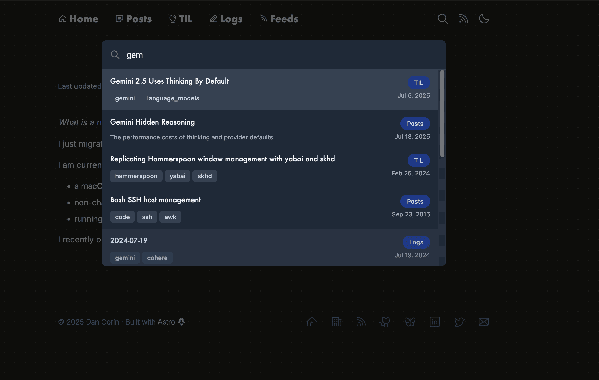

import Sidenote from '@components/prose/Sidenote.astro'

I've run Thought Eddies as a more dynamic, experimental blog since the beginning of this year.
I'd heard about Astro and wanted to put a more personal touch on my web presence.

I wrote an article here or there and then one day, after I'd run into a bit of a block working on [Tomo](https://wvlen.llc/apps/tomo), I had the itch to build [Thought Eddies](https://github.com/danielcorin/thought-eddies) out.

I have several post types I write frequently, so I needed to build sections for those.
Then I added support for a bunch of the [shortcodes](https://github.com/danielcorin/blog/tree/main/layouts/shortcodes) I'd built over the years in Hugo as well as URL aliases.
I _try_ to keep all my old links alive and redirecting properly.

Combined with the strong ecosystem of Astro and LLMs, I was able to build and migrate nearly all the content within about a week.

One of the finishing touches was a search that I practically one-shotted with an agent, that was _exactly_ what I wanted.



I wanted to build something like the search page on my previous site, which loaded all the site content client-side and did a client-side search as well.
It wasn't efficient but it worked and didn't require a backend.
I never had any problems with it and my site was building fast and loading fine.

So I added this search modal, triggered by <kbd>⌘</kbd>+<kbd>k</kbd> on any page, I finished migrating over my content, and I started building and deploying the site.
And wow was it slow.
Almost three minutes on my local and almost 15 on CI.

What?

I started searching around and reading the Astro Discord, looking for reports of slow builds.
My site isn't big.
There aren't many images.

So I ran the build a bunch and started inspecting what was slow.
One major problem were the number of Open Graph images I was generating.

<Sidenote content="I was pretty proud of this and thought the preview looked pretty good when sending site links in Slack or Messages">I had a custom one per page.</Sidenote>

That was not a great idea.
Each took a few 100ms to build.
I tried switching to a different library, started taking more than one second each.

Ok, no problem.
One Open Graph image per site section is fine.

The build is still more than two minutes.

At several points over the course of a few days, I open devtools and view the website source.
It doesn't fully load.
Waterfox is buggy?
I didn't really know.

I almost noticed the site was taking ~500ms to load.
_Just_ slow enough to be annoying.

Hugo (the static site generator I used to build my [previous site](https://github.com/danielcorin/blog)) claims to be fast and there is much talk about how the Javascript web (and Astro by proxy) can be slow and bloated, but was it really this bad?
How had I never run into performance _this bad_ before?
I'd built an [Electron app](https://github.com/danielcorin/delta) of far greater complexity and even that tooling seems nicer than this.

Eventually, I needed to see for myself.
These were static HTML pages after all.
At build time, a webserver starts and a process requests the content for each page, then persists it as a static HTML file to be served in production.
No API calls.

What was taking so long?

I pulled down a page of the site and started to look around

```sh
curl "https://www.thoughteddies.com/posts/2025/find-the-groove" > out.html
vi out.html
```
I saw the page content, a bunch of CSS across the different components, some `<path>`s, and then I started to see my post content.

Not for the page I was on but for all of the pages across the site.

And then it dawned on me.
My seemingly innocuous, static search required all the content from across my site for the search to work.

Every HTML page contained the full content of the entire site.

Classic 🤦

Removing the search functionality from every page brought the site build time down to around 10 seconds total.
_By no means_ fast or reasonable all you web purists will tell me because the web is HTML, CSS, and vanilla JavaScript and everything should be 10kb and load in milliseconds.
But totally workable for me to build a blog with and have a fine time.
