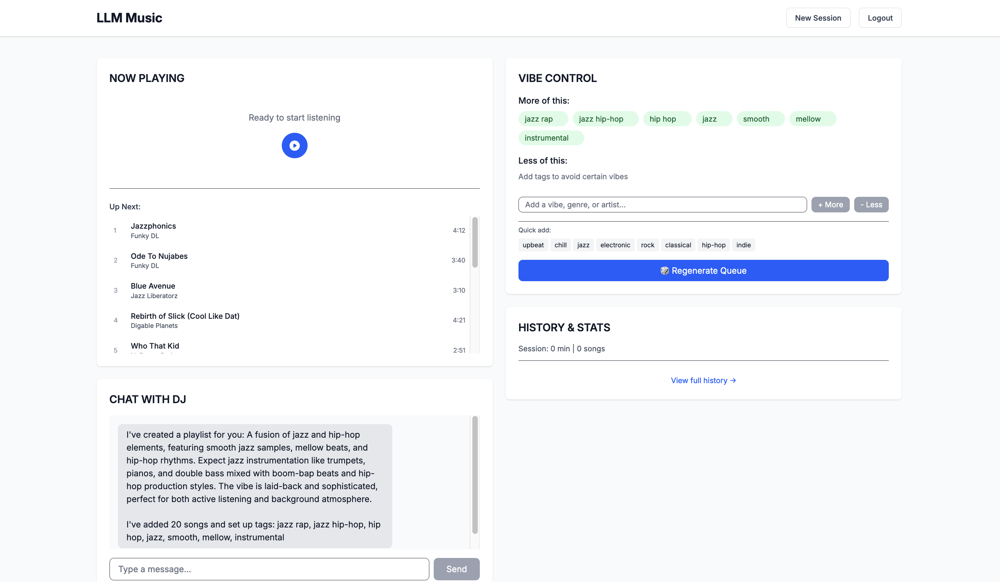

I use code agents to help me code in various capacities.
Everything from fully "vibe coded" tools to scripts to specific, well described tasks.

I'd had an itch to work on an idea after using Sonnet 4 for music recommendations.

The idea at its core was to use a chat with an LLM to generate and update a running playlist based on feedback from the user.
My thought was I could describe the vibe I was looking to create with the music and the LLM could help make that happen.

My hope was it would introduce me to new artists and songs I might not have otherwise discovered.
This had been the case when I chatted with Sonnet about the playlist I was building but the process was quite manual and I wanted to smooth over the rough edges.

## Can an agent just do this?

This is one of those projects that lands in the "would be cool" but "not worth that many hours" that language model and coding agents address nicely.
Also, the stakes are low and it can all run locally.
On my way to get coffee with a friend, I dictated for about 20 minutes, rambling about how this would work, what the UI would look like, what the model would generate, that it needed to integrate with Spotify.
I did speech to text on this audio, then I prompted the model to create a functional requirements document that I read and edited.
From that, I prompted the model to create a design document that I also read and edited.

I chose to use [React Router](https://reactrouter.com/) for the project, so I scaffolded a new project.
Then I created an `AGENT.md` file (I didn't use [Amp](https://ampcode.com/) but I keep this standard for any agent I use) and then had it track its progress in a `plan.md` file.
Then I sent the agent on its way.

Periodically, the agent would finish a stage of the implementation and I would run the dev server and test it could.
I'd prompt the agent with any issue I was having until it fixed them.
Then I prompted it to move on to the next stage.

I repeated this process for a little over an hour and a half, while my attention occasionally wandered elsewhere.

Eventually, the agent finished the implementation and I was able to try it out.

## Problems

The Spotify integration required some manual setup, to get a client id and secret.
I didn't do this entirely correctly and it took a bit of back and forth to setup the redirect URI properly.

Streaming from Spotify in a browser wasn't so easy for the model.
I've never done this by hand before, but it took several correction loops before clicking the "play" button would stream music.
Once the agent got this working, the app started spamming the Spotify API and got rate limited.

The next track, skip, and song history tracking did not work and several correction loops could not address the issues.
I was seeing duplicates in track history, failure to start the new track after the previous one had ended, and incorrect management of the playlist such that refreshing the page would start it back at the beginning.

Playlist regeneration after chatting or changing the "vibe" config didn't really work.
It seemed the model decided to use the LLM for the first pass and Spotify search for the second.
I didn't attempt to fix this.

## Surprises

I never touched the LLM prompt or code that generated the initial music recommendations.
This just worked with what the agent created.
I might have tweaked it more if I had stuck with the project longer, but it didn't give me any problems during initial testing.

Getting Spotify streaming working with my brain in management mode was a surprise.

## Results and takeaways

The app is functional, sort of.



It looks basically right.
It feels pretty wrong and broken.

Agents are great at iterating on projects they can fully test themselves.
Backends and APIs are good examples of things agents work on effectively independently.

LLMs are good at writing React code, but I haven't found them to be great at testing that code in the browser, where it matters.
I attached a Playwright MCP to my agent, but it still seemed to struggle with testing its work.
I'm not quite ready to write off using this approach.
I was too far down the rabbit hole to know what was causing the problem.

Another approach I intend to experiment with is a common log file.
Instead of just running

```sh
npm run dev
```
I run `npm run dev | tee out.log` (or update the `package.json` to use `tee`) so that the agent can see the logs of the dev server to fix issues itself.
This avoids the need to copy and paste logs into the agent's chat.
This is a tip I took from [Armin](https://twitter.com/mitsuhiko).

## What's next?

Agent capabilities are at an interesting intersection.
They can do a lot of things by themselves and also create a lot of messes.
When managed carefully, they can be steered to produce functioning code.
When left to their own devices, it's hard to predict what they will do.

It's hard to cleanup an agent generated codebase because first you need to onboard to it.
The code is completely fresh to you as an engineer.

You can use the model to help you get your bearings, but if you're encountering a bug the model is struggling with, it may not be as helpful as you need when helping you understand the code, though it can probably still point you in the right direction.

Better guardrails might be able to produce better results than I got using the agent on this project.
Maybe setting up the Playwright MCP earlier and having the model test its work incrementally could have kept things on track for longer.
I'm really not sure!

There is something here, but it's hard to articulate.
Being so removed from the code is not a comfortable place to be if you care about your software working.

Right now, it feels like refining the agent's environment and guardrails are where I need to focus.
This "vibes" approach still only applies to projects whose future I am not too invested in.

If I need the project to continue to work and scale, I would still need to be more hands on to ensure the agent isn't making mistakes that cause problems later.

For personal apps that scratch an itch, compelling.
