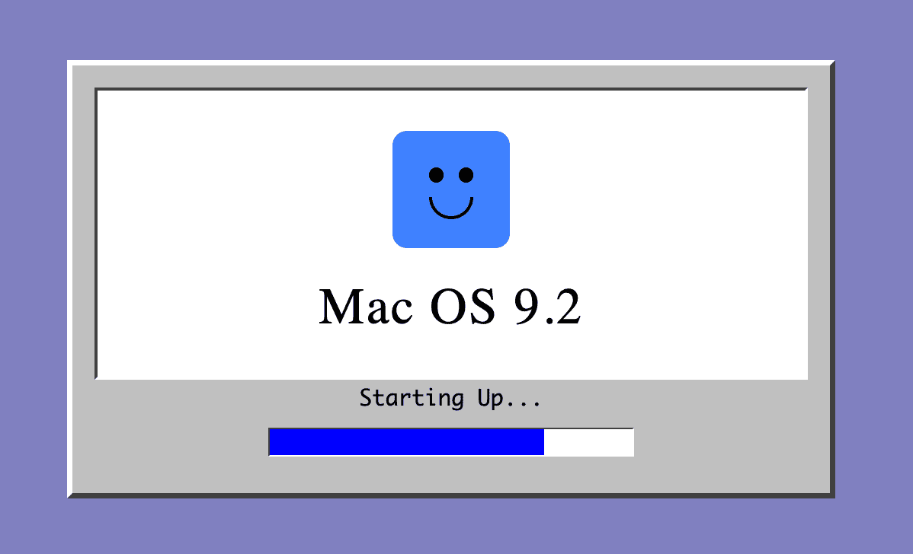

This year was another year of wild change in technology and software engineering.
It felt like the year flew by yet so much happened during it.

In 2024, my approach to building software was thoroughly transformed with the release of `claude-3-5-sonnet` and use of Cursor's Chat/Agent to build software.

The breakneck speed of iteration and improvements did not stop in 2025.
This year, I shifted to working more with Claude Code, and most recently `claude-opus-4-5`, but with meaningful improvements along the way from Sonnet 4 to Opus 4.1 to Sonnet 4.5, with some experimentation with Gemini 2.5 Pro and Gemini 3 Pro preview along the way.

Increasingly, while I have a preferred agent harness and model that I work with, I've found that I can comfortably operate with most leading edge models and most tools to accomplish my goals building software.
With an underlying, first principles approach to how an agent harness works and the tools and context it has access to, you can go far.
The features and improvements in capabilities continue to increase the ceiling of what is possible.
Claude 4.5 Opus was yet another improvement in the autonomy and accuracy with which I found I could delegate to a coding agent to accomplish a task I specified.

## Coding with agents is so much fun

I often tell those interested in how I work with agent coding tools that they both allow me to explore an idea to see if it's interesting enough to continue working on while simultaneously serving as a continuous inspiration for me.
Any idea I can turn into words or text is a jump off point for exploration in code.
If something feels like it's working, I get pulled in and see where it takes me.
This exploration leads to more learning and ideas and this cycle continues.

I probably spent in excess of 1,000 hours working with coding agents this year and I feel like I am still only scratching the surface of the changes that are to come with regard to how people interact with computers and how computers are used as tools.
With the "old way" being only 2-3 years in the rear view mirror, my process of building software and using a computer as a tool has continued to change meaningfully every 3-9 months.

## Review of last year's review

It's hard to appreciate the speed of change while being swept up in it but re-reading last year's review has given me some insight.

Reflecting on the aims I set for this year, here is how those manifested in my focus and work.

> - Continue building machine learning foundations

While I didn't continue my work on the Fast.AI course, I had the opportunity to use an embeddings model to surface unstructured text in a dataset that previously was unreviewed due to lack of resources.
My sense is embeddings continue to be an underappreciated element of the machine learning stack and can go quite far in use for data analysis and semantic search.
You don't always need a chatbot - you can just write queries and scripts.

> - Get comfortable with an LLM eval stack

I intentionally did not invest in a particular eval tool.
In my work creating a multi-stage, complex document analysis LLM pipeline, my takeaway has been that in many cases, to use an LLM eval tool, you need to transform the shape of your problem into a shape the eval tool accepts.
Given the ease with which one can now build bespoke software, I've leaned more heavily into building purpose-specific tools for myself and my team to address our problems specifically, and in a way we can also modify going forward.
This has felt like a good tradeoff for the time being.
Also, we're not building a chatbot and LLM eval tools seem to heavily index on supporting chatbots.

> - Continue exploring alternate LLM UX through Delta and other experiments

At the beginning of the year, I had a hotkey setup that would open a browser tab to the Anthropic Workbench.
My preference has generally been to try and make direct API calls to LLMs rather than use consumer chat wrappers like Claude.ai and ChatGPT, because I want more direct control of things like the system prompt and don't want my prompts to be influenced by the hidden prompt of the product.
The results were better (for what I usually needed), but I was never happy with how slow it felt to load the page in the browser.
Additionally, usually my workflow was something like

- copy content
- hotkey to open the browser
- sign in if I got booted
- paste
- write a prompt
- submit

And this only worked for Claude models.
If I wanted to use Gemini or OpenAI models, I had to go to a different playground.

It was _fine_.
But because it was something I do so often, the friction became irritating.

From this frustration emerged [Tomo](/projects/tomo), a little Swift app I built with Cursor and Claude Code to call the OpenAI chat compatible APIs and with baked in support for popular model providers.
The killer feature for me was hotkey summoning, which allows you to copy text or take a screenshot with hotkeys that also summon the Tomo chat window with the context automatically attached.
It fuses my previous workflow together and allows me to stay in flow.

There is no agent or context integrations.
It's light and fast.
I love it.

> - Engage more with folks working on applying LLMs

This year I said "yes" to far more things and was substantially more proactive about reaching out to folks doing work I thought was interesting.
I only regret not doing this sooner.

I have several recurring 1:1s with people who are genuinely inspirational to me, and this is a huge motivator and support if I'm finding myself stuck, confused, or lost.

## Migrating my blog

As I also noted in [last year's review](/posts/2024/2024-year-in-review?ref=search#redesignrebuild-this-blog), I didn't redesign or rebuild my blog.
In 2025, improvements in coding agents made this feel like not as big a burden.
This current blog was originally launched as a separate site at https://thoughteddies.com.
I used Astro to build a handful of interactive posts, using Astro and MDX to embed modern Javascript frameworks in my post content.
By July, I was ready to migrate my Hugo site fully and wrote about that [here](http://localhost:4321/posts/2025/migrating-to-astro).

In 2024, I avoided this migration because I didn't want to take time away from writing and experimenting.
In 2025, the coding-agent-assisted migration was easy enough I didn't even worry about it.
One day I woke up with a bit of motivation and energy to do it and that was all it took to see light at the end of the tunnel and make it through.

## Coding agents, ambition, and energy

The bar for the size and complexity of tasks and projects that coding agents can complete or assist with continues to rise.
Ideas and projects I might have previously considered writing about can now be realized in an hour or less of prompting.

Knowing I'll be able to rapidly see progress on an idea is usually a great motivator to get started.
Even though more than ever is doable in a fixed amount of time, there are still limits.
Complex projects take time, planning, and persistence.
Not everything can be "one-shot" and I suspect this will always remain the case.
To build something aligned with your personal vision, you have to explain how it works.
With a coding agent, if you don't explain something, the agent will fill it in and since it can't read your mind, you'll likely need to iterate until you get closer to what you personally had in mind.
You can figure this out before you start coding or during, but to make the thing you want, you have to externalize your thinking as much as possible so the agent can implement to those specifications.

## Other things I did this year

- Created a [link blog](/posts/2025/create-a-link-blog)
- Refined my process for teaching others to code with an agent
- Created a ["vibes"](/vibes) site for hosting little one-off apps
- Created a GitHub activity inspired [`/activity`](/activity) page for this site
- Wrote a guide on [agent coding strategies](/posts/2025/agent-coding-strategies) midyear that seems to have held up pretty well
- Experimented with [zoomable documents](/posts/2025/zoomable-document) for progressive disclosure of content
- Explored [LLM conversation branching](/posts/2025/llm-conversation-branching) with embeddings visualization
- Built interactive [document citations](/posts/2025/document-citations) using Claude's citation feature
- Wrote about using [images as context](/posts/2025/images-as-context) for doing design with coding agents
- Built an Escape Room-influenced, retro computer game with my cousin
  
- Built several games, one currently in progress and presently at ~100,000 LOC, 100% coded with Claude Code and Opus 4.5

## Content by the numbers

(Calculated with [this](https://github.com/danielcorin/thought-eddies/blob/main/scripts/year_review.py) script)

| Category                   | Posts   | Words      |
| -------------------------- | ------- | ---------- |
| [🏗️ Projects](/projects)   | 1       | 281        |
| [📖 Posts](/posts)         | 21      | 29,669     |
| [🌱 Garden](/garden)       | 1       | 615        |
| [✏️ Logs](/logs)           | 98      | 14,953     |
| [📝 Today I Learned](/til) | 22      | 18,822     |
| **Total**                  | **143** | **64,340** |

## Things I aim to focus on more next year

- Getting more structured about my process for working with agents and how I teach others to use them
- Experimenting with personal content curation for myself, using RSS feeds
- Possibly sharing the game I've been working on
- Experiment more with local, open source models for coding
