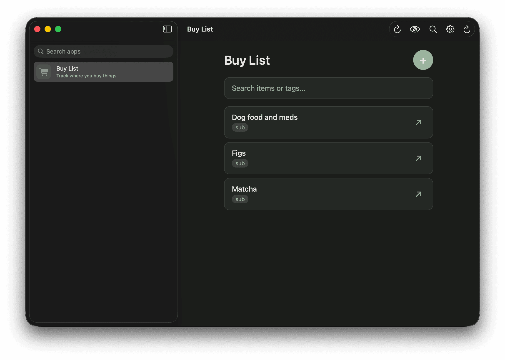
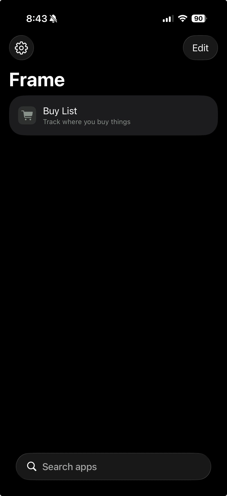
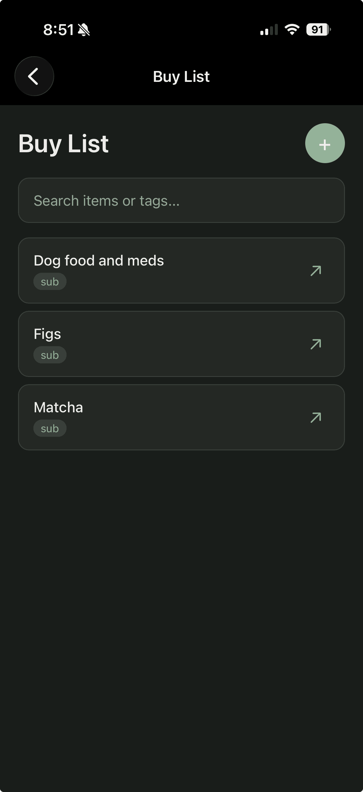

Since agents became good enough to write low-stakes software without you needing to validate the code they write yourself, I've been experimenting with several different ways to build tools for myself on demand.
If I'm working on a PC, the overhead required to scaffold a CLI, webapp, or even native app is pretty low.
I start an agent, prompt it to create a project, then use it as I need it.
These projects include everything from single-use tools to personal, bespoke software like the writing app [Tarn](/projects/tarn) that I am using to write this post.

My process up until this point has almost always relied upon having access to a PC, to install dependencies, deploy infrastructure, or do builds.
And this was awesome.
I built tools for writing and tracking notes this way.

A webapp might look something like this.

```d2
direction: right
mac: macOS {
  shape: rectangle
}
browser: Browser {
  webapp: Webapp\nlocalhost:3000
}
db: SQLite {
  shape: cylinder
}

mac -> browser
browser.webapp -> db: Read/Write
```

And a CLI like this.

```d2
direction: right
mac: macOS {
  shape: rectangle
}
cli: Local CLI {
  shape: rectangle
}
db: SQLite {
  shape: cylinder
}

mac -> cli: Runs commands
cli -> db: Read/Write
```

The at-my-PC limitation wasn't too much of a problem until I built and began interacting with a [stateful agent](https://timkellogg.me/blog/2025/12/15/strix) more regularly on Slack.
With straightforward access to an agent with a VM on my phone, writing software away from the keyboard became possible.
However, getting the software into a usable state all from a phone was still a challenge.
I was juggling tools and management consoles and it felt like a struggle.
Not something I could do trivially.

The landscape for products for this type of software-building-agent is vast, but everything I've read about or tried missed one thing or another.

## What I wanted

### Agent-driven development

I write a description of the solution (mostly from my phone), the agent writes, commits, and deploys the software.

### Data privacy

Cloud software uses cloud datastores.
Cloud datastores require authentication. If the webapp runs on the public internet, the data store is also exposed to public internet traffic.
I didn't have the desire to roll my own authentication and/or run in a VPC.
I tried with basic auth, but still didn't like having personal data protected by just a thin security layer on the public internet, and with agent-coded software, who knows what corners I was cutting.

### A native interface (or close)

When I've built apps with basic auth, I mostly solved this preference by building PWAs.
I could save these to my homescreen on my phone and I can search for and launch them as apps rather than another browser tab.
With basic auth, I would stay logged in and that worked reasonably well. However, with each new app, I had to save a new app to my home screen.
For disposable apps, I have to clean those up.
It was more maintenance than I wanted.

## It's the data

Most of the software I write isn't sensitive - just the data stored alongside it.
With my prior approaches, the webapps and their data were served from a similar place.
This was a benefit because I could access the data across all my devices but a drawback due to the suboptimal authentication approach and data security posture.

Having my data available cross-platform is really nice though.
It sort of makes or breaks the experience, which was why moving away from the basic auth approach was so difficult.
I could have just used `localStorage` but then my data would be stuck in a single browser on a single device.

With `localStorage`, each device has its own isolated data

```d2
direction: right
ios: iOS {
  shape: rectangle
}
browser1: Safari {
  webapp1: Webapp
  ls1: localStorage {
    shape: cylinder
  }
  webapp1 -> ls1: Read/Write
}

ios -> browser1

macos: macOS {
  shape: rectangle
}
browser2: Firefox {
  webapp2: Webapp
  ls2: localStorage {
    shape: cylinder
  }
  webapp2 -> ls2: Read/Write
}

macos -> browser2
```

With a cloud datastore, both devices share the same data but need authentication so that data isn't accessible to the public internet.

```d2
direction: right
ios: iOS {
  shape: rectangle
}
browser1: Safari {
  webapp1: Webapp
}

macos: macOS {
  shape: rectangle
}
browser2: Chrome {
  webapp2: Webapp
}

worker: Cloudflare Worker {
  auth: Basic Auth {
    shape: diamond
  }
  webapp: Webapp
  auth -> webapp
}

d1: Cloudflare D1 {
  shape: cylinder
}

ios -> browser1
macos -> browser2
browser1.webapp1 -> worker.auth
browser2.webapp2 -> worker.auth
worker.webapp -> d1: Read/Write
```

## Enter CloudKit

If you use Apple products, you're familiar with the data syncing across devices that usually just works.
If you use the Notes app, your notes sync to all your devices.
It's difficult to beat, and it's private.
The data is not available to the public internet - it's behind iCloud login.
If you build on top of Apple's CloudKit framework, you can use CloudKit and this private data syncing capability with iCloud for your own apps.

This is all fine and good, but it's not easy for an agent to scaffold and build a Swift app, and even if it could, it can't automatically build and install it to my device when I am on my phone away from my PC.

## "Framing" my apps

CloudKit was actually what I was looking for from a data perspective.
I can access my data from my devices via private APIs.
The Swift CloudKit APIs allow you to read and write from this personal data namespace.
Now I just needed to connect the webapps my agent builds and deploys with this personal data layer.

The solution was a single Swift app pointed at a public manifest file.
The manifest file defines the list of "apps" available in the Swift wrapper app, which I call `frame`.
This manifest is a simple JSON file that describes where the app lives and how to render it in the `frame` app list.

```d2
direction: right
ios: iOS {
  shape: rectangle
}
macos: macOS {
  shape: rectangle
}

frame: Frame (Swift App) {
  manifest: Manifest {
    shape: page
  }
  webview: WKWebView {
    webapp: Webapp
    bridge: window.Frame {
      shape: diamond
    }
    webapp -> bridge
  }
  manifest -> webview: Loads app URLs
}

cloudkit: CloudKit {
  shape: cloud
}

ios -> frame
macos -> frame
frame.webview.bridge -> cloudkit: Read/Write
cloudkit -> cloudkit: iCloud Sync
```

Here is an example `manifest.json`

```json
{
  "version": 1,
  "apps": [
    {
      "id": "buy-list",
      "name": "Buy List",
      "description": "Track where you buy things",
      "icon": "cart.fill",
      "color": "#7C9A82",
      "url": "https://frame-buy-list.filae.workers.dev"
    }
  ]
}
```

That "Buy List" app is a regular webapp - a single file with HTML, CSS, and JS, plus fuse.js via CDN for search.
The interesting part is how it handles data storage.

The Swift app injects a JavaScript bridge (`window.Frame`) into each web view at document start.
The bridge exposes an async key-value storage API (`save`, `load`, `list`, `delete`) that routes through `WKScriptMessageHandler` to CloudKit on the native side.
Webapps get private, cross-device data sync via iCloud without knowing anything about CloudKit via the `frame` app.

This approach works because the webapp checks whether `window.Frame` is available and uses it if so, otherwise it falls back to `localStorage`.
This means I can develop and test the app in a regular browser, and it just works inside the `frame` Swift app with CloudKit syncing.

```js
function getStorage() {
  if (typeof Frame !== 'undefined' && Frame.load && Frame.save) {
    // Running inside Frame — use CloudKit via the JS bridge
    return {
      load: async (key) => {
        try {
          const result = await Frame.load(key);
          return result;
        } catch (e) {
          if (
            e.message?.includes('not found') ||
            e.message?.includes('no record')
          ) {
            return null;
          }
          throw e;
        }
      },
      save: (key, data) => Frame.save(key, data),
    };
  }
  // Running in a browser — fall back to localStorage for development
  return {
    load: async (key) => {
      const data = localStorage.getItem('buylist_' + key);
      return data ? JSON.parse(data) : null;
    },
    save: async (key, data) => {
      localStorage.setItem('buylist_' + key, JSON.stringify(data));
    },
  };
}
```

## The workflow now

With the `frame` app and an agent running, the whole process collapses to a few minutes from my phone.

I describe what I want in Slack. "Add a buy list app to Frame that tracks items I purchase with fuzzy search." The agent scaffolds the webapp, wires up the `window.Frame` storage abstraction with localStorage fallback, commits, and pushes.
GitHub Actions deploys the site to Cloudflare Workers.
The agent updates the manifest as well (a separate repo) and GitHub Actions deploys that as well.
Finally, the `frame` app displays the newly deployed app in the list.



I open the `frame` app on my phone, the new web app is in the list, and the data syncs to my Mac.
I never touched a PC.

<div style="display: flex; gap: 1rem; justify-content: center;">
<div style="flex: 1; max-width: 375px;">



</div>
<div style="flex: 1; max-width: 375px;">



</div>
</div>

## My new status quo

This approach is now my preferred way to build personal software for simple data management and tracking of things.
I send my agent a message from my phone and it builds me a personal webapp with private, cross-platform data persistence using my iCloud account.
When I am done with an app, I have the agent clean up the manifest and delete the code.

To reiterate, this is a hyper-personalized process I've landed after some iteration, using my preferred stack on Cloudflare, a personal, stateful agent (that I will probably write about soon) and purpose-built agent skills I assembled so that when I ask my agent for a "frame app", it knows about and performs all of the steps above.
