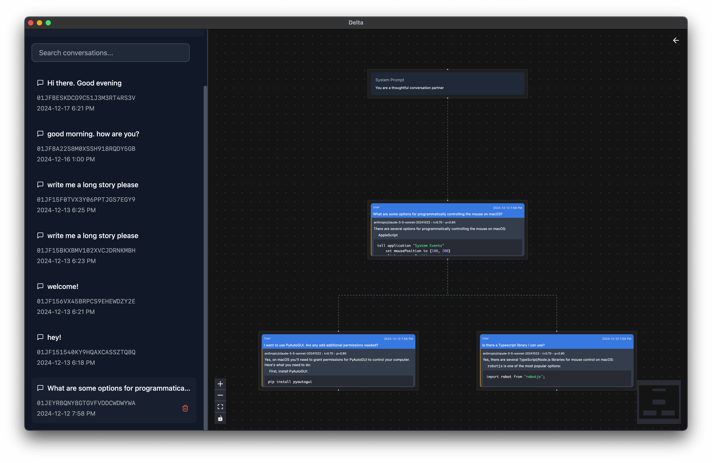
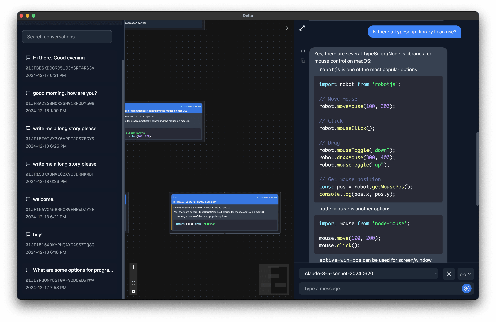

Delta is an [open source Electron app](https://github.com/danielcorin/delta) (initially started as a Next.js app) that enables a straightforward UX for conversation branching with language models.
Conversation branch means rewinding a conversation to a previous response then continuing in another direction by sending a different message to the model.
While this UX is supported by most LLM chat providers via an edit mechanism, what is different about Delta is that it provides a visual representation of conversation branches and makes it easy to navigate between them.

The interface is composed primarily of a chat and canvas.
There is also a tracked list of past conversations.

The tool supports multiple model providers, image inputs (for models that support them) and models served by an `ollama` server.

I also wrote more about conversation branching and why I think this approach is useful [here](/posts/conversation-branching).

Tech: [Electron](https://www.electronjs.org/), [Electron Forge](https://www.electronforge.io/), [Vercel AI SDK](https://sdk.vercel.ai/docs/getting-started/nodejs), [Ollama](https://ollama.com/)
