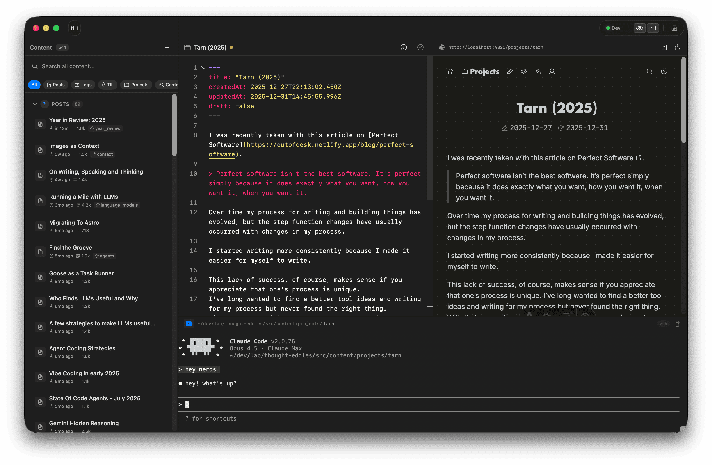
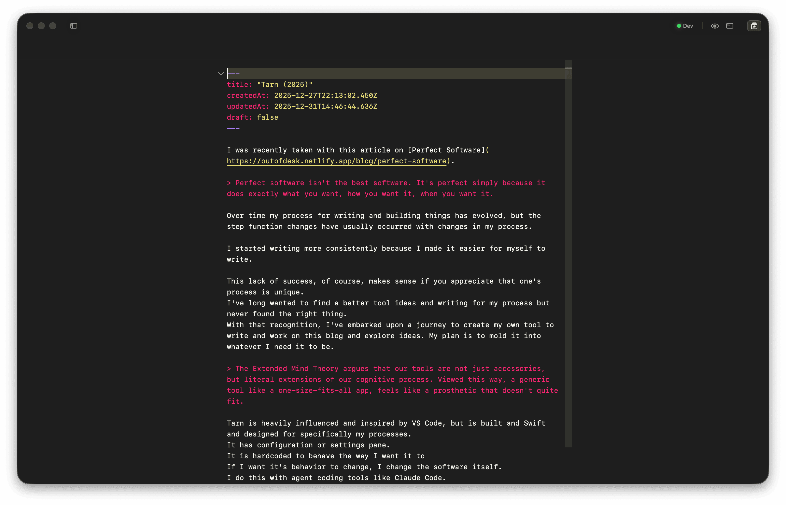

I was recently taken with this article on [Perfect Software](https://outofdesk.netlify.app/blog/perfect-software).

> Perfect software isn't the best software. It's perfect simply because it does exactly what you want, how you want it, when you want it.

Over time my process for writing and building things has evolved, but the step function changes have usually occurred with changes in my process.

I started writing more consistently because I made it easier for myself to write.

This lack of success, of course, makes sense if you appreciate that one's process is unique.
I've long wanted to find a better tool ideas and writing for my process but never found the right thing.
With that recognition, I've embarked upon a journey to create my own tool to write and work on this blog and explore ideas. My plan is to mold it into whatever I need it to be.

> The Extended Mind Theory argues that our tools are not just accessories, but literal extensions of our cognitive process. Viewed this way, a generic tool like a one-size-fits-all app, feels like a prosthetic that doesn't quite fit.

Tarn is heavily influenced and inspired by VS Code, but is built and Swift and designed for specifically my processes.
It has configuration or settings pane.
It is hardcoded to behave the way I want it to
If I want it's behavior to change, I change the software itself.
I do this with agent coding tools like Claude Code.

The main UI

Zen Mode

