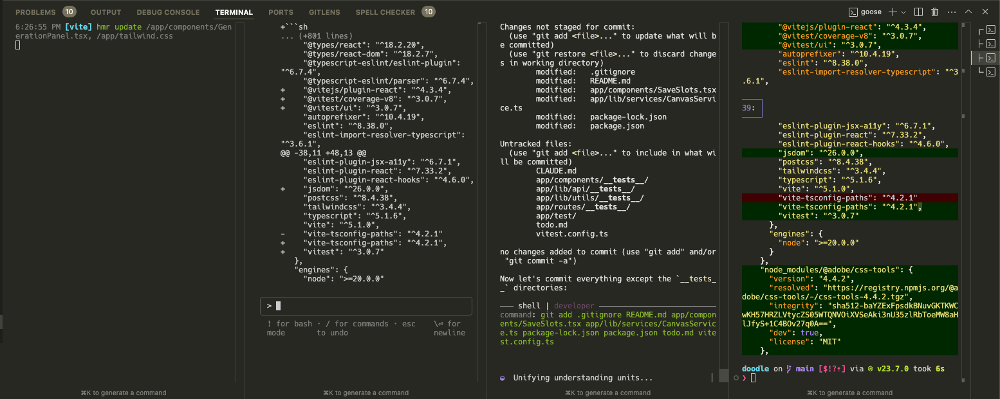

Today, Anthropic entered the LLM code tools party with [Claude Code](https://docs.anthropic.com/en/docs/agents-and-tools/claude-code/overview).

Coding with LLMs is one of my favorite activities these days, so I'm excited to give it a shot.
As a CLI tool, it seems most similar to [`aider`](https://github.com/Aider-AI/aider) and [`goose`](https://github.com/block/goose), at least of the projects I am familiar with.

Be forewarned, agentic coding tools like Claude Code use a lot of tokens which are not free.
Monitor your usage carefully as you use it or know you may spend more than you expect.

I didn't read the docs.
I am just going to dive in and see how it goes.

## Let's go

First, I installed the Claude code with

```sh
npm install -g @anthropic-ai/claude-code
```

then ran it with

```sh
claude
```

After setup, I ran `/init`.
This seemed to analyze my project and create a `CLAUDE.md` file with the technologies the project uses, how to set it up, how to run tests and other helpful context for Claude.
This approach aligns with the most effective approach I am aware of for coding with LLMs, involving the creation of supplementary rules or markdown files and compressing an understanding of a codebase into fewer tokens.
This approach also makes it much easier to reference metadata about the codebase in the future.

I'm interested to see how or if Claude Code will keep this file up to date.
In the future, rather than reading a bunch of files in the codebase Claude (or some other tool) can reference this and learn how to make changes in alignment with the current conventions of the codebase in a token efficient way.

## Slash commands

After creating the `CLAUDE.md` file, the first thing that piqued my interest was the slash commands.
Type `/` and Claude Code shows all the commands available.
Backspace and they autoclear.
It's a very nice and clear CLI tool.

## Bash Mode
There is also "Bash Mode" which seems to be a direct passthrough to run commands in your shell.
These don't appear to be stored in the context, though you can instruct Claude Code to run shell commands on your behalf and the results will be stored in the context window.
Claude Code prompts you when it is going to run a shell command.
Bash mode is fine for quick commands but I definitely will need a proper terminal in parallel and it doesn't deal super nicely with things that require a pager or colors.

## How it compares to existing tools

Compared to `goose` this feels a bit safer.
My read on what is happening is Claude Code is considering things like searching and reading files to be default-safe and doesn't ask for permission, but if you prompt it to list the files in the current directory, it asks if it's ok to run `ls`.

In contrast, `goose` runs a bunch of shell commands to read files and do other things -- by my current understanding, `goose` doesn't distinguish safe vs. unsafe actions in the same manner.
Overall, there are still a lot of similarities between the two.

Claude Code default-proposes changes rather than just making them by default.
It shows one file change at a time and prompt for your approval to make each change.
It's a little unusual to not see the whole changeset at once but it seems to work ok.

I prompted to make several, then asked it to undo the first change I asked for only.
This can sometimes get a bit messy and it wasn't entirely transparent about _how_ it did it, but Claude Code proposed file edits and it seemed to undo the changes correctly which was impressive.

## Final thoughts
It's hard to exactly compare the capabilities against other tools because `claude-3-7-sonnet-20250219` just came out and I haven't had the chance to try all these other coding with this new model yet.
Nevertheless, Claude Code seems to be a highly competent agentic coding tool and is a welcome addition to the kitchen sink of things I can throw at coding problems.
These days I run Cursor with a CLI LLM agent tool in the embedded terminal.
Often, `goose`, but now maybe `claude` as well.

A bit ridiculous but also leading edge?


It's also quite interesting and maybe a bit telling to see Anthropic as one of the leading creators of LLMs, investing resources in a closed-source coding tool as well.
I wonder what that says about where they expect the future of LLMs to be captured.
My read is they think it's in the application layer.
Today, the best coding tools are using Anthropic's models.
As the gatekeepers of Claude, Anthropic's coding tools can be the best (assuming they continue to lead here) if they keep their best models for themselves.
