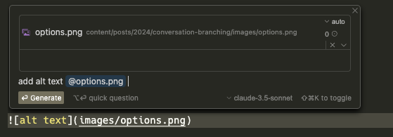
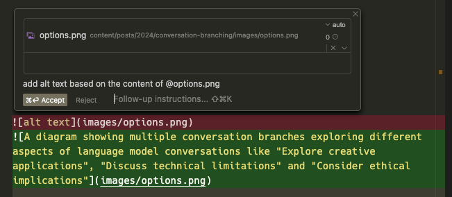

Using Cursor, we can easily get a first pass at creating alt text for an image using a language model.
It's quite straightforward using a multi-modal model/prompt.
For this example, we'll use `claude-3-5-sonnet-20241022`.

Here's what it generates.

The first half is pretty good.

I settled on:

> A diagram showing multiple conversation branches exploring different approaches to adding caching to a Python application

Using the same approach, I generated alt text for the images in this post as well.

I could see models being helpful accessibility aids for sites that haven't yet made efforts to make their content broadly accessible.
