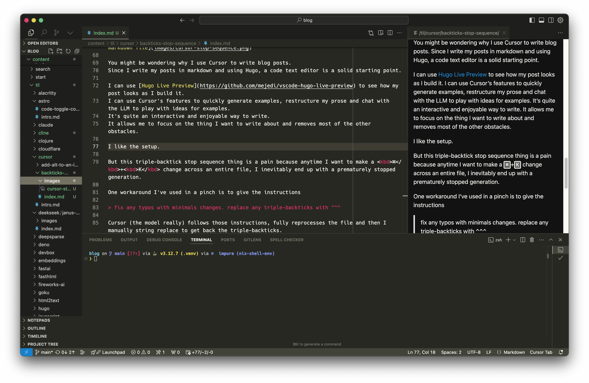

An LLM stop sequence is a sequence of tokens that tells the LLM to stop generating text.
I previously wrote about [stop sequences and prefilling responses](/til/prompting/prefill-and-stop-sequences) with Claude.

As a reference, here's how to use a stop sequence with the OpenAI API in Python

```python
from openai import OpenAI
client = OpenAI()

response = client.chat.completions.create(
  model="gpt-4o",
  messages=[{"role": "user", "content": "What is the capital of France?"}],
  stop=["Paris"],
)
print(response.choices[0].message.content)
```

which outputs something like

```python
'The capital of France is '
```

Notice the LLM never outputs the word "Paris".
This is due to the stop sequence.

[Cursor](https://www.cursor.com/) also utilizes stop sequences.
The most noticeable way in which it does this for me is when attempting to generate content in markdown files containing code blocks.

In a blog post, they look like this

```python
def hello_world():
    print("Hello, World!")
```

but when I am editing these posts they look like this

<pre>
```python
def hello_world():
    print("Hello, World!")
```
</pre>

I occasionally use an LLM to restructure these markdown files, but because Cursor uses triple-backticks as a stop sequence, it will stop generating text at the first triple-backtick it encounters.
These are all over my posts, so it frequently causes me problems.


You might be wondering why I use Cursor to write blog posts.
Since I write my posts in markdown and using Hugo, a code text editor is a solid starting point.

I can use [Hugo Live Preview](https://github.com/mejedi/vscode-hugo-live-preview) to see how my post looks as I build it.
I can use Cursor's features to quickly generate examples, restructure my prose and chat with the LLM to play with ideas for examples.
It's quite an interactive and enjoyable way to write.
It allows me to focus on the thing I want to write about and removes most of the other obstacles.

I like the setup.



But this triple-backtick stop sequence thing is a pain because anytime I want to make a <kbd>⌘</kbd>+<kbd>K</kbd> change across an entire file, I inevitably end up with a prematurely stopped generation.

One workaround I've used in a pinch is to give the instructions

> fix any typos with minimal changes. replace any triple-backticks with ^^^

Cursor (the model, really) follows those instructions, fully reprocesses the selection from the file and then I manually string replace to get back the triple-backticks.

I _could_ use Hugo's [highlight shortcode](https://gohugo.io/content-management/syntax-highlighting/), but in an effort to keep my markdown as portable as possible, I've been avoiding that.
I also find the backticks to be cleaner.

Maybe one day I'll find a workaround that let's me set a custom stop sequence for specific file types in Cursor.
