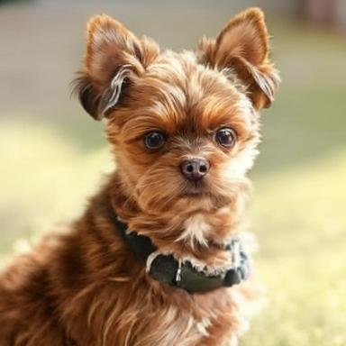

Deepseek is getting a lot of attention with the releases of V3 and recently R1.
Yesterday, they also released "Pro 7B" version of Janus, a "Unified Multimodal" model that can generate images from text and text from images.
Most models I've experimented with can only do one of the two.

The 7B model requires about 15GB of hard disk space.
It also seemed to almost max out the 64GB of memory my machine has.
I'm not deeply familiar with the hardware requirements for this model so your mileage may vary.

## How to run Janus Pro 7B

Let's get the model and run it on a Mac.

```sh
git clone git@github.com:deepseek-ai/Janus.git
```

Install dependencies

```sh
python -m venv .venv
. .venv/bin/activate
pip install -e .
```

Now, modeling off the [script](https://github.com/deepseek-ai/Janus/tree/main?tab=readme-ov-file#janus-pro) provided in the repo, let's generate an image from text.
Note: you need to expand the "Janus-Pro" section to see the code.

## The code

Create the following `generate.py` script:

```python
import os
import PIL.Image
import torch
import numpy as np
from transformers import AutoModelForCausalLM
from janus.models import MultiModalityCausalLM, VLChatProcessor


# specify the path to the model
model_path = "deepseek-ai/Janus-Pro-7B"
vl_chat_processor: VLChatProcessor = VLChatProcessor.from_pretrained(model_path)
tokenizer = vl_chat_processor.tokenizer

vl_gpt: MultiModalityCausalLM = AutoModelForCausalLM.from_pretrained(
    model_path, trust_remote_code=True
)

device = torch.device("mps" if torch.backends.mps.is_available() else "cpu")
vl_gpt = vl_gpt.to(torch.bfloat16).to(device).eval()


conversation = [
    {
        "role": "<|User|>",
        "content": "A small brown dog, mix of a shih tzu, poodle and chihuahua",
    },
    {"role": "<|Assistant|>", "content": ""},
]

sft_format = vl_chat_processor.apply_sft_template_for_multi_turn_prompts(
    conversations=conversation,
    sft_format=vl_chat_processor.sft_format,
    system_prompt="",
)
prompt = sft_format + vl_chat_processor.image_start_tag


@torch.inference_mode()
def generate(
    mmgpt: MultiModalityCausalLM,
    vl_chat_processor: VLChatProcessor,
    prompt: str,
    temperature: float = 1,
    parallel_size: int = 16,
    cfg_weight: float = 5,
    image_token_num_per_image: int = 576,
    img_size: int = 384,
    patch_size: int = 16,
):
    input_ids = vl_chat_processor.tokenizer.encode(prompt)
    input_ids = torch.LongTensor(input_ids)

    tokens = torch.zeros((parallel_size * 2, len(input_ids)), dtype=torch.int).to(
        device
    )
    for i in range(parallel_size * 2):
        tokens[i, :] = input_ids
        if i % 2 != 0:
            tokens[i, 1:-1] = vl_chat_processor.pad_id

    inputs_embeds = mmgpt.language_model.get_input_embeddings()(tokens)

    generated_tokens = torch.zeros(
        (parallel_size, image_token_num_per_image), dtype=torch.int
    ).to(device)

    for i in range(image_token_num_per_image):
        outputs = mmgpt.language_model.model(
            inputs_embeds=inputs_embeds,
            use_cache=True,
            past_key_values=outputs.past_key_values if i != 0 else None,
        )
        hidden_states = outputs.last_hidden_state

        logits = mmgpt.gen_head(hidden_states[:, -1, :])
        logit_cond = logits[0::2, :]
        logit_uncond = logits[1::2, :]

        logits = logit_uncond + cfg_weight * (logit_cond - logit_uncond)
        probs = torch.softmax(logits / temperature, dim=-1)

        next_token = torch.multinomial(probs, num_samples=1)
        generated_tokens[:, i] = next_token.squeeze(dim=-1)

        next_token = torch.cat(
            [next_token.unsqueeze(dim=1), next_token.unsqueeze(dim=1)], dim=1
        ).view(-1)
        img_embeds = mmgpt.prepare_gen_img_embeds(next_token)
        inputs_embeds = img_embeds.unsqueeze(dim=1)

    dec = mmgpt.gen_vision_model.decode_code(
        generated_tokens.to(dtype=torch.int),
        shape=[parallel_size, 8, img_size // patch_size, img_size // patch_size],
    )
    dec = dec.to(torch.float32).cpu().numpy().transpose(0, 2, 3, 1)

    dec = np.clip((dec + 1) / 2 * 255, 0, 255)

    visual_img = np.zeros((parallel_size, img_size, img_size, 3), dtype=np.uint8)
    visual_img[:, :, :] = dec

    os.makedirs("generated_samples", exist_ok=True)
    for i in range(parallel_size):
        save_path = os.path.join("generated_samples", "img_{}.jpg".format(i))
        PIL.Image.fromarray(visual_img[i]).save(save_path)


generate(
    vl_gpt,
    vl_chat_processor,
    prompt,
    parallel_size=1, # to generate a single image
)
```

Here is a diff of the script changes to give you a better sense of what changes were needed to get it running on my Mac:

```diff
 vl_gpt: MultiModalityCausalLM = AutoModelForCausalLM.from_pretrained(
     model_path, trust_remote_code=True
 )
-vl_gpt = vl_gpt.to(torch.bfloat16).cuda().eval()

+device = torch.device("mps" if torch.backends.mps.is_available() else "cpu")
+vl_gpt = vl_gpt.to(torch.bfloat16).to(device).eval()
+
+
 conversation = [
     {
         "role": "<|User|>",
-        "content": "A stunning princess from kabul in red, white traditional clothing, blue eyes, brown hair",
+        "content": "A small brown dog, mix of a shih tzu, poodle and chihuahua",
     },
     {"role": "<|Assistant|>", "content": ""},
 ]
@@ -47,13 +50,17 @@
     input_ids = vl_chat_processor.tokenizer.encode(prompt)
     input_ids = torch.LongTensor(input_ids)

-    tokens = torch.zeros((parallel_size*2, len(input_ids)), dtype=torch.int).cuda()
-    for i in range(parallel_size*2):
+    tokens = torch.zeros((parallel_size * 2, len(input_ids)), dtype=torch.int).to(
+        device
+    )
+    for i in range(parallel_size * 2):
         tokens[i, :] = input_ids
         if i % 2 != 0:
             tokens[i, 1:-1] = vl_chat_processor.pad_id

     inputs_embeds = mmgpt.language_model.get_input_embeddings()(tokens)

-    generated_tokens = torch.zeros((parallel_size, image_token_num_per_image), dtype=torch.int).cuda()
+    generated_tokens = torch.zeros(
+        (parallel_size, image_token_num_per_image), dtype=torch.int
+    ).to(device)

@@ -94,4 +109,5 @@
     vl_gpt,
     vl_chat_processor,
     prompt,
+    parallel_size=1,
 )
```

Let's run it.

Note: prepare to wait for the 15GB of model weights to download if this is your first time pulling the model.

```sh
python generate.py
```

If all goes well, you can find the output image in the `generated_samples` folder called `img_0.jpg`.

On my machine, this run took 3:51.
I've done a few other runs in the ~2 minute range.

Here is the resulting image



## Cleanup

If you want back the 15GB of disk space, you can find the model weights and other files in `~/.cache/huggingface/hub`.
