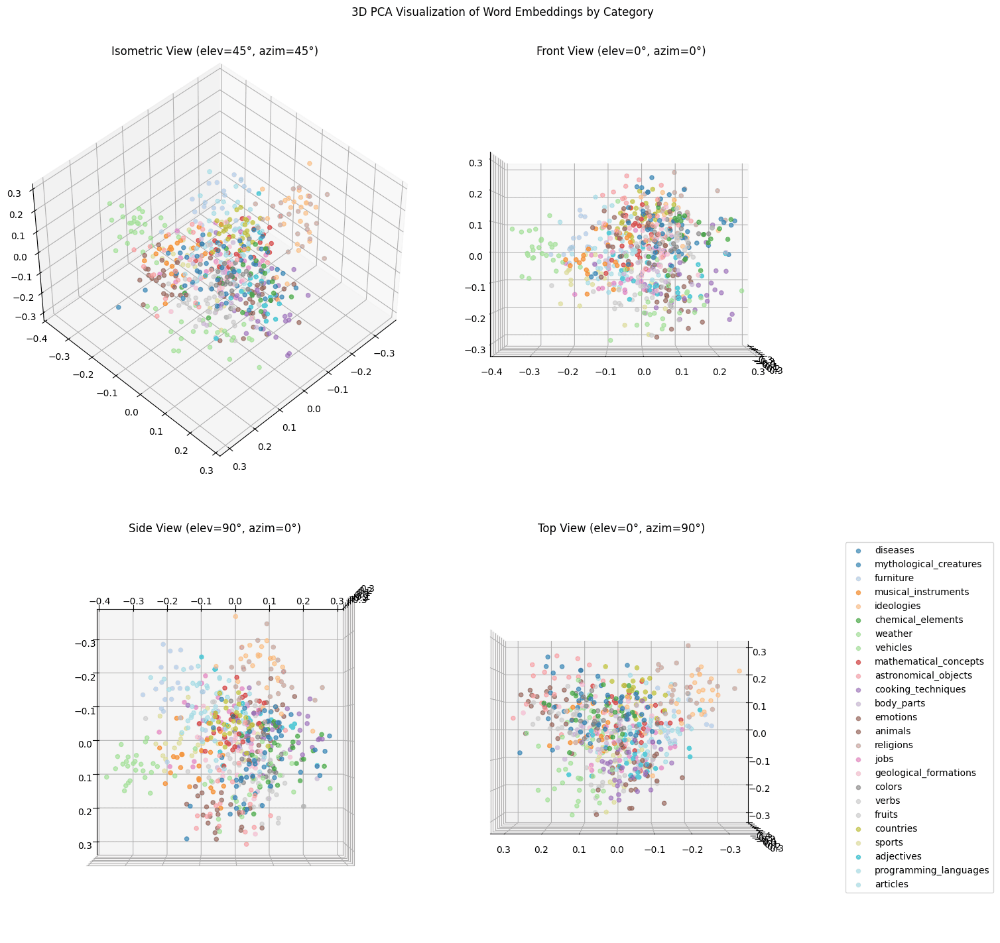
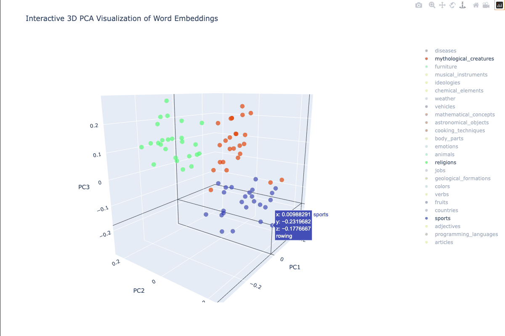

I explored how embeddings cluster by visualizing LLM-generated words across different categories.
The visualizations helped build intuition about how these embeddings relate to each other in vector space. Most of the code was generated using Sonnet.

```python
!pip install --upgrade pip
!pip install openai
!pip install matplotlib
!pip install scikit-learn
!pip install pandas
!pip install plotly
!pip install "nbformat>=4.2.0"
```

We start by setting up functions to call `ollama` locally to generate embeddings and words for several categories.
The `generate_words` function occasionally doesn't adhere to instructions, but the end results are largely unaffected.

```python
from openai import OpenAI

client = OpenAI(base_url='http://localhost:11434/v1', api_key='ollama')

def get_embedding(text):

    response = client.embeddings.create(
        model="nomic-embed-text",
        input=text
    )

    return response.data[0].embedding
```

```python
def generate_words(category, num_words=25):
    prompt = f"""
    Generate {num_words} words that belong to the category '{category}'. Provide them as a comma-separated list.
    Output the only words now:
    """

    response = client.chat.completions.create(
        model="llama3.2",
        messages=[
            {"role": "user", "content": prompt}
        ],
        temperature=0.7,
        max_tokens=100
    )

    if response.choices[0].message and response.choices[0].message.content:
        words = response.choices[0].message.content.split(",")
        return [word.strip().lower() for word in words]
    return []
```

```python
from sklearn.manifold import TSNE
import matplotlib.pyplot as plt
import numpy as np
```

Now we call the functions to actually generate the words and their embeddings.

```python
category_names = [
    'fruits', 'vehicles', 'sports', 'countries', 'jobs',
    'weather', 'emotions', 'colors', 'furniture', 'animals',
    'religions', 'verbs', 'adjectives', 'articles', 'ideologies',
    'chemical_elements', 'musical_instruments', 'body_parts',
    'geological_formations', 'programming_languages',
    'mythological_creatures', 'diseases', 'astronomical_objects',
    'mathematical_concepts', 'cooking_techniques'
]

categories = {name: generate_words(name, 25) for name in category_names}

strings = []
labels = []
embeddings = []

for category, words in categories.items():
    for word in words:
        strings.append(word)
        labels.append(category)
        embeddings.append(get_embedding(word))
```

Here are the first few sets of words:

```python
for category in list(categories.keys())[:3]:
    print(f"\n{category.upper()}:")
    print(", ".join(categories[category]))
print("\n...")
```

    FRUITS:
    apple, banana, mango, orange, grapes, watermelon, pineapple, strawberry, cherry, lemon, peach, kiwi, blueberry, pears, apricot, plum, guava, papaya, cantaloupe, raspberry, blackberry, fig, acai berry, starfruit, pomegranate, avocado

    VEHICLES:
    car, truck, bus, train, motorcycle, bicycle, airplane, helicopter, ship, boat, ferry, ambulance, fire engine, police car, semi-truck, tractor, scooter, taxi, limousine, rv, van, buses, motorcycles, cycles, cars, vehicles, automobile

    SPORTS:
    basketball, football, tennis, baseball, hockey, golf, rugby, cricket, boxing, wrestling, volleyball, softball, table tennis, cycling, rowing, swimming, gymnastics, skiing, snowboarding, surfing, diving, sailing, fencing, karate, lacrosse

    ...

From here, we can visualize a 3D scatter plot of the embeddings from multiple angles.

```python
from sklearn.decomposition import PCA

labels = []
for category in category_names:
    labels.extend([category] * len(categories[category]))

colors = plt.cm.tab20(np.linspace(0, 1, len(set(labels))))
color_dict = dict(zip(set(labels), colors))

pca = PCA(n_components=3)
pca_result = pca.fit_transform(embeddings)

fig = plt.figure(figsize=(15, 15))
angles = [(45, 45), (0, 0), (90, 0), (0, 90)]
titles = ['Isometric View', 'Front View', 'Side View', 'Top View']

for i, (elev, azim) in enumerate(angles, 1):
    ax = fig.add_subplot(2, 2, i, projection='3d')
    ax.view_init(elev=elev, azim=azim)

    colors = plt.cm.tab20(np.linspace(0, 1, len(set(labels))))
    color_dict = dict(zip(set(labels), colors))

    for category in set(labels):
        mask = [l == category for l in labels]
        ax.scatter(pca_result[mask, 0], pca_result[mask, 1], pca_result[mask, 2],
                   c=[color_dict[category]], label=category, alpha=0.6)

    ax.set_title(f'{titles[i-1]} (elev={elev}°, azim={azim}°)')

plt.legend(bbox_to_anchor=(1.05, 1), loc='upper left')
plt.suptitle('3D PCA Visualization of Word Embeddings by Category')
plt.tight_layout()
plt.show()
```



We can definitely see some clustering, but it's a bit of a mess.
The next cell uses `plotly` to create an interactive visualization, where the visibility of the categories can be toggled.
Mouse over shows the word and category.
The visualization also supports rotation and panning.
I've included a screenshot because I haven't found a good way to include the interactive visualization on my site yet.

```python
import plotly.express as px
import plotly.graph_objects as go
import plotly.colors

fig = go.Figure()

colors = px.colors.qualitative.Set3[:len(set(category_names))]

n = len(category_names)
colors = plotly.colors.sample_colorscale('turbo', n)
color_dict = dict(zip(category_names, colors))

for category in set(labels):
    mask = [l == category for l in labels]
    category_words = [word for word, l in zip(strings, labels) if l == category]

    fig.add_trace(go.Scatter3d(
        x=pca_result[mask, 0],
        y=pca_result[mask, 1],
        z=pca_result[mask, 2],
        mode='markers',
        name=category,
        hovertext=category_words,
        marker=dict(
            size=6,
            color=color_dict[category],
            opacity=0.7
        )
    ))

fig.update_layout(
    title='Interactive 3D PCA Visualization of Word Embeddings',
    scene=dict(
        xaxis_title='PC1',
        yaxis_title='PC2',
        zaxis_title='PC3'
    ),
    width=1200,
    height=800,
    showlegend=True,
    legend=dict(
        yanchor="top",
        y=0.99,
        xanchor="left",
        x=1.05
    )
)

fig.show()
```


