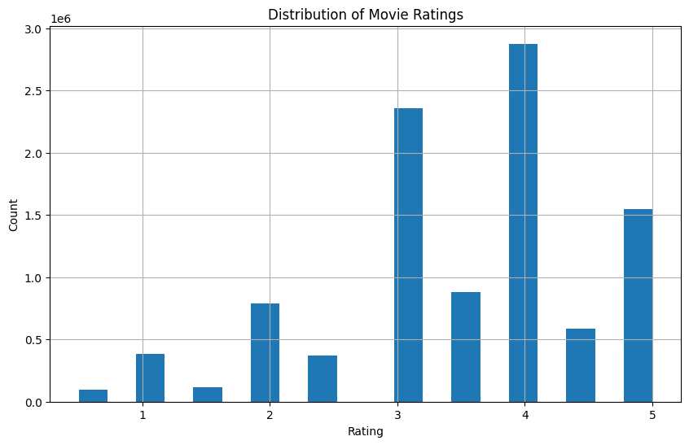

In this notebook, we'll use the [MovieLens 10M dataset](https://grouplens.org/datasets/movielens/) and collaborative filtering to create a movie recommendation model.
We'll use the data from `movies.dat` and `ratings.dat` to create embeddings that will help us predict ratings for movies I haven't watched yet.

## Create some personal data

Before I wrote any code to train models, I code-generated a quick UI to rate movies to generate `my_ratings.dat`, to append to `ratings.dat`.
There is a bit of code needed to do that.
The nice part is using [inline script metadata](https://peps.python.org/pep-0723/) and [`uv`](https://github.com/astral-sh/uv), we can write (generate) and run the whole tool in a single file.

Here is the code:

```python
# /// script
# requires-python = ">=3.12"
# dependencies = [
#     "fastapi",
#     "pandas",
#     "uvicorn",
# ]
# ///

from fastapi import FastAPI
from fastapi.responses import JSONResponse, HTMLResponse
import pandas as pd
from datetime import datetime
import uvicorn

app = FastAPI()

movies_df = pd.read_csv(
    "ml-10M100K/movies.dat",
    sep="::",
    names=["movie_id", "title", "genres"],
    engine="python",
)
movies_df["year"] = movies_df["title"].str.extract(r"\((\d{4})\)")
movies_df["title"] = movies_df["title"].str.replace(r"\s*\(\d{4}\)", "", regex=True)
movies_df = movies_df.sort_values("year", ascending=False)

last_rated_index = 0


@app.get("/", response_class=HTMLResponse)
async def get_root():
    return """
    <!DOCTYPE html>
    <html>
    <head>
        <title>Movie Ratings</title>
        <style>
            body { font-family: sans-serif; max-width: 800px; margin: 0 auto; padding: 20px; }
            .movie { margin-bottom: 20px; padding: 20px; border: 1px solid #ccc; border-radius: 5px; }
            .rating-buttons { margin-top: 10px; }
            button { margin-right: 5px; padding: 5px 10px; cursor: pointer; }
            .rating-btn { background: #4CAF50; color: white; border: none; }
            .skip-btn { background: #f44336; color: white; border: none; }
        </style>
    </head>
    <body>
        <div id="current-movie" class="movie">
            <h2 id="movie-title"></h2>
            <p>Year: <span id="movie-year"></span></p>
            <p>Genres: <span id="movie-genres"></span></p>
            <div class="rating-buttons">
                <button class="rating-btn" onclick="rateMovie(1)">1★</button>
                <button class="rating-btn" onclick="rateMovie(2)">2★</button>
                <button class="rating-btn" onclick="rateMovie(3)">3★</button>
                <button class="rating-btn" onclick="rateMovie(4)">4★</button>
                <button class="rating-btn" onclick="rateMovie(5)">5★</button>
                <button class="skip-btn" onclick="skipMovie()">Skip</button>
            </div>
        </div>

        <script>
            let currentMovie = null;

            async function loadNextMovie() {
                const response = await fetch('/next-movie');
                currentMovie = await response.json();
                document.getElementById('movie-title').textContent = currentMovie.title;
                document.getElementById('movie-year').textContent = currentMovie.year;
                document.getElementById('movie-genres').textContent = currentMovie.genres;
            }

            async function rateMovie(rating) {
                if (!currentMovie) return;
                await fetch(`/rate-movie/${currentMovie.movie_id}/${rating}`, {
                    method: 'POST'
                });
                loadNextMovie();
            }

            async function skipMovie() {
                if (!currentMovie) return;
                await fetch(`/skip-movie/${currentMovie.movie_id}`, {
                    method: 'POST'
                });
                loadNextMovie();
            }

            loadNextMovie();
        </script>
    </body>
    </html>
    """


@app.get("/next-movie")
async def get_next_movie():
    global last_rated_index
    movie = movies_df.iloc[last_rated_index].to_dict()
    return JSONResponse(movie)


@app.post("/rate-movie/{movie_id}/{rating}")
async def rate_movie(movie_id: int, rating: int):
    global last_rated_index
    if rating not in range(1, 6):
        return JSONResponse(
            {"error": "Rating must be between 1 and 5"}, status_code=400
        )

    timestamp = int(datetime.now().timestamp())
    user_id = 99999

    with open("my_ratings.dat", "a") as f:
        f.write(f"{user_id}::{movie_id}::{rating}::{timestamp}\n")

    last_rated_index += 1
    with open("last_rated.txt", "w") as f:
        f.write(str(last_rated_index))

    return JSONResponse({"status": "success"})


@app.post("/skip-movie/{movie_id}")
async def skip_movie(movie_id: int):
    global last_rated_index
    last_rated_index += 1
    with open("last_rated.txt", "w") as f:
        f.write(str(last_rated_index))
    return JSONResponse({"status": "success"})


if __name__ == "__main__":
    uvicorn.run(app, host="127.0.0.1", port=8000)
```

which can be run with

```sh
uv run app.py
```

When run, the tool looks like this.


## Load the data

With around 40 movies rated and saved in `my_ratings.dat`, let's install `fastai`, suppress warnings to make the notebook cleaner and import the libraries we'll need to train the model.

```python
!pip install fastai
```

```python
import warnings
warnings.filterwarnings('ignore')
```

```python
import pandas as pd
import matplotlib.pyplot as plt
from fastai.collab import *
from fastai.tabular.all import *

user_id = 99999
```

Looking at the [README](https://files.grouplens.org/datasets/movielens/ml-10m-README.html) for the dataset, we see it has the following structure

```text
MovieID::Title::Genres
```

We can import that as a csv

```python
movies = pd.read_csv('ml-10M100K/movies.dat', sep='::', names=['id', 'name', 'genre'])
movies['year'] = movies['name'].str.extract(r'\((\d{4})\)')
movies.head()
```

<div>
<style scoped>
    .dataframe tbody tr th:only-of-type {
        vertical-align: middle;
    }

    .dataframe tbody tr th {
        vertical-align: top;
    }

    .dataframe thead th {
        text-align: right;
    }

</style>
<table border="1" class="dataframe">
  <thead>
    <tr style="text-align: right;">
      <th></th>
      <th>id</th>
      <th>name</th>
      <th>genre</th>
      <th>year</th>
    </tr>
  </thead>
  <tbody>
    <tr>
      <th>0</th>
      <td>1</td>
      <td>Toy Story (1995)</td>
      <td>Adventure|Animation|Children|Comedy|Fantasy</td>
      <td>1995</td>
    </tr>
    <tr>
      <th>1</th>
      <td>2</td>
      <td>Jumanji (1995)</td>
      <td>Adventure|Children|Fantasy</td>
      <td>1995</td>
    </tr>
    <tr>
      <th>2</th>
      <td>3</td>
      <td>Grumpier Old Men (1995)</td>
      <td>Comedy|Romance</td>
      <td>1995</td>
    </tr>
    <tr>
      <th>3</th>
      <td>4</td>
      <td>Waiting to Exhale (1995)</td>
      <td>Comedy|Drama|Romance</td>
      <td>1995</td>
    </tr>
    <tr>
      <th>4</th>
      <td>5</td>
      <td>Father of the Bride Part II (1995)</td>
      <td>Comedy</td>
      <td>1995</td>
    </tr>
  </tbody>
</table>
</div>

Next, we load the ratings from the dataset and concatenate them with the ratings I created so that I could generate predictions for myself (user id `99999`).

```python
ratings = pd.concat([
    pd.read_csv('ml-10M100K/ratings.dat', sep='::', names=['userId', 'movieId', 'rating', 'timestamp']),
    pd.read_csv('ml-10M100K/my_ratings.dat', sep='::', names=['userId', 'movieId', 'rating', 'timestamp'])
])
ratings.tail()
```

<div>
<style scoped>
    .dataframe tbody tr th:only-of-type {
        vertical-align: middle;
    }

    .dataframe tbody tr th {
        vertical-align: top;
    }

    .dataframe thead th {
        text-align: right;
    }

</style>
<table border="1" class="dataframe">
  <thead>
    <tr style="text-align: right;">
      <th></th>
      <th>userId</th>
      <th>movieId</th>
      <th>rating</th>
      <th>timestamp</th>
    </tr>
  </thead>
  <tbody>
    <tr>
      <th>35</th>
      <td>99999</td>
      <td>46578</td>
      <td>3.0</td>
      <td>1734831045</td>
    </tr>
    <tr>
      <th>36</th>
      <td>99999</td>
      <td>44191</td>
      <td>5.0</td>
      <td>1734831168</td>
    </tr>
    <tr>
      <th>37</th>
      <td>99999</td>
      <td>40815</td>
      <td>4.0</td>
      <td>1734831310</td>
    </tr>
    <tr>
      <th>38</th>
      <td>99999</td>
      <td>30793</td>
      <td>3.0</td>
      <td>1734831332</td>
    </tr>
    <tr>
      <th>39</th>
      <td>99999</td>
      <td>35836</td>
      <td>4.0</td>
      <td>1734831347</td>
    </tr>
  </tbody>
</table>
</div>

Once we load the ratings, we can check the ratings distribution to validate it seems diverse enough to be a good dataset.

```python
ratings['rating'].hist(bins=20, figsize=(10,6))
plt.title('Distribution of Movie Ratings')
plt.xlabel('Rating')
plt.ylabel('Count')
plt.show()
```



## Train some models

Now we'll lean heavily on `fastai` and create and train a collaborative learner from the ratings data, training it for 5 epochs.
This process will likely take some time.

```python
dls = CollabDataLoaders.from_df(
    ratings,
    user_name='userId',
    item_name='movieId',
    rating_name='rating',
    bs=256
)
```

```python
dls.show_batch()
```

<table border="1" class="dataframe">
  <thead>
    <tr style="text-align: right;">
      <th></th>
      <th>userId</th>
      <th>movieId</th>
      <th>rating</th>
    </tr>
  </thead>
  <tbody>
    <tr>
      <th>0</th>
      <td>51959</td>
      <td>4102</td>
      <td>3.5</td>
    </tr>
    <tr>
      <th>1</th>
      <td>1485</td>
      <td>377</td>
      <td>3.5</td>
    </tr>
    <tr>
      <th>2</th>
      <td>38778</td>
      <td>733</td>
      <td>5.0</td>
    </tr>
    <tr>
      <th>3</th>
      <td>8960</td>
      <td>1635</td>
      <td>5.0</td>
    </tr>
    <tr>
      <th>4</th>
      <td>15107</td>
      <td>1254</td>
      <td>3.0</td>
    </tr>
    <tr>
      <th>5</th>
      <td>2392</td>
      <td>246</td>
      <td>5.0</td>
    </tr>
    <tr>
      <th>6</th>
      <td>36036</td>
      <td>32</td>
      <td>4.0</td>
    </tr>
    <tr>
      <th>7</th>
      <td>28788</td>
      <td>3751</td>
      <td>3.5</td>
    </tr>
    <tr>
      <th>8</th>
      <td>69439</td>
      <td>3547</td>
      <td>1.0</td>
    </tr>
    <tr>
      <th>9</th>
      <td>436</td>
      <td>410</td>
      <td>3.0</td>
    </tr>
  </tbody>
</table>

```python
learner = collab_learner(
    dls,
    n_factors=20,
    y_range=(0.5, 5.5)
)

learner.fit_one_cycle(3)
```

<style>
    /* Turns off some styling */
    progress {
        /* gets rid of default border in Firefox and Opera. */
        border: none;
        /* Needs to be in here for Safari polyfill so background images work as expected. */
        background-size: auto;
    }
    progress:not([value]), progress:not([value])::-webkit-progress-bar {
        background: repeating-linear-gradient(45deg, #7e7e7e, #7e7e7e 10px, #5c5c5c 10px, #5c5c5c 20px);
    }
    .progress-bar-interrupted, .progress-bar-interrupted::-webkit-progress-bar {
        background: #F44336;
    }
</style>

<table border="1" class="dataframe">
  <thead>
    <tr style="text-align: left;">
      <th>epoch</th>
      <th>train_loss</th>
      <th>valid_loss</th>
      <th>time</th>
    </tr>
  </thead>
  <tbody>
    <tr>
      <td>0</td>
      <td>0.717291</td>
      <td>0.733708</td>
      <td>02:19</td>
    </tr>
    <tr>
      <td>1</td>
      <td>0.652198</td>
      <td>0.687307</td>
      <td>02:20</td>
    </tr>
    <tr>
      <td>2</td>
      <td>0.632653</td>
      <td>0.676981</td>
      <td>02:23</td>
    </tr>
  </tbody>
</table>

Let's save a checkpoint of the model, then reload it and run two more epochs.

```python
learner.save('collab_model_20_factors_256_bs')
```

    Path('models/collab_model_20_factors_256_bs.pth')

```python
learner = learner.load('collab_model_20_factors_256_bs')
learner.fit_one_cycle(2)
```

<style>
    /* Turns off some styling */
    progress {
        /* gets rid of default border in Firefox and Opera. */
        border: none;
        /* Needs to be in here for Safari polyfill so background images work as expected. */
        background-size: auto;
    }
    progress:not([value]), progress:not([value])::-webkit-progress-bar {
        background: repeating-linear-gradient(45deg, #7e7e7e, #7e7e7e 10px, #5c5c5c 10px, #5c5c5c 20px);
    }
    .progress-bar-interrupted, .progress-bar-interrupted::-webkit-progress-bar {
        background: #F44336;
    }
</style>

<table border="1" class="dataframe">
  <thead>
    <tr style="text-align: left;">
      <th>epoch</th>
      <th>train_loss</th>
      <th>valid_loss</th>
      <th>time</th>
    </tr>
  </thead>
  <tbody>
    <tr>
      <td>0</td>
      <td>0.602660</td>
      <td>0.670399</td>
      <td>02:21</td>
    </tr>
    <tr>
      <td>1</td>
      <td>0.586995</td>
      <td>0.658351</td>
      <td>02:20</td>
    </tr>
  </tbody>
</table>

It looks like the loss doesn't improve too much with the additional two training epochs, which is good to know for future model training.

I'm intentionally keeping the training time relatively fast at this point.
I want to be able to get a feel for how training these types of models works.
Once I get a better sense of that, I'll increase things like `n_factors` and training epochs.

Now that we've trained the model, let's get movie recommendations for me -- user `99999`.
To do this, we'll predict ratings for all movies and sort them by highest predicted rating.
These values are what the model thinks we'll rate these movies given our rating history.

```python
def get_preds(learner, user_id=99999, num_recs=20):
    all_movies = pd.DataFrame({'userId': [user_id] * len(movies), 'movieId': movies['id']})
    preds = learner.get_preds(dl=learner.dls.test_dl(all_movies))[0].numpy()

    recommendations = pd.DataFrame({
        'movie_id': movies['id'],
        'title': movies['name'],
        'year': movies['year'],
        'predicted_rating': preds
    })

    return recommendations.sort_values('predicted_rating', ascending=False).head(num_recs)

recommendations = get_preds(learner)
recommendations
```

<style>
    /* Turns off some styling */
    progress {
        /* gets rid of default border in Firefox and Opera. */
        border: none;
        /* Needs to be in here for Safari polyfill so background images work as expected. */
        background-size: auto;
    }
    progress:not([value]), progress:not([value])::-webkit-progress-bar {
        background: repeating-linear-gradient(45deg, #7e7e7e, #7e7e7e 10px, #5c5c5c 10px, #5c5c5c 20px);
    }
    .progress-bar-interrupted, .progress-bar-interrupted::-webkit-progress-bar {
        background: #F44336;
    }
</style>

<div>
<style scoped>
    .dataframe tbody tr th:only-of-type {
        vertical-align: middle;
    }

    .dataframe tbody tr th {
        vertical-align: top;
    }

    .dataframe thead th {
        text-align: right;
    }

</style>
<table border="1" class="dataframe">
  <thead>
    <tr style="text-align: right;">
      <th></th>
      <th>movie_id</th>
      <th>title</th>
      <th>year</th>
      <th>predicted_rating</th>
    </tr>
  </thead>
  <tbody>
    <tr>
      <th>293</th>
      <td>296</td>
      <td>Pulp Fiction (1994)</td>
      <td>1994</td>
      <td>4.727180</td>
    </tr>
    <tr>
      <th>49</th>
      <td>50</td>
      <td>Usual Suspects, The (1995)</td>
      <td>1995</td>
      <td>4.673663</td>
    </tr>
    <tr>
      <th>315</th>
      <td>318</td>
      <td>Shawshank Redemption, The (1994)</td>
      <td>1994</td>
      <td>4.528549</td>
    </tr>
    <tr>
      <th>843</th>
      <td>858</td>
      <td>Godfather, The (1972)</td>
      <td>1972</td>
      <td>4.521612</td>
    </tr>
    <tr>
      <th>2487</th>
      <td>2571</td>
      <td>Matrix, The (1999)</td>
      <td>1999</td>
      <td>4.423033</td>
    </tr>
    <tr>
      <th>4134</th>
      <td>4226</td>
      <td>Memento (2000)</td>
      <td>2000</td>
      <td>4.410904</td>
    </tr>
    <tr>
      <th>1173</th>
      <td>1198</td>
      <td>Raiders of the Lost Ark (Indiana Jones and the Raiders of the Lost Ark) (1981)</td>
      <td>1981</td>
      <td>4.393826</td>
    </tr>
    <tr>
      <th>4899</th>
      <td>4993</td>
      <td>Lord of the Rings: The Fellowship of the Ring, The (2001)</td>
      <td>2001</td>
      <td>4.388923</td>
    </tr>
    <tr>
      <th>2874</th>
      <td>2959</td>
      <td>Fight Club (1999)</td>
      <td>1999</td>
      <td>4.380060</td>
    </tr>
    <tr>
      <th>10216</th>
      <td>58559</td>
      <td>Dark Knight, The (2008)</td>
      <td>2008</td>
      <td>4.371044</td>
    </tr>
    <tr>
      <th>7039</th>
      <td>7153</td>
      <td>Lord of the Rings: The Return of the King, The (2003)</td>
      <td>2003</td>
      <td>4.354837</td>
    </tr>
    <tr>
      <th>1195</th>
      <td>1221</td>
      <td>Godfather: Part II, The (1974)</td>
      <td>1974</td>
      <td>4.352811</td>
    </tr>
    <tr>
      <th>1067</th>
      <td>1089</td>
      <td>Reservoir Dogs (1992)</td>
      <td>1992</td>
      <td>4.338005</td>
    </tr>
    <tr>
      <th>5852</th>
      <td>5952</td>
      <td>Lord of the Rings: The Two Towers, The (2002)</td>
      <td>2002</td>
      <td>4.321620</td>
    </tr>
    <tr>
      <th>1113</th>
      <td>1136</td>
      <td>Monty Python and the Holy Grail (1975)</td>
      <td>1975</td>
      <td>4.311879</td>
    </tr>
    <tr>
      <th>1171</th>
      <td>1196</td>
      <td>Star Wars: Episode V - The Empire Strikes Back (1980)</td>
      <td>1980</td>
      <td>4.311409</td>
    </tr>
    <tr>
      <th>257</th>
      <td>260</td>
      <td>Star Wars: Episode IV - A New Hope (a.k.a. Star Wars) (1977)</td>
      <td>1977</td>
      <td>4.301165</td>
    </tr>
    <tr>
      <th>523</th>
      <td>527</td>
      <td>Schindler's List (1993)</td>
      <td>1993</td>
      <td>4.293892</td>
    </tr>
    <tr>
      <th>5916</th>
      <td>6016</td>
      <td>City of God (Cidade de Deus) (2002)</td>
      <td>2002</td>
      <td>4.267132</td>
    </tr>
    <tr>
      <th>1187</th>
      <td>1213</td>
      <td>Goodfellas (1990)</td>
      <td>1990</td>
      <td>4.253361</td>
    </tr>
  </tbody>
</table>
</div>

These recommendations seem pretty good.
I've actually seen and liked some of these movies the model is recommending.
Something I didn't expect is also happening.
The model is generating predictions for movies I've already rated.
Movie id `58559` is already in `my_ratings.dat`

```python
ratings[(ratings['userId'] == 99999) & (ratings['movieId'] == 58559)]

```

<div>
<style scoped>
    .dataframe tbody tr th:only-of-type {
        vertical-align: middle;
    }

    .dataframe tbody tr th {
        vertical-align: top;
    }

    .dataframe thead th {
        text-align: right;
    }

</style>
<table border="1" class="dataframe">
  <thead>
    <tr style="text-align: right;">
      <th></th>
      <th>userId</th>
      <th>movieId</th>
      <th>rating</th>
      <th>timestamp</th>
    </tr>
  </thead>
  <tbody>
    <tr>
      <th>0</th>
      <td>99999</td>
      <td>58559</td>
      <td>5.0</td>
      <td>1734829873</td>
    </tr>
  </tbody>
</table>
</div>

```python
recommendations[recommendations['movie_id'] == 58559]
```

<div>
<style scoped>
    .dataframe tbody tr th:only-of-type {
        vertical-align: middle;
    }

    .dataframe tbody tr th {
        vertical-align: top;
    }

    .dataframe thead th {
        text-align: right;
    }

</style>
<table border="1" class="dataframe">
  <thead>
    <tr style="text-align: right;">
      <th></th>
      <th>movie_id</th>
      <th>title</th>
      <th>year</th>
      <th>predicted_rating</th>
    </tr>
  </thead>
  <tbody>
    <tr>
      <th>10216</th>
      <td>58559</td>
      <td>Dark Knight, The (2008)</td>
      <td>2008</td>
      <td>4.371044</td>
    </tr>
  </tbody>
</table>
</div>

Let's modify `get_preds` to filter these duplicates out

```python
def get_preds(learner, ratings, user_id=99999, num_recs=20):
    all_movies = pd.DataFrame({'userId': [user_id] * len(movies), 'movieId': movies['id']})
    preds = learner.get_preds(dl=learner.dls.test_dl(all_movies))[0].numpy()

    recommendations = pd.DataFrame({
        'movie_id': movies['id'],
        'title': movies['name'],
        'year': movies['year'],
        'predicted_rating': preds
    })

    rated_movies = ratings[ratings['userId'] == user_id]['movieId'].values

    recommendations = recommendations[~recommendations['movie_id'].isin(rated_movies)]

    return recommendations.sort_values('predicted_rating', ascending=False).head(num_recs)

recommendations = get_preds(learner, ratings)
recommendations
```

<style>
    /* Turns off some styling */
    progress {
        /* gets rid of default border in Firefox and Opera. */
        border: none;
        /* Needs to be in here for Safari polyfill so background images work as expected. */
        background-size: auto;
    }
    progress:not([value]), progress:not([value])::-webkit-progress-bar {
        background: repeating-linear-gradient(45deg, #7e7e7e, #7e7e7e 10px, #5c5c5c 10px, #5c5c5c 20px);
    }
    .progress-bar-interrupted, .progress-bar-interrupted::-webkit-progress-bar {
        background: #F44336;
    }
</style>

<div>
<style scoped>
    .dataframe tbody tr th:only-of-type {
        vertical-align: middle;
    }

    .dataframe tbody tr th {
        vertical-align: top;
    }

    .dataframe thead th {
        text-align: right;
    }

</style>
<table border="1" class="dataframe">
  <thead>
    <tr style="text-align: right;">
      <th></th>
      <th>movie_id</th>
      <th>title</th>
      <th>year</th>
      <th>predicted_rating</th>
    </tr>
  </thead>
  <tbody>
    <tr>
      <th>293</th>
      <td>296</td>
      <td>Pulp Fiction (1994)</td>
      <td>1994</td>
      <td>4.727180</td>
    </tr>
    <tr>
      <th>49</th>
      <td>50</td>
      <td>Usual Suspects, The (1995)</td>
      <td>1995</td>
      <td>4.673663</td>
    </tr>
    <tr>
      <th>315</th>
      <td>318</td>
      <td>Shawshank Redemption, The (1994)</td>
      <td>1994</td>
      <td>4.528549</td>
    </tr>
    <tr>
      <th>843</th>
      <td>858</td>
      <td>Godfather, The (1972)</td>
      <td>1972</td>
      <td>4.521612</td>
    </tr>
    <tr>
      <th>2487</th>
      <td>2571</td>
      <td>Matrix, The (1999)</td>
      <td>1999</td>
      <td>4.423033</td>
    </tr>
    <tr>
      <th>4134</th>
      <td>4226</td>
      <td>Memento (2000)</td>
      <td>2000</td>
      <td>4.410904</td>
    </tr>
    <tr>
      <th>1173</th>
      <td>1198</td>
      <td>Raiders of the Lost Ark (Indiana Jones and the Raiders of the Lost Ark) (1981)</td>
      <td>1981</td>
      <td>4.393826</td>
    </tr>
    <tr>
      <th>4899</th>
      <td>4993</td>
      <td>Lord of the Rings: The Fellowship of the Ring, The (2001)</td>
      <td>2001</td>
      <td>4.388923</td>
    </tr>
    <tr>
      <th>2874</th>
      <td>2959</td>
      <td>Fight Club (1999)</td>
      <td>1999</td>
      <td>4.380060</td>
    </tr>
    <tr>
      <th>7039</th>
      <td>7153</td>
      <td>Lord of the Rings: The Return of the King, The (2003)</td>
      <td>2003</td>
      <td>4.354837</td>
    </tr>
    <tr>
      <th>1195</th>
      <td>1221</td>
      <td>Godfather: Part II, The (1974)</td>
      <td>1974</td>
      <td>4.352811</td>
    </tr>
    <tr>
      <th>1067</th>
      <td>1089</td>
      <td>Reservoir Dogs (1992)</td>
      <td>1992</td>
      <td>4.338005</td>
    </tr>
    <tr>
      <th>5852</th>
      <td>5952</td>
      <td>Lord of the Rings: The Two Towers, The (2002)</td>
      <td>2002</td>
      <td>4.321620</td>
    </tr>
    <tr>
      <th>1113</th>
      <td>1136</td>
      <td>Monty Python and the Holy Grail (1975)</td>
      <td>1975</td>
      <td>4.311879</td>
    </tr>
    <tr>
      <th>1171</th>
      <td>1196</td>
      <td>Star Wars: Episode V - The Empire Strikes Back (1980)</td>
      <td>1980</td>
      <td>4.311409</td>
    </tr>
    <tr>
      <th>257</th>
      <td>260</td>
      <td>Star Wars: Episode IV - A New Hope (a.k.a. Star Wars) (1977)</td>
      <td>1977</td>
      <td>4.301165</td>
    </tr>
    <tr>
      <th>523</th>
      <td>527</td>
      <td>Schindler's List (1993)</td>
      <td>1993</td>
      <td>4.293892</td>
    </tr>
    <tr>
      <th>5916</th>
      <td>6016</td>
      <td>City of God (Cidade de Deus) (2002)</td>
      <td>2002</td>
      <td>4.267132</td>
    </tr>
    <tr>
      <th>1187</th>
      <td>1213</td>
      <td>Goodfellas (1990)</td>
      <td>1990</td>
      <td>4.253361</td>
    </tr>
    <tr>
      <th>1172</th>
      <td>1197</td>
      <td>Princess Bride, The (1987)</td>
      <td>1987</td>
      <td>4.251543</td>
    </tr>
  </tbody>
</table>
</div>

Now we're getting clean predictions.

Since I've seen some of these movies (but haven't added ratings for them yet), it would be nice to do that so I can generate new recommendations with additional data.
Given the way collaborative filtering works, we'd need to retrain the model with the augmented ratings dataset.

I could _just_ filter out the IDs of the recommendations I've already watched and work through the existing recommendations/predictions list.
However, these would still only take into account the original ratings I trained the model on for my user, which means we're not making great use of the data.

It would be nice to retrain the model on this augmented data, simulating what real system retraining could look like.

```python
import time

def add_new_ratings(user_id, new_ratings):
    new_ratings_df = pd.DataFrame({
        'userId': [user_id] * len(new_ratings),
        'movieId': [x[0] for x in new_ratings],
        'rating': [x[1] for x in new_ratings],
        'timestamp': [int(time.time())] * len(new_ratings)
    })
    return new_ratings_df

new_ratings = [
    (318, 4.5), # Shawshank Redemption
    (50, 4), # The Usual Suspects
    (4226, 4.5), # Memento
]

new_ratings_df = add_new_ratings(user_id, new_ratings)
new_ratings_df
```

<div>
<style scoped>
    .dataframe tbody tr th:only-of-type {
        vertical-align: middle;
    }

    .dataframe tbody tr th {
        vertical-align: top;
    }

    .dataframe thead th {
        text-align: right;
    }

</style>
<table border="1" class="dataframe">
  <thead>
    <tr style="text-align: right;">
      <th></th>
      <th>userId</th>
      <th>movieId</th>
      <th>rating</th>
      <th>timestamp</th>
    </tr>
  </thead>
  <tbody>
    <tr>
      <th>0</th>
      <td>99999</td>
      <td>318</td>
      <td>4.5</td>
      <td>1735055101</td>
    </tr>
    <tr>
      <th>1</th>
      <td>99999</td>
      <td>50</td>
      <td>4.0</td>
      <td>1735055101</td>
    </tr>
    <tr>
      <th>2</th>
      <td>99999</td>
      <td>4226</td>
      <td>4.5</td>
      <td>1735055101</td>
    </tr>
  </tbody>
</table>
</div>

```python
ratings2 = pd.concat([ratings, new_ratings_df], ignore_index=True)
ratings2.tail(5)
```

<div>
<style scoped>
    .dataframe tbody tr th:only-of-type {
        vertical-align: middle;
    }

    .dataframe tbody tr th {
        vertical-align: top;
    }

    .dataframe thead th {
        text-align: right;
    }

</style>
<table border="1" class="dataframe">
  <thead>
    <tr style="text-align: right;">
      <th></th>
      <th>userId</th>
      <th>movieId</th>
      <th>rating</th>
      <th>timestamp</th>
    </tr>
  </thead>
  <tbody>
    <tr>
      <th>10000092</th>
      <td>99999</td>
      <td>30793</td>
      <td>3.0</td>
      <td>1734831332</td>
    </tr>
    <tr>
      <th>10000093</th>
      <td>99999</td>
      <td>35836</td>
      <td>4.0</td>
      <td>1734831347</td>
    </tr>
    <tr>
      <th>10000094</th>
      <td>99999</td>
      <td>318</td>
      <td>4.5</td>
      <td>1735055101</td>
    </tr>
    <tr>
      <th>10000095</th>
      <td>99999</td>
      <td>50</td>
      <td>4.0</td>
      <td>1735055101</td>
    </tr>
    <tr>
      <th>10000096</th>
      <td>99999</td>
      <td>4226</td>
      <td>4.5</td>
      <td>1735055101</td>
    </tr>
  </tbody>
</table>
</div>

We validate our new ratings have been added, then train a new model with 3 epochs this time (because I am impatient).

```python
dls = CollabDataLoaders.from_df(
    ratings2,
    user_name='userId',
    item_name='movieId',
    rating_name='rating',
    bs=256,
)

learner2 = collab_learner(
    dls,
    n_factors=20,
    y_range=(0.5, 5.5)
)
```

```python
learner2.fit_one_cycle(3)
```

<style>
    /* Turns off some styling */
    progress {
        /* gets rid of default border in Firefox and Opera. */
        border: none;
        /* Needs to be in here for Safari polyfill so background images work as expected. */
        background-size: auto;
    }
    progress:not([value]), progress:not([value])::-webkit-progress-bar {
        background: repeating-linear-gradient(45deg, #7e7e7e, #7e7e7e 10px, #5c5c5c 10px, #5c5c5c 20px);
    }
    .progress-bar-interrupted, .progress-bar-interrupted::-webkit-progress-bar {
        background: #F44336;
    }
</style>

<table border="1" class="dataframe">
  <thead>
    <tr style="text-align: left;">
      <th>epoch</th>
      <th>train_loss</th>
      <th>valid_loss</th>
      <th>time</th>
    </tr>
  </thead>
  <tbody>
    <tr>
      <td>0</td>
      <td>0.698186</td>
      <td>0.734756</td>
      <td>02:15</td>
    </tr>
    <tr>
      <td>1</td>
      <td>0.640888</td>
      <td>0.686441</td>
      <td>02:16</td>
    </tr>
    <tr>
      <td>2</td>
      <td>0.620803</td>
      <td>0.676162</td>
      <td>02:16</td>
    </tr>
  </tbody>
</table>

```python
get_preds(learner2, ratings2)
```

<style>
    /* Turns off some styling */
    progress {
        /* gets rid of default border in Firefox and Opera. */
        border: none;
        /* Needs to be in here for Safari polyfill so background images work as expected. */
        background-size: auto;
    }
    progress:not([value]), progress:not([value])::-webkit-progress-bar {
        background: repeating-linear-gradient(45deg, #7e7e7e, #7e7e7e 10px, #5c5c5c 10px, #5c5c5c 20px);
    }
    .progress-bar-interrupted, .progress-bar-interrupted::-webkit-progress-bar {
        background: #F44336;
    }
</style>

<div>
<style scoped>
    .dataframe tbody tr th:only-of-type {
        vertical-align: middle;
    }

    .dataframe tbody tr th {
        vertical-align: top;
    }

    .dataframe thead th {
        text-align: right;
    }

</style>
<table border="1" class="dataframe">
  <thead>
    <tr style="text-align: right;">
      <th></th>
      <th>movie_id</th>
      <th>title</th>
      <th>year</th>
      <th>predicted_rating</th>
    </tr>
  </thead>
  <tbody>
    <tr>
      <th>843</th>
      <td>858</td>
      <td>Godfather, The (1972)</td>
      <td>1972</td>
      <td>4.458255</td>
    </tr>
    <tr>
      <th>523</th>
      <td>527</td>
      <td>Schindler's List (1993)</td>
      <td>1993</td>
      <td>4.407414</td>
    </tr>
    <tr>
      <th>732</th>
      <td>745</td>
      <td>Wallace &amp; Gromit: A Close Shave (1995)</td>
      <td>1995</td>
      <td>4.385326</td>
    </tr>
    <tr>
      <th>660</th>
      <td>668</td>
      <td>Pather Panchali (1955)</td>
      <td>1955</td>
      <td>4.381900</td>
    </tr>
    <tr>
      <th>708</th>
      <td>720</td>
      <td>Wallace &amp; Gromit: The Best of Aardman Animation (1996)</td>
      <td>1996</td>
      <td>4.373108</td>
    </tr>
    <tr>
      <th>1125</th>
      <td>1148</td>
      <td>Wallace &amp; Gromit: The Wrong Trousers (1993)</td>
      <td>1993</td>
      <td>4.368431</td>
    </tr>
    <tr>
      <th>895</th>
      <td>912</td>
      <td>Casablanca (1942)</td>
      <td>1942</td>
      <td>4.365451</td>
    </tr>
    <tr>
      <th>661</th>
      <td>670</td>
      <td>World of Apu, The (Apur Sansar) (1959)</td>
      <td>1959</td>
      <td>4.364862</td>
    </tr>
    <tr>
      <th>4879</th>
      <td>4973</td>
      <td>Amelie (Fabuleux destin d'Amélie Poulain, Le) (2001)</td>
      <td>2001</td>
      <td>4.358409</td>
    </tr>
    <tr>
      <th>293</th>
      <td>296</td>
      <td>Pulp Fiction (1994)</td>
      <td>1994</td>
      <td>4.358396</td>
    </tr>
    <tr>
      <th>5916</th>
      <td>6016</td>
      <td>City of God (Cidade de Deus) (2002)</td>
      <td>2002</td>
      <td>4.351150</td>
    </tr>
    <tr>
      <th>1169</th>
      <td>1193</td>
      <td>One Flew Over the Cuckoo's Nest (1975)</td>
      <td>1975</td>
      <td>4.349298</td>
    </tr>
    <tr>
      <th>9468</th>
      <td>44555</td>
      <td>Lives of Others, The (Das Leben der Anderen) (2006)</td>
      <td>2006</td>
      <td>4.344989</td>
    </tr>
    <tr>
      <th>2937</th>
      <td>3022</td>
      <td>General, The (1927)</td>
      <td>1927</td>
      <td>4.336016</td>
    </tr>
    <tr>
      <th>1935</th>
      <td>2019</td>
      <td>Seven Samurai (Shichinin no samurai) (1954)</td>
      <td>1954</td>
      <td>4.329831</td>
    </tr>
    <tr>
      <th>887</th>
      <td>904</td>
      <td>Rear Window (1954)</td>
      <td>1954</td>
      <td>4.318365</td>
    </tr>
    <tr>
      <th>737</th>
      <td>750</td>
      <td>Dr. Strangelove or: How I Learned to Stop Worrying and Love the Bomb (1964)</td>
      <td>1964</td>
      <td>4.311434</td>
    </tr>
    <tr>
      <th>2945</th>
      <td>3030</td>
      <td>Yojimbo (1961)</td>
      <td>1961</td>
      <td>4.303742</td>
    </tr>
    <tr>
      <th>1195</th>
      <td>1221</td>
      <td>Godfather: Part II, The (1974)</td>
      <td>1974</td>
      <td>4.294334</td>
    </tr>
    <tr>
      <th>1178</th>
      <td>1203</td>
      <td>12 Angry Men (1957)</td>
      <td>1957</td>
      <td>4.291220</td>
    </tr>
  </tbody>
</table>
</div>

We see these ratings are a bit different and not _just_ that the three ratings I added are removed from the predictions.
These predictions seem ok, but the movies skew a bit older than I typically like.
It's hard to explain quantitatively, but I think we can improve on this.

With the model training process down reasonably well, we're going to train a model with more factors to see how the predictions change and hopefully improve.

```python
dls = CollabDataLoaders.from_df(
    ratings2,
    user_name='userId',
    item_name='movieId',
    rating_name='rating',
    bs=256,
)

learner3 = collab_learner(
    dls,
    n_factors=100,
    y_range=(0.5, 5.5)
)
```

```python
learner3.fit_one_cycle(3)
```

<style>
    /* Turns off some styling */
    progress {
        /* gets rid of default border in Firefox and Opera. */
        border: none;
        /* Needs to be in here for Safari polyfill so background images work as expected. */
        background-size: auto;
    }
    progress:not([value]), progress:not([value])::-webkit-progress-bar {
        background: repeating-linear-gradient(45deg, #7e7e7e, #7e7e7e 10px, #5c5c5c 10px, #5c5c5c 20px);
    }
    .progress-bar-interrupted, .progress-bar-interrupted::-webkit-progress-bar {
        background: #F44336;
    }
</style>

<table border="1" class="dataframe">
  <thead>
    <tr style="text-align: left;">
      <th>epoch</th>
      <th>train_loss</th>
      <th>valid_loss</th>
      <th>time</th>
    </tr>
  </thead>
  <tbody>
    <tr>
      <td>0</td>
      <td>0.653620</td>
      <td>0.705440</td>
      <td>03:37</td>
    </tr>
    <tr>
      <td>1</td>
      <td>0.515555</td>
      <td>0.662772</td>
      <td>03:44</td>
    </tr>
    <tr>
      <td>2</td>
      <td>0.494222</td>
      <td>0.654260</td>
      <td>03:42</td>
    </tr>
  </tbody>
</table>

This model ended up training faster than I expected.
Here are the recommendations:

```python
recommendations = get_preds(learner3, ratings2)
recommendations
```

<style>
    /* Turns off some styling */
    progress {
        /* gets rid of default border in Firefox and Opera. */
        border: none;
        /* Needs to be in here for Safari polyfill so background images work as expected. */
        background-size: auto;
    }
    progress:not([value]), progress:not([value])::-webkit-progress-bar {
        background: repeating-linear-gradient(45deg, #7e7e7e, #7e7e7e 10px, #5c5c5c 10px, #5c5c5c 20px);
    }
    .progress-bar-interrupted, .progress-bar-interrupted::-webkit-progress-bar {
        background: #F44336;
    }
</style>

<div>
<style scoped>
    .dataframe tbody tr th:only-of-type {
        vertical-align: middle;
    }

    .dataframe tbody tr th {
        vertical-align: top;
    }

    .dataframe thead th {
        text-align: right;
    }

</style>
<table border="1" class="dataframe">
  <thead>
    <tr style="text-align: right;">
      <th></th>
      <th>movie_id</th>
      <th>title</th>
      <th>year</th>
      <th>predicted_rating</th>
    </tr>
  </thead>
  <tbody>
    <tr>
      <th>843</th>
      <td>858</td>
      <td>Godfather, The (1972)</td>
      <td>1972</td>
      <td>4.215202</td>
    </tr>
    <tr>
      <th>2240</th>
      <td>2324</td>
      <td>Life Is Beautiful (La Vita è bella) (1997)</td>
      <td>1997</td>
      <td>4.161647</td>
    </tr>
    <tr>
      <th>523</th>
      <td>527</td>
      <td>Schindler's List (1993)</td>
      <td>1993</td>
      <td>4.159183</td>
    </tr>
    <tr>
      <th>9468</th>
      <td>44555</td>
      <td>Lives of Others, The (Das Leben der Anderen) (2006)</td>
      <td>2006</td>
      <td>4.143415</td>
    </tr>
    <tr>
      <th>293</th>
      <td>296</td>
      <td>Pulp Fiction (1994)</td>
      <td>1994</td>
      <td>4.143309</td>
    </tr>
    <tr>
      <th>2245</th>
      <td>2329</td>
      <td>American History X (1998)</td>
      <td>1998</td>
      <td>4.124294</td>
    </tr>
    <tr>
      <th>5916</th>
      <td>6016</td>
      <td>City of God (Cidade de Deus) (2002)</td>
      <td>2002</td>
      <td>4.122414</td>
    </tr>
    <tr>
      <th>1171</th>
      <td>1196</td>
      <td>Star Wars: Episode V - The Empire Strikes Back (1980)</td>
      <td>1980</td>
      <td>4.106239</td>
    </tr>
    <tr>
      <th>257</th>
      <td>260</td>
      <td>Star Wars: Episode IV - A New Hope (a.k.a. Star Wars) (1977)</td>
      <td>1977</td>
      <td>4.096898</td>
    </tr>
    <tr>
      <th>895</th>
      <td>912</td>
      <td>Casablanca (1942)</td>
      <td>1942</td>
      <td>4.092230</td>
    </tr>
    <tr>
      <th>1149</th>
      <td>1172</td>
      <td>Cinema Paradiso (Nuovo cinema Paradiso) (1989)</td>
      <td>1989</td>
      <td>4.082796</td>
    </tr>
    <tr>
      <th>1645</th>
      <td>1704</td>
      <td>Good Will Hunting (1997)</td>
      <td>1997</td>
      <td>4.076812</td>
    </tr>
    <tr>
      <th>290</th>
      <td>293</td>
      <td>Léon: The Professional (Léon) (Professional, The) (1994)</td>
      <td>1994</td>
      <td>4.039810</td>
    </tr>
    <tr>
      <th>4879</th>
      <td>4973</td>
      <td>Amelie (Fabuleux destin d'Amélie Poulain, Le) (2001)</td>
      <td>2001</td>
      <td>4.038737</td>
    </tr>
    <tr>
      <th>1195</th>
      <td>1221</td>
      <td>Godfather: Part II, The (1974)</td>
      <td>1974</td>
      <td>4.038615</td>
    </tr>
    <tr>
      <th>2773</th>
      <td>2858</td>
      <td>American Beauty (1999)</td>
      <td>1999</td>
      <td>4.035391</td>
    </tr>
    <tr>
      <th>2874</th>
      <td>2959</td>
      <td>Fight Club (1999)</td>
      <td>1999</td>
      <td>4.030475</td>
    </tr>
    <tr>
      <th>1172</th>
      <td>1197</td>
      <td>Princess Bride, The (1987)</td>
      <td>1987</td>
      <td>4.022649</td>
    </tr>
    <tr>
      <th>6427</th>
      <td>6539</td>
      <td>Pirates of the Caribbean: The Curse of the Black Pearl (2003)</td>
      <td>2003</td>
      <td>4.022105</td>
    </tr>
    <tr>
      <th>1207</th>
      <td>1234</td>
      <td>Sting, The (1973)</td>
      <td>1973</td>
      <td>4.010592</td>
    </tr>
  </tbody>
</table>
</div>

The predictions are pretty similar to the previous models.
It seems like I misunderstood the meaning of `bs` (batch size) which when larger, can get stuck in local minima.
The `fastai` `bs` [default](https://docs.fast.ai/collab.html) is 64, so let's try training another model with that.

```python
dls = CollabDataLoaders.from_df(
    ratings2,
    user_name='userId',
    item_name='movieId',
    rating_name='rating',
    bs=64,
)

learner4 = collab_learner(
    dls,
    n_factors=100,
    y_range=(0.5, 5.5)
)
```

```python
learner4.fit_one_cycle(3)
```

<style>
    /* Turns off some styling */
    progress {
        /* gets rid of default border in Firefox and Opera. */
        border: none;
        /* Needs to be in here for Safari polyfill so background images work as expected. */
        background-size: auto;
    }
    progress:not([value]), progress:not([value])::-webkit-progress-bar {
        background: repeating-linear-gradient(45deg, #7e7e7e, #7e7e7e 10px, #5c5c5c 10px, #5c5c5c 20px);
    }
    .progress-bar-interrupted, .progress-bar-interrupted::-webkit-progress-bar {
        background: #F44336;
    }
</style>

<table border="1" class="dataframe">
  <thead>
    <tr style="text-align: left;">
      <th>epoch</th>
      <th>train_loss</th>
      <th>valid_loss</th>
      <th>time</th>
    </tr>
  </thead>
  <tbody>
    <tr>
      <td>0</td>
      <td>0.670424</td>
      <td>0.718308</td>
      <td>15:11</td>
    </tr>
    <tr>
      <td>1</td>
      <td>0.552318</td>
      <td>0.678102</td>
      <td>15:23</td>
    </tr>
    <tr>
      <td>2</td>
      <td>0.520957</td>
      <td>0.663053</td>
      <td>15:25</td>
    </tr>
  </tbody>
</table>

Forty five minutes later and our model is trained.
Let's see how we did.

```python
recommendations = get_preds(learner4, ratings2)
recommendations
```

<style>
    /* Turns off some styling */
    progress {
        /* gets rid of default border in Firefox and Opera. */
        border: none;
        /* Needs to be in here for Safari polyfill so background images work as expected. */
        background-size: auto;
    }
    progress:not([value]), progress:not([value])::-webkit-progress-bar {
        background: repeating-linear-gradient(45deg, #7e7e7e, #7e7e7e 10px, #5c5c5c 10px, #5c5c5c 20px);
    }
    .progress-bar-interrupted, .progress-bar-interrupted::-webkit-progress-bar {
        background: #F44336;
    }
</style>

<div>
<style scoped>
    .dataframe tbody tr th:only-of-type {
        vertical-align: middle;
    }

    .dataframe tbody tr th {
        vertical-align: top;
    }

    .dataframe thead th {
        text-align: right;
    }

</style>
<table border="1" class="dataframe">
  <thead>
    <tr style="text-align: right;">
      <th></th>
      <th>movie_id</th>
      <th>title</th>
      <th>year</th>
      <th>predicted_rating</th>
    </tr>
  </thead>
  <tbody>
    <tr>
      <th>293</th>
      <td>296</td>
      <td>Pulp Fiction (1994)</td>
      <td>1994</td>
      <td>4.540648</td>
    </tr>
    <tr>
      <th>2874</th>
      <td>2959</td>
      <td>Fight Club (1999)</td>
      <td>1999</td>
      <td>4.533676</td>
    </tr>
    <tr>
      <th>843</th>
      <td>858</td>
      <td>Godfather, The (1972)</td>
      <td>1972</td>
      <td>4.420893</td>
    </tr>
    <tr>
      <th>2487</th>
      <td>2571</td>
      <td>Matrix, The (1999)</td>
      <td>1999</td>
      <td>4.418619</td>
    </tr>
    <tr>
      <th>1195</th>
      <td>1221</td>
      <td>Godfather: Part II, The (1974)</td>
      <td>1974</td>
      <td>4.376376</td>
    </tr>
    <tr>
      <th>5916</th>
      <td>6016</td>
      <td>City of God (Cidade de Deus) (2002)</td>
      <td>2002</td>
      <td>4.362540</td>
    </tr>
    <tr>
      <th>2245</th>
      <td>2329</td>
      <td>American History X (1998)</td>
      <td>1998</td>
      <td>4.313848</td>
    </tr>
    <tr>
      <th>1935</th>
      <td>2019</td>
      <td>Seven Samurai (Shichinin no samurai) (1954)</td>
      <td>1954</td>
      <td>4.291965</td>
    </tr>
    <tr>
      <th>587</th>
      <td>593</td>
      <td>Silence of the Lambs, The (1991)</td>
      <td>1991</td>
      <td>4.287333</td>
    </tr>
    <tr>
      <th>46</th>
      <td>47</td>
      <td>Seven (a.k.a. Se7en) (1995)</td>
      <td>1995</td>
      <td>4.286267</td>
    </tr>
    <tr>
      <th>7039</th>
      <td>7153</td>
      <td>Lord of the Rings: The Return of the King, The (2003)</td>
      <td>2003</td>
      <td>4.276011</td>
    </tr>
    <tr>
      <th>1067</th>
      <td>1089</td>
      <td>Reservoir Dogs (1992)</td>
      <td>1992</td>
      <td>4.256866</td>
    </tr>
    <tr>
      <th>7247</th>
      <td>7361</td>
      <td>Eternal Sunshine of the Spotless Mind (2004)</td>
      <td>2004</td>
      <td>4.256151</td>
    </tr>
    <tr>
      <th>4899</th>
      <td>4993</td>
      <td>Lord of the Rings: The Fellowship of the Ring, The (2001)</td>
      <td>2001</td>
      <td>4.251918</td>
    </tr>
    <tr>
      <th>5852</th>
      <td>5952</td>
      <td>Lord of the Rings: The Two Towers, The (2002)</td>
      <td>2002</td>
      <td>4.243845</td>
    </tr>
    <tr>
      <th>6762</th>
      <td>6874</td>
      <td>Kill Bill: Vol. 1 (2003)</td>
      <td>2003</td>
      <td>4.231368</td>
    </tr>
    <tr>
      <th>1564</th>
      <td>1617</td>
      <td>L.A. Confidential (1997)</td>
      <td>1997</td>
      <td>4.224444</td>
    </tr>
    <tr>
      <th>2240</th>
      <td>2324</td>
      <td>Life Is Beautiful (La Vita è bella) (1997)</td>
      <td>1997</td>
      <td>4.212670</td>
    </tr>
    <tr>
      <th>9127</th>
      <td>33794</td>
      <td>Batman Begins (2005)</td>
      <td>2005</td>
      <td>4.211322</td>
    </tr>
    <tr>
      <th>523</th>
      <td>527</td>
      <td>Schindler's List (1993)</td>
      <td>1993</td>
      <td>4.199523</td>
    </tr>
  </tbody>
</table>
</div>

Qualitatively, I think these predictions are an improvement.
The movies are a bit newer than surfaced by the other models and there are more in this list that either I've already seen or that have been recommended to me by friends.

Let's see if we can reduce `n_factors` and still get what appear to be good results, as this should speed up training.

My goal is to find a balance of prediction quality and speed of training that makes it reasonable to retrain a model whenever I update my ratings list.
It's possible faster training will sacrifice quality too much on my hardware but let's see.

```python
dls = CollabDataLoaders.from_df(
    ratings2,
    user_name='userId',
    item_name='movieId',
    rating_name='rating',
    bs=64,
)

learner5 = collab_learner(
    dls,
    n_factors=50,
    y_range=(0.5, 5.5)
)
```

```python
learner5.fit_one_cycle(3)
```

<style>
    /* Turns off some styling */
    progress {
        /* gets rid of default border in Firefox and Opera. */
        border: none;
        /* Needs to be in here for Safari polyfill so background images work as expected. */
        background-size: auto;
    }
    progress:not([value]), progress:not([value])::-webkit-progress-bar {
        background: repeating-linear-gradient(45deg, #7e7e7e, #7e7e7e 10px, #5c5c5c 10px, #5c5c5c 20px);
    }
    .progress-bar-interrupted, .progress-bar-interrupted::-webkit-progress-bar {
        background: #F44336;
    }
</style>

<table border="1" class="dataframe">
  <thead>
    <tr style="text-align: left;">
      <th>epoch</th>
      <th>train_loss</th>
      <th>valid_loss</th>
      <th>time</th>
    </tr>
  </thead>
  <tbody>
    <tr>
      <td>0</td>
      <td>0.679360</td>
      <td>0.726244</td>
      <td>10:14</td>
    </tr>
    <tr>
      <td>1</td>
      <td>0.624619</td>
      <td>0.682216</td>
      <td>10:10</td>
    </tr>
    <tr>
      <td>2</td>
      <td>0.580484</td>
      <td>0.668213</td>
      <td>10:08</td>
    </tr>
  </tbody>
</table>

```python
recommendations = get_preds(learner5, ratings2)
recommendations
```

<style>
    /* Turns off some styling */
    progress {
        /* gets rid of default border in Firefox and Opera. */
        border: none;
        /* Needs to be in here for Safari polyfill so background images work as expected. */
        background-size: auto;
    }
    progress:not([value]), progress:not([value])::-webkit-progress-bar {
        background: repeating-linear-gradient(45deg, #7e7e7e, #7e7e7e 10px, #5c5c5c 10px, #5c5c5c 20px);
    }
    .progress-bar-interrupted, .progress-bar-interrupted::-webkit-progress-bar {
        background: #F44336;
    }
</style>

<div>
<style scoped>
    .dataframe tbody tr th:only-of-type {
        vertical-align: middle;
    }

    .dataframe tbody tr th {
        vertical-align: top;
    }

    .dataframe thead th {
        text-align: right;
    }

</style>
<table border="1" class="dataframe">
  <thead>
    <tr style="text-align: right;">
      <th></th>
      <th>movie_id</th>
      <th>title</th>
      <th>year</th>
      <th>predicted_rating</th>
    </tr>
  </thead>
  <tbody>
    <tr>
      <th>7039</th>
      <td>7153</td>
      <td>Lord of the Rings: The Return of the King, The (2003)</td>
      <td>2003</td>
      <td>4.511814</td>
    </tr>
    <tr>
      <th>5852</th>
      <td>5952</td>
      <td>Lord of the Rings: The Two Towers, The (2002)</td>
      <td>2002</td>
      <td>4.485892</td>
    </tr>
    <tr>
      <th>108</th>
      <td>110</td>
      <td>Braveheart (1995)</td>
      <td>1995</td>
      <td>4.471653</td>
    </tr>
    <tr>
      <th>4899</th>
      <td>4993</td>
      <td>Lord of the Rings: The Fellowship of the Ring, The (2001)</td>
      <td>2001</td>
      <td>4.465234</td>
    </tr>
    <tr>
      <th>257</th>
      <td>260</td>
      <td>Star Wars: Episode IV - A New Hope (a.k.a. Star Wars) (1977)</td>
      <td>1977</td>
      <td>4.461960</td>
    </tr>
    <tr>
      <th>2487</th>
      <td>2571</td>
      <td>Matrix, The (1999)</td>
      <td>1999</td>
      <td>4.458735</td>
    </tr>
    <tr>
      <th>1171</th>
      <td>1196</td>
      <td>Star Wars: Episode V - The Empire Strikes Back (1980)</td>
      <td>1980</td>
      <td>4.448349</td>
    </tr>
    <tr>
      <th>1173</th>
      <td>1198</td>
      <td>Raiders of the Lost Ark (Indiana Jones and the Raiders of the Lost Ark) (1981)</td>
      <td>1981</td>
      <td>4.401854</td>
    </tr>
    <tr>
      <th>843</th>
      <td>858</td>
      <td>Godfather, The (1972)</td>
      <td>1972</td>
      <td>4.367479</td>
    </tr>
    <tr>
      <th>523</th>
      <td>527</td>
      <td>Schindler's List (1993)</td>
      <td>1993</td>
      <td>4.364442</td>
    </tr>
    <tr>
      <th>1184</th>
      <td>1210</td>
      <td>Star Wars: Episode VI - Return of the Jedi (1983)</td>
      <td>1983</td>
      <td>4.358963</td>
    </tr>
    <tr>
      <th>1944</th>
      <td>2028</td>
      <td>Saving Private Ryan (1998)</td>
      <td>1998</td>
      <td>4.299438</td>
    </tr>
    <tr>
      <th>1195</th>
      <td>1221</td>
      <td>Godfather: Part II, The (1974)</td>
      <td>1974</td>
      <td>4.241967</td>
    </tr>
    <tr>
      <th>2245</th>
      <td>2329</td>
      <td>American History X (1998)</td>
      <td>1998</td>
      <td>4.237298</td>
    </tr>
    <tr>
      <th>1113</th>
      <td>1136</td>
      <td>Monty Python and the Holy Grail (1975)</td>
      <td>1975</td>
      <td>4.220087</td>
    </tr>
    <tr>
      <th>3489</th>
      <td>3578</td>
      <td>Gladiator (2000)</td>
      <td>2000</td>
      <td>4.213627</td>
    </tr>
    <tr>
      <th>2677</th>
      <td>2762</td>
      <td>Sixth Sense, The (1999)</td>
      <td>1999</td>
      <td>4.209116</td>
    </tr>
    <tr>
      <th>9127</th>
      <td>33794</td>
      <td>Batman Begins (2005)</td>
      <td>2005</td>
      <td>4.207511</td>
    </tr>
    <tr>
      <th>2874</th>
      <td>2959</td>
      <td>Fight Club (1999)</td>
      <td>1999</td>
      <td>4.203415</td>
    </tr>
    <tr>
      <th>587</th>
      <td>593</td>
      <td>Silence of the Lambs, The (1991)</td>
      <td>1991</td>
      <td>4.195570</td>
    </tr>
  </tbody>
</table>
</div>

These seem reasonably similar.
Not so surprisingly if you haven't seen Lord of the Rings or Star Wars, the model thinks you should.

Do things change with further training?

```python
learner5.fit_one_cycle(2)
```

<style>
    /* Turns off some styling */
    progress {
        /* gets rid of default border in Firefox and Opera. */
        border: none;
        /* Needs to be in here for Safari polyfill so background images work as expected. */
        background-size: auto;
    }
    progress:not([value]), progress:not([value])::-webkit-progress-bar {
        background: repeating-linear-gradient(45deg, #7e7e7e, #7e7e7e 10px, #5c5c5c 10px, #5c5c5c 20px);
    }
    .progress-bar-interrupted, .progress-bar-interrupted::-webkit-progress-bar {
        background: #F44336;
    }
</style>

<table border="1" class="dataframe">
  <thead>
    <tr style="text-align: left;">
      <th>epoch</th>
      <th>train_loss</th>
      <th>valid_loss</th>
      <th>time</th>
    </tr>
  </thead>
  <tbody>
    <tr>
      <td>0</td>
      <td>0.584899</td>
      <td>0.686621</td>
      <td>10:07</td>
    </tr>
    <tr>
      <td>1</td>
      <td>0.575225</td>
      <td>0.664721</td>
      <td>10:07</td>
    </tr>
  </tbody>
</table>

```python
recommendations = get_preds(learner5, ratings2)
recommendations
```

<style>
    /* Turns off some styling */
    progress {
        /* gets rid of default border in Firefox and Opera. */
        border: none;
        /* Needs to be in here for Safari polyfill so background images work as expected. */
        background-size: auto;
    }
    progress:not([value]), progress:not([value])::-webkit-progress-bar {
        background: repeating-linear-gradient(45deg, #7e7e7e, #7e7e7e 10px, #5c5c5c 10px, #5c5c5c 20px);
    }
    .progress-bar-interrupted, .progress-bar-interrupted::-webkit-progress-bar {
        background: #F44336;
    }
</style>

<div>
<style scoped>
    .dataframe tbody tr th:only-of-type {
        vertical-align: middle;
    }

    .dataframe tbody tr th {
        vertical-align: top;
    }

    .dataframe thead th {
        text-align: right;
    }

</style>
<table border="1" class="dataframe">
  <thead>
    <tr style="text-align: right;">
      <th></th>
      <th>movie_id</th>
      <th>title</th>
      <th>year</th>
      <th>predicted_rating</th>
    </tr>
  </thead>
  <tbody>
    <tr>
      <th>843</th>
      <td>858</td>
      <td>Godfather, The (1972)</td>
      <td>1972</td>
      <td>4.525020</td>
    </tr>
    <tr>
      <th>1173</th>
      <td>1198</td>
      <td>Raiders of the Lost Ark (Indiana Jones and the Raiders of the Lost Ark) (1981)</td>
      <td>1981</td>
      <td>4.468911</td>
    </tr>
    <tr>
      <th>1195</th>
      <td>1221</td>
      <td>Godfather: Part II, The (1974)</td>
      <td>1974</td>
      <td>4.464158</td>
    </tr>
    <tr>
      <th>108</th>
      <td>110</td>
      <td>Braveheart (1995)</td>
      <td>1995</td>
      <td>4.433938</td>
    </tr>
    <tr>
      <th>1171</th>
      <td>1196</td>
      <td>Star Wars: Episode V - The Empire Strikes Back (1980)</td>
      <td>1980</td>
      <td>4.393318</td>
    </tr>
    <tr>
      <th>1944</th>
      <td>2028</td>
      <td>Saving Private Ryan (1998)</td>
      <td>1998</td>
      <td>4.367393</td>
    </tr>
    <tr>
      <th>7039</th>
      <td>7153</td>
      <td>Lord of the Rings: The Return of the King, The (2003)</td>
      <td>2003</td>
      <td>4.325635</td>
    </tr>
    <tr>
      <th>5852</th>
      <td>5952</td>
      <td>Lord of the Rings: The Two Towers, The (2002)</td>
      <td>2002</td>
      <td>4.321746</td>
    </tr>
    <tr>
      <th>4899</th>
      <td>4993</td>
      <td>Lord of the Rings: The Fellowship of the Ring, The (2001)</td>
      <td>2001</td>
      <td>4.321311</td>
    </tr>
    <tr>
      <th>2487</th>
      <td>2571</td>
      <td>Matrix, The (1999)</td>
      <td>1999</td>
      <td>4.315341</td>
    </tr>
    <tr>
      <th>523</th>
      <td>527</td>
      <td>Schindler's List (1993)</td>
      <td>1993</td>
      <td>4.307681</td>
    </tr>
    <tr>
      <th>257</th>
      <td>260</td>
      <td>Star Wars: Episode IV - A New Hope (a.k.a. Star Wars) (1977)</td>
      <td>1977</td>
      <td>4.301846</td>
    </tr>
    <tr>
      <th>1187</th>
      <td>1213</td>
      <td>Goodfellas (1990)</td>
      <td>1990</td>
      <td>4.281674</td>
    </tr>
    <tr>
      <th>352</th>
      <td>356</td>
      <td>Forrest Gump (1994)</td>
      <td>1994</td>
      <td>4.267944</td>
    </tr>
    <tr>
      <th>293</th>
      <td>296</td>
      <td>Pulp Fiction (1994)</td>
      <td>1994</td>
      <td>4.262625</td>
    </tr>
    <tr>
      <th>5916</th>
      <td>6016</td>
      <td>City of God (Cidade de Deus) (2002)</td>
      <td>2002</td>
      <td>4.260427</td>
    </tr>
    <tr>
      <th>9127</th>
      <td>33794</td>
      <td>Batman Begins (2005)</td>
      <td>2005</td>
      <td>4.240374</td>
    </tr>
    <tr>
      <th>1263</th>
      <td>1291</td>
      <td>Indiana Jones and the Last Crusade (1989)</td>
      <td>1989</td>
      <td>4.234428</td>
    </tr>
    <tr>
      <th>1935</th>
      <td>2019</td>
      <td>Seven Samurai (Shichinin no samurai) (1954)</td>
      <td>1954</td>
      <td>4.223034</td>
    </tr>
    <tr>
      <th>1184</th>
      <td>1210</td>
      <td>Star Wars: Episode VI - Return of the Jedi (1983)</td>
      <td>1983</td>
      <td>4.215607</td>
    </tr>
  </tbody>
</table>
</div>

Not too different.

Let's add some more filtering capabilities to our prediction generator.

```python
def get_preds(learner, ratings, user_id=99999, num_recs=20, exclude_terms=None):
    all_movies = pd.DataFrame({'userId': [user_id] * len(movies), 'movieId': movies['id']})
    preds = learner.get_preds(dl=learner.dls.test_dl(all_movies))[0].numpy()

    recommendations = pd.DataFrame({
        'movie_id': movies['id'],
        'title': movies['name'],
        'year': movies['year'],
        'predicted_rating': preds
    })

    rated_movies = ratings[ratings['userId'] == user_id]['movieId'].values
    recommendations = recommendations[~recommendations['movie_id'].isin(rated_movies)]

    if exclude_terms:
        for term in exclude_terms:
            recommendations = recommendations[~recommendations['title'].str.contains(term, case=False)]

    return recommendations.sort_values('predicted_rating', ascending=False).head(num_recs)

```

```python
recommendations = get_preds(learner5, ratings2, exclude_terms=['Star Wars', 'Lord of the Rings'])
recommendations
```

<style>
    /* Turns off some styling */
    progress {
        /* gets rid of default border in Firefox and Opera. */
        border: none;
        /* Needs to be in here for Safari polyfill so background images work as expected. */
        background-size: auto;
    }
    progress:not([value]), progress:not([value])::-webkit-progress-bar {
        background: repeating-linear-gradient(45deg, #7e7e7e, #7e7e7e 10px, #5c5c5c 10px, #5c5c5c 20px);
    }
    .progress-bar-interrupted, .progress-bar-interrupted::-webkit-progress-bar {
        background: #F44336;
    }
</style>

<div>
<style scoped>
    .dataframe tbody tr th:only-of-type {
        vertical-align: middle;
    }

    .dataframe tbody tr th {
        vertical-align: top;
    }

    .dataframe thead th {
        text-align: right;
    }

</style>
<table border="1" class="dataframe">
  <thead>
    <tr style="text-align: right;">
      <th></th>
      <th>movie_id</th>
      <th>title</th>
      <th>year</th>
      <th>predicted_rating</th>
    </tr>
  </thead>
  <tbody>
    <tr>
      <th>843</th>
      <td>858</td>
      <td>Godfather, The (1972)</td>
      <td>1972</td>
      <td>4.525020</td>
    </tr>
    <tr>
      <th>1173</th>
      <td>1198</td>
      <td>Raiders of the Lost Ark (Indiana Jones and the Raiders of the Lost Ark) (1981)</td>
      <td>1981</td>
      <td>4.468911</td>
    </tr>
    <tr>
      <th>1195</th>
      <td>1221</td>
      <td>Godfather: Part II, The (1974)</td>
      <td>1974</td>
      <td>4.464158</td>
    </tr>
    <tr>
      <th>108</th>
      <td>110</td>
      <td>Braveheart (1995)</td>
      <td>1995</td>
      <td>4.433938</td>
    </tr>
    <tr>
      <th>1944</th>
      <td>2028</td>
      <td>Saving Private Ryan (1998)</td>
      <td>1998</td>
      <td>4.367393</td>
    </tr>
    <tr>
      <th>2487</th>
      <td>2571</td>
      <td>Matrix, The (1999)</td>
      <td>1999</td>
      <td>4.315341</td>
    </tr>
    <tr>
      <th>523</th>
      <td>527</td>
      <td>Schindler's List (1993)</td>
      <td>1993</td>
      <td>4.307681</td>
    </tr>
    <tr>
      <th>1187</th>
      <td>1213</td>
      <td>Goodfellas (1990)</td>
      <td>1990</td>
      <td>4.281674</td>
    </tr>
    <tr>
      <th>352</th>
      <td>356</td>
      <td>Forrest Gump (1994)</td>
      <td>1994</td>
      <td>4.267944</td>
    </tr>
    <tr>
      <th>293</th>
      <td>296</td>
      <td>Pulp Fiction (1994)</td>
      <td>1994</td>
      <td>4.262625</td>
    </tr>
    <tr>
      <th>5916</th>
      <td>6016</td>
      <td>City of God (Cidade de Deus) (2002)</td>
      <td>2002</td>
      <td>4.260427</td>
    </tr>
    <tr>
      <th>9127</th>
      <td>33794</td>
      <td>Batman Begins (2005)</td>
      <td>2005</td>
      <td>4.240374</td>
    </tr>
    <tr>
      <th>1263</th>
      <td>1291</td>
      <td>Indiana Jones and the Last Crusade (1989)</td>
      <td>1989</td>
      <td>4.234428</td>
    </tr>
    <tr>
      <th>1935</th>
      <td>2019</td>
      <td>Seven Samurai (Shichinin no samurai) (1954)</td>
      <td>1954</td>
      <td>4.223034</td>
    </tr>
    <tr>
      <th>895</th>
      <td>912</td>
      <td>Casablanca (1942)</td>
      <td>1942</td>
      <td>4.207191</td>
    </tr>
    <tr>
      <th>3489</th>
      <td>3578</td>
      <td>Gladiator (2000)</td>
      <td>2000</td>
      <td>4.201711</td>
    </tr>
    <tr>
      <th>1113</th>
      <td>1136</td>
      <td>Monty Python and the Holy Grail (1975)</td>
      <td>1975</td>
      <td>4.175015</td>
    </tr>
    <tr>
      <th>2245</th>
      <td>2329</td>
      <td>American History X (1998)</td>
      <td>1998</td>
      <td>4.164785</td>
    </tr>
    <tr>
      <th>9468</th>
      <td>44555</td>
      <td>Lives of Others, The (Das Leben der Anderen) (2006)</td>
      <td>2006</td>
      <td>4.145649</td>
    </tr>
    <tr>
      <th>2418</th>
      <td>2502</td>
      <td>Office Space (1999)</td>
      <td>1999</td>
      <td>4.134266</td>
    </tr>
  </tbody>
</table>
</div>

Nice.
Lots of movies I have heard of or have seen but haven't added ratings for (which I liked).

It turns out [MovieLens](https://movielens.org/) is a movie recommendation service (they've kindly provided their data to learn from).
Given my success here, I will probably try out the service.

## Wrapping up

This exploration was great for getting a feel for how hyperparameter tuning can affect model predictions and an appreciation for the time constraints you can run into when trying to train a lot of slightly varied models.
Specifically, I now have a deeper appreciation for the potential challenges one might face when trying to continuously train a model given new data.
Since training isn't always fast, accomplishing this isn't so trivial, like writing the new data to a database might be.

It was fun to generate personalized predictions and I actually ended up watching _The Usual Suspects_ after getting the recommendation from the model, which I enjoyed.
