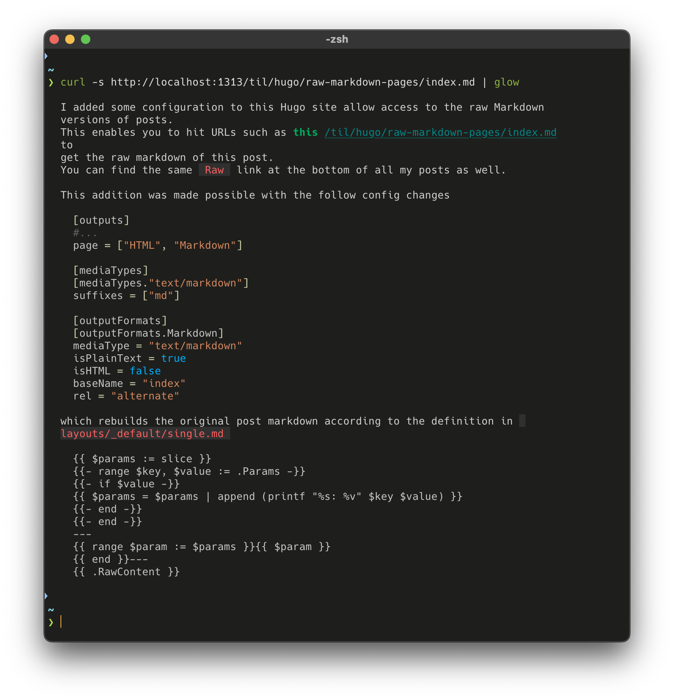

I added some configuration to this Hugo site allow access to the raw Markdown versions of posts.
This enables you to hit URLs such as [this](/til/hugo/raw-markdown-pages/index.md) to get the raw markdown of this post.
You can find the same `Raw` link at the bottom of all my posts as well.

This addition was made possible with the follow config changes

```toml
[outputs]
# ...
page = ["HTML", "Markdown"]

[mediaTypes]
[mediaTypes."text/markdown"]
suffixes = ["md"]

[outputFormats]
[outputFormats.Markdown]
mediaType = "text/markdown"
isPlainText = true
isHTML = false
baseName = "index"
rel = "alternate"
```

which rebuilds the original post markdown according to the definition in `layouts/_default/single.md`

```md
{{ $params := slice }}
{{- range $key, $value := .Params -}}
{{- if $value -}}
{{ $params = $params | append (printf "%s: %v" $key $value) }}
{{- end -}}
{{- end -}}
---
{{ range $param := $params }}{{ $param }}
{{ end }}---
{{ .RawContent }}
```

With everything setup, I ran `hugo` and validated that the `.md` files were correctly created in the public folder.
For example:

```text
❯ tree public/til/hugo/raw-markdown-pages
public/til/hugo/raw-markdown-pages
├── images
│   └── raw-markdown-pages.png
├── index.html
├── index.md
├── raw-markdown-pages
│   ├── index.html
│   └── index.md
└── raw-markdown-pages.png
```

This approach also allows me to easily view the content from my site via curl


