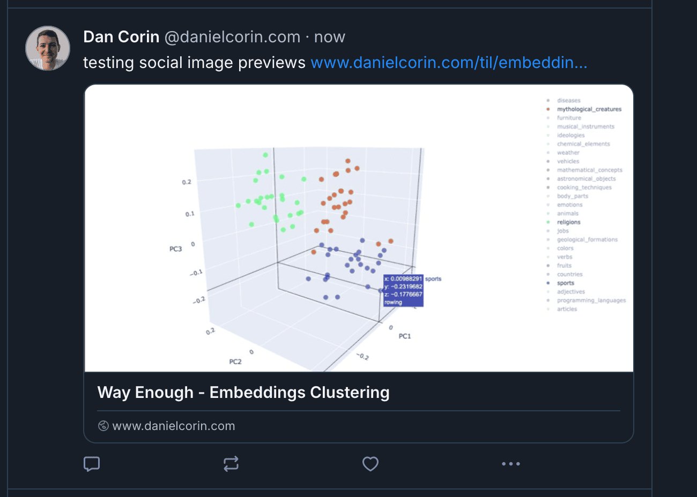

I've started posting more on Bluesky and I noticed that articles from my site didn't have social image previews 😔


I looked into [Poison's code](https://github.com/lukeorth/poison) (the theme this site is based on) and found that it [supports](https://github.com/lukeorth/poison/blob/master/layouts/partials/head/meta.html) social image previews at the site level or in the site's `assets` folder.

This approach didn't quite work for me.
I recently switched to using [page bundles](/til/hugo/page-bundles) which group markdown and content in the same folder and make linking to images from markdown straightforward.
With a few modifications, I was able to make the code work to use images in the page bundles for social previews as well.

The key changes:

- Instead of looking for images in the `assets` folder, use Hugo's `Resources.GetMatch` to find images in the page bundle
- Replace `imageConfig` with the image resource itself to get dimensions
- Update paths to use the image resource's `RelPermalink`

This allows images in page bundles to be used for social previews rather than requiring them to be in the site's assets folder, which would grow unruly if it had all the images for all my posts.

The changes are against [layouts/partials/head/meta.html](https://github.com/lukeorth/poison/blob/07485e85f0247518bc64ed0cc6fd6b39abe3d90d/layouts/partials/head/meta.html).

```diff
{{ .Scratch.Set "title" .Site.Title }}

{{ .Scratch.Set "publisherIcon" .Site.Params.favicon }}
{{ if .Site.Params.publisherIcon }}
    {{ .Scratch.Set "publisherIcon" .Site.Params.publisher_icon }}
{{ end }}

{{ if eq .Kind "home" }}
  {{ .Scratch.Set "title" $.Site.Params.brand }}
  {{ .Scratch.Set "description" .Site.Params.Description }}
{{ else }}
  {{ .Scratch.Set "description" .Description }}
{{ end }}

{{ if .IsSection }}
  {{ .Scratch.Set "title" ($.Site.Params.brand) }}
  {{ .Scratch.Add "title" " - " }}
  {{ .Scratch.Add "title" .LinkTitle }}
{{ end }}

{{ if .IsPage }}
  {{ .Scratch.Set "title" ($.Site.Params.brand) }}
  {{ .Scratch.Add "title" " - " }}
  {{ .Scratch.Add "title" .LinkTitle }}
{{ end }}

{{ "<!-- Open Graph image and Twitter Card metadata -->" | safeHTML }}
{{ $image_path := .Params.image | default .Site.Params.og_image -}}
{{ with $image_path }}
-  {{ $image_path_local :=  printf "assets/%s" $image_path -}}
-  {{ $image_ext := trim (path.Ext $image_path | lower) "." -}}
-  {{ if fileExists $image_path_local -}}
-    {{ $image_path:= resources.Get $image_path}}
-    <meta property="og:image" content="{{ $image_path.RelPermalink }}" />
+  {{ $image := $.Resources.GetMatch . }}
+  {{ $image_ext := trim (path.Ext .) " " | lower }}
+  {{ if $image }}
+    <meta property="og:image" content="{{ $image.RelPermalink }}" />
    {{/* If not SVG, read image aspect ratio and define Twitter Card and Open Graph width and height  */ -}}
    {{ if ne $image_ext "svg" -}}
-      {{ with (imageConfig $image_path_local) -}}
+      {{ with $image -}}
        {{ if (and (gt .Width 144) (gt .Height 144)) -}}
-          <meta name="twitter:image" content="{{ $image_path.RelPermalink }}"/>
+          <meta name="twitter:image" content="{{ .RelPermalink }}"/>
          <meta name="twitter:card" content="summary{{ if (and (gt .Width 300) (gt .Height 157) (not (eq .Width .Height))) }}_large_image{{ end }}">
        {{ end -}}
        <meta property="og:image:width" content="{{ .Width }}">
        <meta property="og:image:height" content="{{ .Height }}">
      {{ end -}}
    {{ end -}}
    <meta property="og:image:type" content="image/{{ if eq $image_ext "svg" }}svg+xml{{ else }}{{ replaceRE `^jpg$` `jpeg` $image_ext }}{{ end }}">
  {{ end -}}
{{ end -}}

<!-- Title Tags -->
<title itemprop="name">{{ .Scratch.Get "title" }}</title>
<meta property="og:title" content={{ .Scratch.Get "title" }} />
<meta name="twitter:title" content={{ .Scratch.Get "title" }} />
<meta itemprop="name" content={{ .Scratch.Get "title" }} />
<meta name="application-name" content={{ .Scratch.Get "title" }} />
<meta property="og:site_name" content="{{ .Site.Title }}" />

<!-- Description Tags -->
<meta name="description" content="{{ .Scratch.Get "description" }}" />
<meta itemprop="description" content="{{ .Scratch.Get "description" }}" />
<meta property="og:description" content="{{ .Scratch.Get "description" }}" />
<meta name="twitter:description" content="{{ .Scratch.Get "description" }}" />

<!-- Link Tags -->
<base href="{{ .Permalink }}" />
<link rel="canonical" href="{{ .Permalink }}" itemprop="url" />
<meta name="url" content="{{ .Permalink }}" />
<meta name="twitter:url" content="{{ .Permalink }}" />
<meta property="og:url" content="{{ .Permalink }}" />

<!-- Date Tags -->
<meta property="og:updated_time" content="{{ .Lastmod.Format "2006-01-02T15:04:05Z07:00" }}" />

<!-- Sitemap & Alternate Outputs -->
<link rel="sitemap" type="application/xml" title="Sitemap" href='{{ "sitemap.xml" | absURL }}' />
{{ range .AlternativeOutputFormats -}}
    {{ printf `<link href="%s" rel="%s" type="%s" title="%s" />` .Permalink .Rel .MediaType.Type $.Site.Title | safeHTML }}
{{ end -}}

<!-- Search Engine Crawler Tags -->
<meta name="robots" content="index,follow" />
<meta name="googlebot" content="index,follow" />

<!-- Social Media Tags -->
{{if (or (ne .Site.Params.twitter_url nil) (ne .Site.Params.x_url nil))}}
  {{ $twitter_user := index (split (default .Site.Params.twitter_url .Site.Params.x_url) "/") 3 }}
    <meta name="twitter:site" content="@{{ $twitter_user }}" />
    <meta name="twitter:creator" content="@{{ $twitter_user }}" />
{{end}}
<meta property="fb:admins" content="{{ .Site.Params.fb.admins }}" />

<!-- Other Tags -->
<meta name="apple-mobile-web-app-title" content="{{ .Site.Title }}" />
<meta name="apple-mobile-web-app-capable" content="yes" />
<meta name="apple-mobile-web-app-status-bar-style" content="black" />

<!-- Article Specific Tags -->
<!-- To make sure this renders only in the article page, we check the section -->
{{ if and (eq .Section "posts") (.Page.IsNode) }}
<!-- Pagination meta tags for list pages only -->
{{ $paginator := .Paginate (where .Pages "Type" "posts") }}
{{ if $paginator }}
  <link rel="first" href="{{ $paginator.First.URL }}" />
  <link rel="last" href="{{ $paginator.Last.URL }}" />
  {{ if $paginator.HasPrev }}
    <link rel="prev" href="{{ $paginator.Prev.URL }}" />
  {{end }}
  {{ if $paginator.HasNext }}
    <link rel="next" href="{{ $paginator.Next.URL }}" />
  {{end }}
{{end }}

<meta property="og:type" content="article" />
<meta property="article:publisher" content="{{ .Site.Params.facebook_url }}" />
<meta property="og:article:published_time" content="{{ .Date.Format "2006-01-02T15:04:05Z07:00" }}" />
<meta property="article:published_time" content="{{ .Date.Format "2006-01-02T15:04:05Z07:00"  }}" />

{{ with (or (.Params.Author) (.Site.Language.Params.Author.Name)) }}
  <meta property="og:article:author" content="{{ . }}" />
  <meta property="article:author" content="{{ . }}" />
  <meta name="author" content="{{ . }}" />
{{ end }}

{{ with.Params.category }}
  <meta name="news_keywords" content="{{ index . 0 }}" />
  <meta property="article:section" content="{{ index . 0 }}" />
{{ end }}

{{ end }}

<!-- Hugo Generator Attribution -->
{{ hugo.Generator }}
```

With these changes in place, Bluesky now shows proper preview cards with images when sharing links from my Hugo site.


