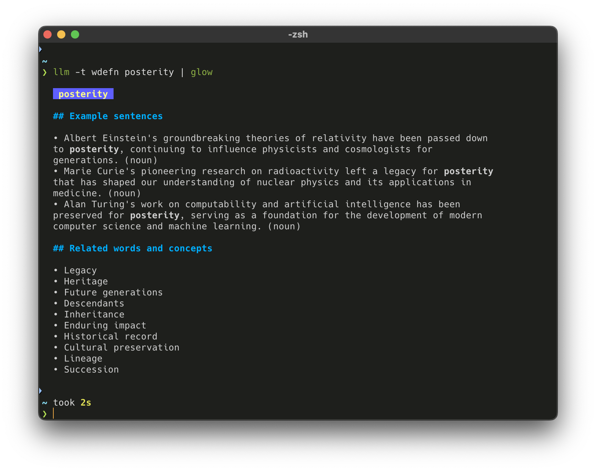

I was listening to [episode 34 of AI & I](https://podcasts.apple.com/us/podcast/how-to-use-ai-to-become-a-learning-machine-ep-34/id1719789201?i=1000669162604) of Dan Shipper interviewing Simon Eskiidsen.
Simon was describing one of the processes he uses with language models to learn new words and concepts.
In practice, he has a prompt template that instructs the model to explain a word to him but using it in a few sentences and giving synonyms, then injects the specific word or phrase into this template.

I've been fiddling around with the idea of prompt templates for a while but nothing had felt quite like the right spot to apply the approach until I heard Simon explain this example.
Using [`llm`](), here is the template and approach I came up with.

## How?

Create an edit a template

```sh
llm templates edit wdefn
```

`wdefn` short for "word definition".

Add the prompt

```yaml
prompt: |
  Please help me learn what this word or phrase means: $input

  Under header `## Example sentences`:
  - Give 3 example sentences using this word.
  - Try and use historical examples, something that is going to teach me something.
  - Give me something with some well known people, in physics, computer science, or other research fields.
  - Please try and make the example sentences as educational as possible. I want to learn from the examples.

  Under header `## Related words and concepts`:
  Give me some related words, synonyms and/or concepts that are related to this word.

  Output formatting:
  - Output the above in markdown.
  - Use unordered lists.
  - Bold the word or any derivative uses of the word in the sentences you output.
  - Start the response with "# $input"

  No talk. Just go.
```

Run the prompt template

```sh
llm -t wdefn posterity
```

which outputs something like the following (extra fun piping it to [`glow`](https://github.com/charmbracelet/glow)):


