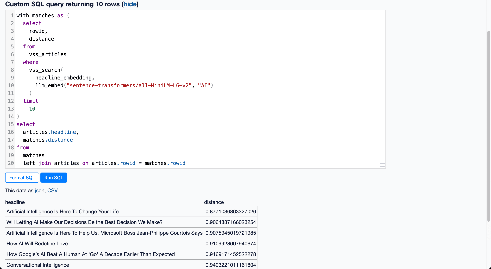

I spent yesterday and today working through the excellent [guide](https://observablehq.com/@asg017/introducing-sqlite-vss) by Alex on using [`sqlite-vss`](https://github.com/asg017/sqlite-vss) to do vector similarity search in a SQLite database.
I'm particularly interested in the benefits one can get from having these tools available locally for getting better insights into non-big datasets with a low barrier to entry.
Combining this plugin with a tool like [`datasette`](https://github.com/simonw/datasette) gives you a powerful data stack nearly out of the box.

## Installing the sqlite-vss extension

The ergonomics of installing and loading `vector0.dylib` and `vss0.dylib` are a little unusual.
When `pip install`ing `sqlite_vss`, the extension can be loaded via

```python
import sqlite_vss

db.enable_load_extension(True)
sqlite_vss.load(db)
```

However, to use it in the `sqlite` shell, I needed to download these dylibs to my project from the [Github project releases page](https://github.com/asg017/sqlite-vss/releases).
These dylibs are also downloaded with the Python library but live a bit deep in the virtualenv.

```sh
❯ ls env/lib/python3.11/site-packages/sqlite_vss
__pycache__  __init__.py  vector0.dylib  version.py  vss0.dylib
```

Maybe there is a better way to automatically load these to `sqlite` given the installed Python packages but I haven't come across it yet.

After downloading both of these dylibs, I could run `sqlite` then

```sh
.load ./vector0.dylib
.load ./vss0.dylib
```

then could create and query vector similarity search tables.

Running this each time I opened the `sqlite` shell was a chore, so I created a `.sqliterc` for my project

```sh
.headers on
.mode column
.load './vector0.dylib'
.load './vss0.dylib'
```

then loaded that each time with

```sh
sqlite3 -init .sqliterc whatever.db
```

I also use `rlwrap` to enable arrow key navigation in `sqlite`, described in further detail [here](/til/sqlite/arrow-key-support)

This is the command that does it all (data comes from the [News Category Dataset](https://www.kaggle.com/datasets/rmisra/news-category-dataset) used by the guide linked above)

```sh
❯ rlwrap sqlite3 -init .sqliterc database.db
-- Loading resources from .sqliterc
SQLite version 3.45.1 2024-01-30 16:01:20
Enter ".help" for usage hints.
sqlite> with matches as (
(x1...>   select
(x1...>     rowid,
(x1...>     distance
(x1...>   from vss_articles
(x1...>   where vss_search(
(x2...>     headline_embedding,
(x2...>     (select headline_embedding from articles where rowid = 82345)
(x2...>   )
(x1...>   limit 5
(x1...> )
   ...> select
   ...>   articles.rowid,
   ...>   articles.headline,
   ...>   matches.distance
   ...> from matches
   ...> left join articles on articles.rowid = matches.rowid;
rowid   headline                                                distance
------  ------------------------------------------------------  -----------------
82345   10 Books That Remind Us America Should Be For Everyone  0.0
94538   10 New Books Everyone Should Read This Summer           0.568291664123535
3490    The Best Books Of 2020                                  0.651552319526672
194850  50 Books That Every African American Should Read        0.654529571533203
144072  The 9 Best Books for Meaningful Change                  0.721711039543152
```

## Building the index

I mostly followed the guide above to load the data and build the vss index.
Loading the data was relatively fast as fast calculating the headline and description embeddings using the [bulk script](https://github.com/asg017/sqlite-vss/blob/main/examples/headlines/build/add_embeddings.py).

What took much longer (10+ minutes) was filling the vss0 virtual table.
Creating the table was trivial.

```sql
create virtual table vss_articles using vss0(
  headline_embedding(384),
  description_embedding(384),
);
```

Inserting the data seemed to hang forever.

```sql
insert into vss_articles(rowid, headline_embedding, description_embedding)
  select
    rowid,
    headline_embedding,
    description_embedding
  from articles;
```

`sqlite` was maxing out a core for many minutes and I had no visibility into what was happening.
It's possible this would have completed eventually if I waited long enough, but instead, I wrote a script to build `vss_articles` in batches with some sqlite config changes to try and speed things up.

```python
import os
import sqlite3
import sqlite_vss

DB = os.environ.get("DATABASE_FILE")
db = sqlite3.connect(DB)
db.enable_load_extension(True)
sqlite_vss.load(db)

BATCH_SIZE = 256

def insert_in_batches(batch_size):
    db.execute("""
    CREATE VIRTUAL TABLE IF NOT EXISTS vss_articles USING vss0(
        headline_embedding(384),
        description_embedding(384)
    );
    """)
    cursor = db.cursor()

    db.execute("PRAGMA synchronous = OFF")
    db.execute("PRAGMA journal_mode = MEMORY")
    db.execute("PRAGMA temp_store = MEMORY")
    db.execute("PRAGMA cache_size = -64000")

    # Determine total number of rows
    cursor.execute("SELECT COUNT(*) FROM articles")
    total_rows = cursor.fetchone()[0]
    batches = (total_rows // batch_size) + (1 if total_rows % batch_size else 0)

    for i in range(batches):
        print(f"Batch {i+1}/{batches}")
        offset = i * batch_size
        db.execute("BEGIN TRANSACTION")
        db.execute("""
        INSERT INTO vss_articles(rowid, headline_embedding, description_embedding)
        SELECT rowid, headline_embedding, description_embedding
        FROM articles LIMIT ? OFFSET ?""", (batch_size, offset))
        db.execute("COMMIT")

    db.close()

insert_in_batches(BATCH_SIZE)
```

This script still took nearly 10 minutes to run, but at least I was able to see progress and have some confidence that it would eventually finish.
A note (that may inform future optimizations) is that the first ~200/~800 batches loaded quite quickly.
After those, the ingest pace slowed to only a few batches per second for the remainder of the run.
Increasing to a batch size of 1024, got to 50% quite quickly, then slowed for the rest of the run.
Overall, larger batches were clearly faster.
Pushing the batch size to 2048 resulted in runtime of about 2.5 minutes.
I may return to this benchmarking exercise separately.

## Size of the data at various points in the process

| Dataset                       | Size     |
| ----------------------------- | -------- |
| Kaggle JSON                   | 28 MB    |
| SQLite db loaded from JSON    | 74.2 MB  |
| SQLite with embeddings added  | 860.5 MB |
| SQLite with vss virtual table | 1.83 GB  |

The embeddings seem to contribute the majority of the data size.
Creating the virtual table seems to be an effective doubling, which makes sense since we're copying the embeddings to another table.

## Running queries

Finally, with the data loaded, I installed and setup a `datasette` instance to run queries against the vector store.

```sh
pip install datasette
datasette install datasette-sqlite-vss
```

I initially setup a [`SentenceTransformer` plugin](https://github.com/asg017/sqlite-vss/blob/main/examples/headlines/plugins/plugin.py#L7-L9) as Alex does in post and called it `st_encode`.

With this plugin, I started `datasette` with

```sh
datasette --plugins-dir=plugins database.db
```

I later learned I could also use the [`datasette-llm-embed`](https://datasette.io/plugins/datasette-llm-embed) plugin to do something similar.

Since I already had `llm` installed using `brew` for general purposes, per [these instructions](https://simonwillison.net/2023/Sep/4/llm-embeddings/), in my project I ran

```sh
llm install -U llm
llm install llm-sentence-transformers
```

`llm-sentence-transformers` registers `sentence-transformers/all-MiniLM-L6-v2` by default, which you can validate at

```sh
cat ~/Library/Application\ Support/io.datasette.llm/sentence-transformers.json
```

which (for me) outputs

```json
[
  {
    "name": "all-MiniLM-L6-v2"
  }
]
```

Or you can just run this command to confirm

```sh
❯ llm sentence-transformers register all-MiniLM-L6-v2
Error: Model all-MiniLM-L6-v2 is already registered
```

After restarting `datasette`, the following query now produces the same results as Alex's example with the custom `st_encode` plugin.

```sql
with matches as (
  select
    rowid,
    distance
  from
    vss_articles
  where
    vss_search(
      headline_embedding,
      llm_embed("sentence-transformers/all-MiniLM-L6-v2", "AI")
    )
  limit
    10
)
select
  articles.headline,
  matches.distance
from
  matches
  left join articles on articles.rowid = matches.rowid
```

You can navigate to <http://127.0.0.1:8001/database> to try it yourself.



It works pretty well!
We find several article titles that relate to "AI" even though the exact string "AI" doesn't appear in all of them.
