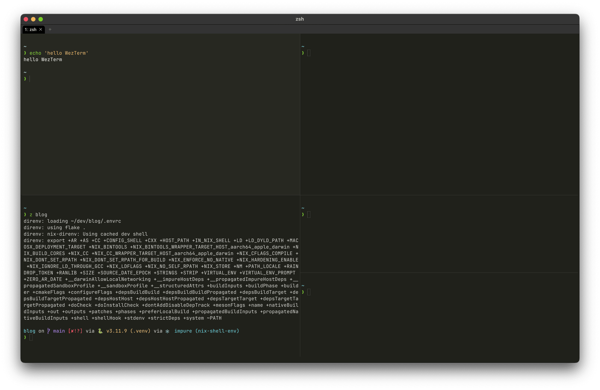

I spent a bit of time configuring [WezTerm](https://wezfurlong.org/wezterm/index.html) to my liking.
This exercise was similar to [rebuilding my iTerm setup in Alacritty](/til/wezterm/rebuilding-my-iterm-setup-in-alacritty).
I found WezTerm to be more accessible and strongly appreciated the builtin terminal multiplexing because I don't like using tmux.

I configured WezTerm to provide the following experience.
Getting this working probably took me 30 minutes spread across a few sessions as I noticed things I was missing.

- Monokai-like theme
- Horizontal and vertical pane splitting
- Dimmed inactive panes
- Steady cursor
- Immediate pane closing with confirmation if something is still running
- Pane full screening
- Command+arrow navigation between panes
- Command+option+arrow navigation between tabs
- Moving between words in the command prompt with option-arrow
- Hotkey to clear terminal

## What went well

I found achieving these configurations to be much easier in WezTerm than Alacritty, or at least, it took me less time.
The blend of native UI with dotfile-style configurable settings hits a sweet spot for my preferences as well, and I haven't even scratched the surface of scripting things with Lua.

## What could be better

Command+F find in WezTerm is pretty much the same as Alacritty.
I don't dislike it, I guess I just like how iTerm does it, particularly with the animation when jumping between search matches.

Here is my `~/.wezterm.lua` file after the initial setup.

```lua
local wezterm = require 'wezterm'

return {
  -- Update the config when changes are detected
  automatically_reload_config = true,

  -- Hide traffic lights but allow window resizing
  window_decorations = "RESIZE",

  -- Set the font settings
  font_size = 13.0,

  -- Dim inactive panes
  inactive_pane_hsb = {
    saturation = 0.9,
    brightness = 0.7,
  },

  -- Cursor Style
  default_cursor_style = "SteadyBar",
  cursor_thickness = "0.1",

  color_scheme = "Monokai (dark) (terminal.sexy)",

  keys = {
    -- Pane splitting
    {
      key = 'd',
      mods = 'CMD',
      action = wezterm.action.SplitHorizontal
    },
    {
      key = 'd',
      mods = 'SHIFT|CMD',
      action = wezterm.action.SplitVertical
    },
    -- Pane closing
    {
      key="w",
      mods="CMD",
      action = wezterm.action{CloseCurrentPane={confirm=true}}
    },
    -- Pane full screen
    {
      key = 'Enter',
      mods = 'CMD|SHIFT',
      action = wezterm.action.TogglePaneZoomState,
    },
    -- Command prompt word navigation
    {key="LeftArrow", mods="OPT", action=wezterm.action{SendString="\x1bb"}},
    {key="RightArrow", mods="OPT", action=wezterm.action{SendString="\x1bf"}},

    -- Pane navigation
    {key="UpArrow", mods="CMD", action=wezterm.action.ActivatePaneDirection("Up")},
    {key="DownArrow", mods="CMD", action=wezterm.action.ActivatePaneDirection("Down")},
    {key="LeftArrow", mods="CMD", action=wezterm.action.ActivatePaneDirection("Left")},
    {key="RightArrow", mods="CMD", action=wezterm.action.ActivatePaneDirection("Right")},

    -- Command+option+arrows to move between tabs
    {key="LeftArrow", mods="CMD|OPT", action=wezterm.action.ActivateTabRelative(-1)},
    {key="RightArrow", mods="CMD|OPT", action=wezterm.action.ActivateTabRelative(1)},

    -- Clear terminal
    {
      key = 'k',
      mods = 'CMD',
      action = wezterm.action.ClearScrollback 'ScrollbackAndViewport',
    },
  }
}

```

Finally, [here's a commit](https://github.com/danielcorin/nix-config/commit/4f6596c3c558daa85a2a467308943d2c5267ab4d) adding the above config to my Nix config (placed at `~/.config/wezterm/wezterm.lua`)


