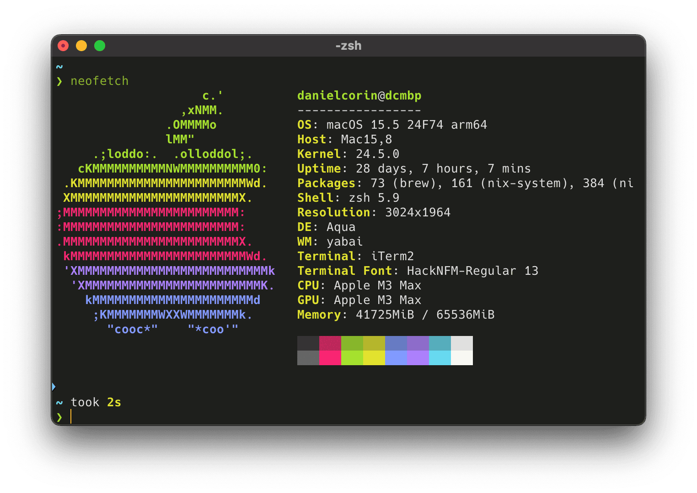

## 💻 macOS apps

- [Alfred](https://www.alfredapp.com/): app launcher, multi-clipboard
- [Dozer](https://github.com/Mortennn/Dozer): hides menu bar items
- [Firefox](https://www.mozilla.org/en-US/firefox/new/): support the open web
- [iTerm2](https://iterm2.com/): my primary terminal emulator
- [itsycal](https://www.mowglii.com/itsycal/): a drop in replacement for the macOS datetime menubar item with a pop-open calendar view
- [Karabiner](https://karabiner-elements.pqrs.org/): to turn caps lock into a hyper key
- [Obsidian](https://obsidian.md/): notes as plaintext files (markdown)
- [Paku](https://paku.app/): monitors air quality
- [Tomo](https://www.wvlen.llc/apps/tomo): an unobtrusive, ambient LLM chat app

## 🧰 CLI

- [bat](https://github.com/sharkdp/bat)
- [brew](https://brew.sh/) (nix managed)
- [claude-code](https://github.com/anthropics/claude-code): my preferred CLI coding agent
- [delta](https://github.com/dandavison/delta)
- [eza](https://github.com/eza-community/eza)
- [fzf](https://github.com/junegunn/fzf)
- [goku](https://github.com/yqrashawn/GokuRakuJoudo)
- [llm](https://github.com/simonw/llm)
- [ollama](https://github.com/ollama/ollama)
- [nix](https://nixos.org/) ([config](https://github.com/danielcorin/nix-config/))
- [hugo](https://gohugo.io/)
- [skhd](https://github.com/koekeishiya/skhd)
- [starship prompt](https://starship.rs/)
- [yabai](https://github.com/koekeishiya/yabai)
- [zoxide](https://github.com/ajeetdsouza/zoxide)

### Experimenting

- [Zed](https://zed.dev/): a fast text editor with interesting AI features
- [WezTerm](https://wezfurlong.org/wezterm/index.html): a fast terminal with flexible Lua configuration
- [Raycast](https://www.raycast.com/): an extensible launcher, similar to Alfred

## 📱 iOS apps

- [Day One](https://dayoneapp.com/download/)
- [Obsidian](https://obsidian.md/mobile)
- [Paku](https://paku.app/)
- [Spotify](https://www.spotify.com/us/download/ios/)

## 🔗 Web

- [GoatCounter](https://goatcounter.com): easy web analytics

## ✨🤖 Language Models

- [claude-sonnet-4](https://docs.anthropic.com/en/docs/about-claude/models/overview)
- [claude-opus-4](https://docs.anthropic.com/en/docs/about-claude/models/overview)
