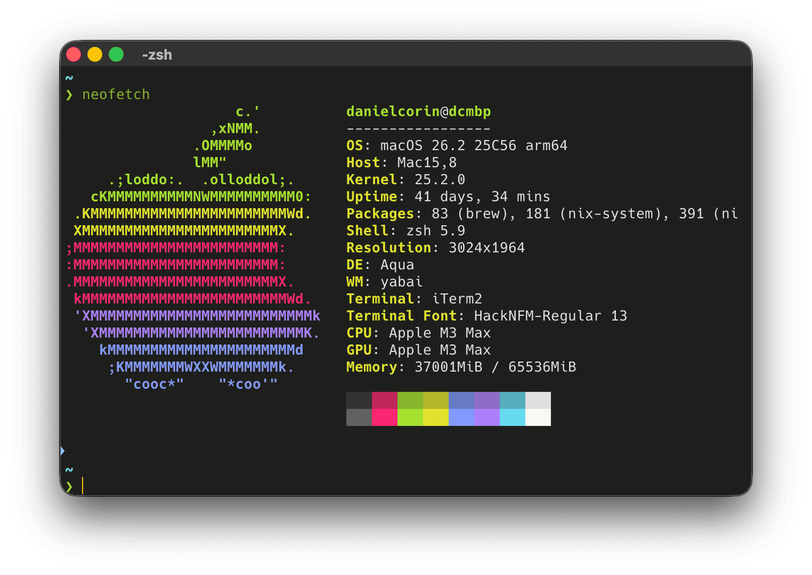

## 💻 macOS apps

- [Alfred](https://www.alfredapp.com/): app launcher, multi-clipboard
- [Dozer](https://github.com/Mortennn/Dozer): hides menu bar items
- [Handy](https://handy.computer/download): local voice to text
- [iTerm2](https://iterm2.com/): my primary terminal emulator
- [itsycal](https://www.mowglii.com/itsycal/): a drop in replacement for the macOS datetime menubar item with a pop-open calendar view
- [Karabiner](https://karabiner-elements.pqrs.org/): to turn caps lock into a hyper key
- [Paku](https://paku.app/): monitors air quality
- [Waterfox](https://github.com/BrowserWorks/Waterfox)

### Experimenting

- [Ghostty](https://ghostty.org/)

## 🧰 CLI

- [astro](https://astro.build)
- [bat](https://github.com/sharkdp/bat)
- [brew](https://brew.sh/) (nix managed)
- [claude-code](https://github.com/anthropics/claude-code): my preferred CLI coding agent
- [delta](https://github.com/dandavison/delta)
- [eza](https://github.com/eza-community/eza)
- [fzf](https://github.com/junegunn/fzf)
- [goku](https://github.com/yqrashawn/GokuRakuJoudo)
- [nix](https://nixos.org/) ([config](https://github.com/danielcorin/nix-config/))
- [skhd](https://github.com/koekeishiya/skhd)
- [starship prompt](https://starship.rs/)
- [yabai](https://github.com/koekeishiya/yabai)
- [zoxide](https://github.com/ajeetdsouza/zoxide)

### Experimenting

- [hermes](https://github.com/nousresearch/hermes-agent)

## 📱 iOS apps

- [Day One](https://dayoneapp.com/download/)
- [Paku](https://paku.app/)
- [Spotify](https://www.spotify.com/us/download/ios/)

## 🔗 Web

- [GoatCounter](https://goatcounter.com): easy web analytics

## ✨🤖 Language Models

- [claude-4.6-opus](https://docs.anthropic.com/en/docs/about-claude/models/overview)

## ☁️ Cloud

- [Cloudflare](https://www.cloudflare.com/)
