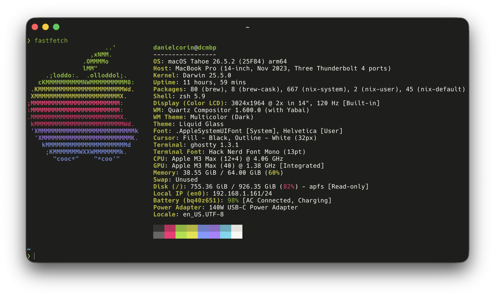

## 💻 macOS apps

- [Alfred](https://www.alfredapp.com/): app launcher, multi-clipboard
- [Ghostty](https://ghostty.org/): my primary terminal emulator
- [Helium](https://helium.computer/)
- [itsycal](https://www.mowglii.com/itsycal/): a drop in replacement for the macOS datetime menubar item with a pop-open calendar view
- [Karabiner](https://karabiner-elements.pqrs.org/): to turn caps lock into a hyper key
- [Mo](https://github.com/danielcorin/Mo): hides menu bar items
- [Paku](https://paku.app/): monitors air quality
- [Reco](https://github.com/danielcorin/Reco): local voice to text

## 🧰 CLI

- [astro](https://astro.build)
- [bat](https://github.com/sharkdp/bat)
- [brew](https://brew.sh/) (nix managed)
- [claude-code](https://github.com/anthropics/claude-code)
- [codex](https://github.com/openai/codex)
- [eza](https://github.com/eza-community/eza)
- [fzf](https://github.com/junegunn/fzf)
- [goku](https://github.com/yqrashawn/GokuRakuJoudo)
- [hunk](https://github.com/modem-dev/hunk/)
- [nix](https://nixos.org/) ([config](https://github.com/danielcorin/nix-config/))
- [skhd](https://github.com/koekeishiya/skhd)
- [starship prompt](https://starship.rs/)
- [yabai](https://github.com/koekeishiya/yabai)
- [zoxide](https://github.com/ajeetdsouza/zoxide)

### Experimenting

- [hermes](https://github.com/nousresearch/hermes-agent)

## 📱 iOS apps

- [Day One](https://dayoneapp.com/download/)
- [Paku](https://paku.app/)
- [Spotify](https://www.spotify.com/us/download/ios/)

## 🔗 Web

- [GoatCounter](https://goatcounter.com): easy web analytics

## ✨🤖 AI things

- [claude-4.8-opus](https://docs.anthropic.com/en/docs/about-claude/models/overview)
- [claude-agent-sdk](https://github.com/anthropics/claude-agent-sdk-typescript)
- [claude-fable-5](https://docs.anthropic.com/en/docs/about-claude/models/overview)
- [gpt-5.6](https://developers.openai.com/api/docs/models)
- [pi](https://github.com/earendil-works/pi)

## ☁️ Cloud

- [Cloudflare](https://www.cloudflare.com/)

## Changelog

- Add [claude-fable-5](https://docs.anthropic.com/en/docs/about-claude/models/overview)
- Switch from Dozer to [Mo](https://github.com/danielcorin/Mo)
- Switch from Handy to [Reco](https://github.com/danielcorin/Reco)
- Switch from iTerm2 to [Ghostty](https://ghostty.org/)
- Update [gpt-5.5](https://developers.openai.com/api/docs/models) to [gpt-5.6](https://developers.openai.com/api/docs/models)
